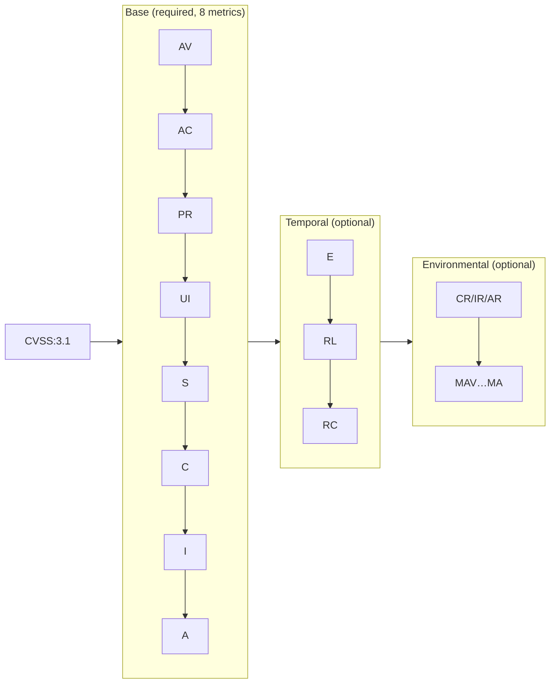
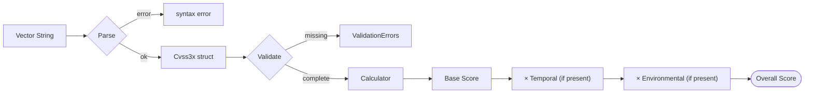

# CVSS Skills — Agent Reference

This document guides AI agents (Claude Code, LLMs, etc.) on how to use the CVSS Skills toolkit.

## Quick Links

| Resource | URL | Description |
|----------|-----|-------------|
| **Website** | https://scagogogo.github.io/cvss-skills/ | Full documentation, tutorials, API reference |
| **CLI Reference** | https://scagogogo.github.io/cvss-skills/cli/ | All 30+ commands with examples |
| **Go SDK** | https://scagogogo.github.io/cvss-skills/sdk/ | Package docs: `cvss`, `parser`, `vector`, `mock` |
| **CVSS Metrics** | https://scagogogo.github.io/cvss-skills/metrics/ | Every metric: values, scores, version quirks |
| **Concepts** | https://scagogogo.github.io/cvss-skills/concepts/ | Scoring formulas, severity bands, validation |
| **API Reference** | https://scagogogo.github.io/cvss-skills/docs/api/ | Generated Go SDK API docs |
| **GitHub Repo** | https://github.com/scagogogo/cvss-skills | Source code, releases, issues |

## Claude Code Skills

9 built-in skills under `.claude/skills/`:

| Skill | Purpose | CLI Commands |
|-------|---------|--------------|
| `cvss-parse` | Parse vector strings | `cvss parse` |
| `cvss-score` | Calculate scores & severity | `cvss score`, `cvss severity` |
| `cvss-validate` | Validate vectors | `cvss validate`, `cvss batch validate` |
| `cvss-construct` | Build vectors from metrics | `cvss build`, `cvss preset`, `cvss random` |
| `cvss-compare` | Diff, merge, distance | `cvss diff`, `cvss merge`, `cvss distance`, `cvss equal` |
| `cvss-serialize` | JSON, XML, CSV, map output | `cvss json`, `cvss csv`, `cvss map` |
| `cvss-metrics` | Metric values & scores reference | `cvss enumerate`, `cvss get`, `cvss groups` |
| `cvss-advanced` | Analysis, batch, version convert | `cvss analyze`, `cvss range`, `cvss convert`, `cvss batch` |
| `cvss-install` | Installation instructions | — |

### Usage in Claude Code

```bash
# Install as MCP server (enables all skills)
claude mcp add --scope user cvss-skills -- https://github.com/scagogogo/cvss-skills
```

Once installed, ask in natural language:
- "Score this vector: CVSS:3.1/AV:N/AC:L/PR:N/UI:N/S:U/C:H/I:H/A:H"
- "Validate this vector and tell me what's missing"
- "Compare these two vectors and show the differences"
- "Build a Critical severity vector"

## CLI Quick Reference

```bash
# Install (choose one)
go install github.com/scagogogo/cvss-skills/cmd/cvss-cli@latest
# Or download pre-built binary from GitHub Releases

# Core commands
cvss score "CVSS:3.1/AV:N/AC:L/PR:N/UI:N/S:U/C:H/I:H/A:H"  # → 9.8 (Critical)
cvss validate "CVSS:3.1/AV:N/AC:L/PR:N/UI:N/S:U/C:H/I:H/A:H"
cvss parse "CVSS:3.1/AV:N/AC:L/PR:N/UI:N/S:U/C:H/I:H/A:H"
cvss build --AV N --AC L --PR N --UI N --S U --C H --I H --A H

# JSON output (all commands support --format json)
cvss score "CVSS:3.1/..." --format json | jq .score

# Comparison
cvss diff "CVSS:3.1/..." "CVSS:3.1/..."
cvss distance "CVSS:3.1/..." "CVSS:3.1/..."

# Batch processing
cvss batch score vectors.txt --format json
cvss sort vectors.txt
```

## Go SDK Quick Reference

```go
import (
    "github.com/scagogogo/cvss-skills/pkg/parser"
    "github.com/scagogogo/cvss-skills/pkg/cvss"
)

func main() {
    // One-liner: parse + score
    cv, score, severity, err := parser.ParseAndScore(
        "CVSS:3.1/AV:N/AC:L/PR:N/UI:N/S:U/C:H/I:H/A:H",
    )
    // score = 9.8, severity = "Critical"

    // Validate
    if err := cv.Validate(); err != nil {
        // handle ValidationErrors
    }

    // Compare
    diffs := cv1.Diff(cv2)
    dist := cvss.NewDistanceCalculator(cv1, cv2)
    fmt.Println(dist.EuclideanDistance())
}
```

## CVSS v3.x Structure



**Metric groups**:
- **Base**: AV, AC, PR, UI, S, C, I, A — all required for a complete vector
- **Temporal**: E, RL, RC — optional, refine the base score
- **Environmental**: CR, IR, AR, MAV, MAC, MPR, MUI, MS, MC, MI, MA — optional, customize to environment

## Scoring Pipeline



## Severity Scale

| Rating | Score Range |
|--------|-------------|
| None | 0.0 |
| Low | 0.1 – 3.9 |
| Medium | 4.0 – 6.9 |
| High | 7.0 – 8.9 |
| Critical | 9.0 – 10.0 |

## When to Use Which Resource

| Task | Go to |
|------|-------|
| Parse/score a vector | CLI: `cvss score` or Skill: `cvss-score` |
| Validate completeness | CLI: `cvss validate` or Skill: `cvss-validate` |
| Compare two vectors | CLI: `cvss diff` or Skill: `cvss-compare` |
| Build a vector | CLI: `cvss build` or Skill: `cvss-construct` |
| Understand a metric | Website: `/metrics/<metric-name>` |
| Learn scoring formula | Website: `/concepts/scoring` |
| Go API details | Website: `/sdk/<package>` or `/docs/api/` |
| Install CLI | Website: `/downloads/` or Skill: `cvss-install` |

## For AI Agents

If you are an AI agent working with CVSS vectors:

1. **For quick operations**: Use the CLI commands directly via shell
2. **For structured output**: Add `--format json` to any command
3. **For Go code generation**: Import from `github.com/scagogogo/cvss-skills/pkg/...`
4. **For deep understanding**: Read the website documentation linked above

The `.claude/skills/*.md` files contain focused instructions for specific tasks. Each skill maps to one or more CLI commands and includes examples and Go SDK patterns.

## Version Differences (v3.0 vs v3.1)

- **`UI:R`**: v3.0 = 0.56, v3.1 = 0.62
- **` roundup`**: v3.1 defines explicit rounding function
- **Scope Changed** calculations differ slightly

The toolkit handles version differences automatically — just preserve the `CVSS:3.0` or `CVSS:3.1` prefix in your vectors.
