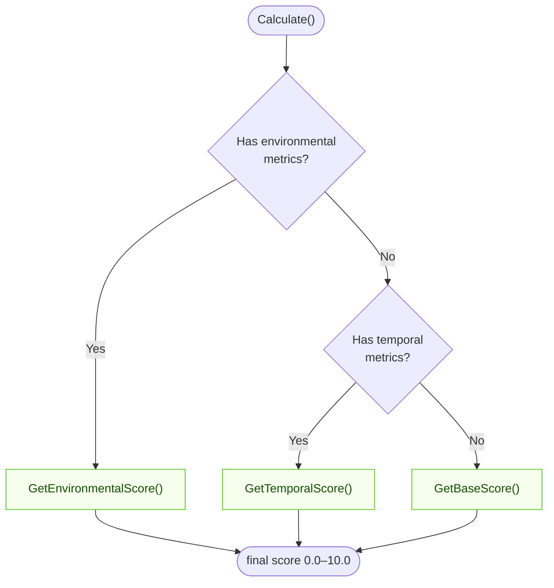
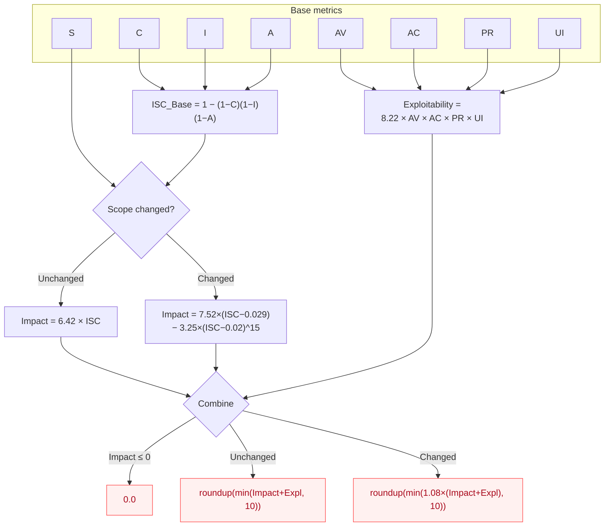

# Calculator

The `Calculator` is the core component in CVSS Skills for computing CVSS scores. It provides complete CVSS 3.x score calculation functionality, including base score, temporal score, and environmental score.

## How `Calculate()` Chooses a Score

`Calculate()` inspects which metric groups are present and returns the most specific score available — environmental > temporal > base:



::: info Under the hood
`Calculate()` dispatches to the same private routines that `GetBaseScore()`, `GetTemporalScore()`, and `GetEnvironmentalScore()` expose publicly. The dispatch order is environmental → temporal → base.
:::

## Base Score Formula (CVSS v3.1)

The base score is derived from two sub-scores — Impact and Exploitability — combined differently depending on whether Scope (`S`) changed:



::: tip Version-specific quirk
`PR` and `UI` value weights differ between v3.0 and v3.1 (e.g. `UI:R` = 0.56 in v3.0 vs 0.62 in v3.1). The Calculator is version-aware and applies the correct table automatically based on the parsed `CVSS:3.0` / `CVSS:3.1` prefix.
:::

## Type Definition

`Calculator` is a struct that wraps a parsed `*Cvss3x` vector. It is constructed via `NewCalculator` and exposes scoring methods on a `*Calculator` receiver:

```go
type Calculator struct {
    // unexported: holds the *Cvss3x passed to NewCalculator
}

func NewCalculator(cvss *Cvss3x) *Calculator

func (c *Calculator) Calculate() (float64, error)
func (c *Calculator) GetBaseScore() (float64, error)
func (c *Calculator) GetTemporalScore() (float64, error)
func (c *Calculator) GetEnvironmentalScore() (float64, error)
func (c *Calculator) GetSeverityRating(score float64) Severity
```

::: warning Not reusable across vectors
`Calculator` holds a single `*Cvss3x` and exposes no setter for it. Create a new `Calculator` per vector — construction is cheap.
:::

## Creating a Calculator

### NewCalculator

```go
func NewCalculator(cvss *Cvss3x) *Calculator
```

Creates a new calculator bound to the given vector.

**Parameters:**
- `cvss`: The parsed CVSS 3.x vector (`*Cvss3x`) to score

**Returns:**
- `*Calculator`: Calculator instance

**Example:**
```go
calculator := cvss.NewCalculator(cvssVector)
```

## Main Methods

### Calculate

```go
func (c *Calculator) Calculate() (float64, error)
```

Calculates the final CVSS score. Automatically selects the appropriate calculation method based on the metrics included in the vector:
- Base metrics only: returns base score
- Includes temporal metrics: returns temporal score
- Includes environmental metrics: returns environmental score

**Returns:**
- `float64`: CVSS score (0.0-10.0)
- `error`: Calculation error

**Example:**
```go
score, err := calculator.Calculate()
if err != nil {
    log.Fatalf("Calculation failed: %v", err)
}
fmt.Printf("CVSS Score: %.1f\n", score)
```

### GetBaseScore

```go
func (c *Calculator) GetBaseScore() (float64, error)
```

Calculates the CVSS base score from the base metrics only.

**Calculation Formula:**
```
If (Impact <= 0)
    BaseScore = 0
Else
    If (Scope == Unchanged)
        BaseScore = Roundup(Minimum((Impact + Exploitability), 10))
    Else
        BaseScore = Roundup(Minimum(1.08 × (Impact + Exploitability), 10))
```

**Example:**
```go
baseScore, err := calculator.GetBaseScore()
if err != nil {
    log.Fatalf("Base score calculation failed: %v", err)
}
fmt.Printf("Base Score: %.1f\n", baseScore)
```

### GetTemporalScore

```go
func (c *Calculator) GetTemporalScore() (float64, error)
```

Calculates the temporal score, derived from the base score and temporal metrics (`E`, `RL`, `RC`).

**Calculation Formula:**
```
TemporalScore = Roundup(BaseScore × ExploitCodeMaturity × RemediationLevel × ReportConfidence)
```

**Example:**
```go
temporalScore, err := calculator.GetTemporalScore()
if err != nil {
    log.Fatalf("Temporal score calculation failed: %v", err)
}
fmt.Printf("Temporal Score: %.1f\n", temporalScore)
```

### GetEnvironmentalScore

```go
func (c *Calculator) GetEnvironmentalScore() (float64, error)
```

Calculates the environmental score from the modified base metrics and environmental requirements.

**Calculation Formula:**
```
ModifiedImpact = Minimum(1 − [(1−CR×ModifiedConfidentialityImpact)
                           × (1−IR×ModifiedIntegrityImpact)
                           × (1−AR×ModifiedAvailabilityImpact)], 0.915)

ModifiedExploitability = 8.22 × ModifiedAV × ModifiedAC × ModifiedPR × ModifiedUI

If (ModifiedImpact <= 0)
    EnvironmentalScore = 0
Else
    If (ModifiedScope == Unchanged)
        EnvironmentalScore = Roundup(Roundup(Minimum((ModifiedImpact + ModifiedExploitability), 10))
                                     × ExploitCodeMaturity × RemediationLevel × ReportConfidence)
    Else
        EnvironmentalScore = Roundup(Roundup(Minimum(1.08 × (ModifiedImpact + ModifiedExploitability), 10))
                                     × ExploitCodeMaturity × RemediationLevel × ReportConfidence)
```

**Example:**
```go
envScore, err := calculator.GetEnvironmentalScore()
if err != nil {
    log.Fatalf("Environmental score calculation failed: %v", err)
}
fmt.Printf("Environmental Score: %.1f\n", envScore)
```

### GetSeverityRating

```go
func (c *Calculator) GetSeverityRating(score float64) Severity
```

Gets the corresponding severity level based on CVSS score. `Severity` is a `string`-backed type with a `String()` method, so it prints naturally with `%s`.

**Score Ranges and Levels:**

| Score Range | Severity Level |
|-------------|----------------|
| 0.0 | None |
| 0.1-3.9 | Low |
| 4.0-6.9 | Medium |
| 7.0-8.9 | High |
| 9.0-10.0 | Critical |

**Example:**
```go
score := 7.5
severity := calculator.GetSeverityRating(score)
fmt.Printf("Score %.1f corresponds to severity: %s\n", score, severity) // "High"
```

## Complete Example

### Basic Usage

```go
package main

import (
    "fmt"
    "log"

    "github.com/scagogogo/cvss-skills/pkg/cvss"
    "github.com/scagogogo/cvss-skills/pkg/parser"
)

func main() {
    // Parse CVSS vector
    vectorStr := "CVSS:3.1/AV:N/AC:L/PR:N/UI:N/S:U/C:H/I:H/A:H"
    p := parser.NewCvss3xParser(vectorStr)
    vector, err := p.Parse()
    if err != nil {
        log.Fatalf("Parse failed: %v", err)
    }

    // Create calculator
    calculator := cvss.NewCalculator(vector)

    // Calculate score
    score, err := calculator.Calculate()
    if err != nil {
        log.Fatalf("Calculation failed: %v", err)
    }

    severity := calculator.GetSeverityRating(score)

    // Output results
    fmt.Printf("CVSS Vector: %s\n", vectorStr)
    fmt.Printf("Score: %.1f\n", score)
    fmt.Printf("Severity: %s\n", severity)
}
```

## Error Handling

`Calculate()` returns a plain `error` when the vector is incomplete or invalid (it runs `Cvss3x.Check()` internally, which reports the first missing metric as a message string). For structured, per-metric diagnostics, call `Validate()` first — it returns `ValidationErrors`, a slice of `*ValidationError` each carrying a `Metric` and `Message`:

```go
// Structured validation before scoring
if err := vector.Validate(); err != nil {
    if ve, ok := err.(cvss.ValidationErrors); ok {
        for _, e := range ve {
            fmt.Printf("metric %s: %s\n", e.Metric, e.Message)
        }
        fmt.Printf("missing: %v\n", ve.MissingMetrics())
    } else {
        fmt.Printf("validation error: %v\n", err)
    }
    return
}

// Safe to score now
score, err := calculator.Calculate()
if err != nil {
    fmt.Printf("calculation error: %v\n", err) // e.g. "calculator or cvss is nil"
    return
}
```

::: tip Check() vs Validate()
`Check()` (used by `Calculate()`) returns a single `error` describing the first problem; `Validate()` collects all problems into `ValidationErrors`. Prefer `Validate()` when you want to report every missing metric at once.
:::

## Related Documentation

- [Cvss3x Data Structure](/api/cvss/cvss3x)
- [Usage Examples](/examples/basic)
- [CVSS Specification](https://www.first.org/cvss/v3.1/specification-document)