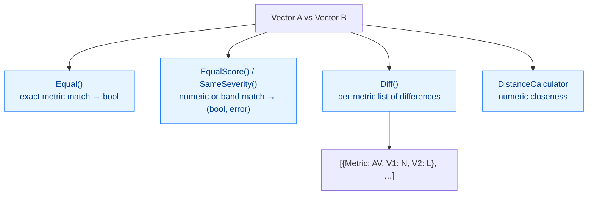

# Vector Comparison API

CVSS Skills compares vectors through methods on `Cvss3x` itself — there is no separate comparator type. The comparison surface spans four levels of granularity, from a single boolean to a full per-metric breakdown.

## Comparison Dimensions

Two vectors can be compared at four levels of granularity — from a single boolean to a full per-metric breakdown:



| Question | Method | Returns |
|----------|--------|---------|
| Are the two vectors identical, metric for metric? | `Equal(other)` | `bool` |
| Do they produce the same base score? | `EqualScore(other)` | `(bool, error)` |
| Do they land in the same severity band? | `SameSeverity(other)` | `(bool, error)` |
| Exactly which metrics differ? | `Diff(other)` | `[]DiffEntry` |
| How numerically close are they? | `NewDistanceCalculator(a, b)` | distances / similarities |
| Combine metrics from two vectors? | `Merge(other)` | `*Cvss3x` |

## DiffEntry

`Diff()` returns a slice of `DiffEntry`, one per metric whose short value differs between the two vectors:

```go
type DiffEntry struct {
    Metric string // short name, e.g. "AV", "PR"
    V1     string // vector A's short value, e.g. "N"
    V2     string // vector B's short value, e.g. "L"
    V1Long string // vector A's long value, e.g. "Network"
    V2Long string // vector B's long value, e.g. "Local"
}

func (d DiffEntry) String() string // "AV: N vs L"
```

::: tip Diff only reports set, differing metrics
`Diff` walks the metrics present on both vectors and emits an entry for each position where the short values disagree. Metrics absent from one side are not reported as diffs — use `MissingMetrics()` to detect absence instead.
:::

## Methods

### Equal

```go
func (x *Cvss3x) Equal(other *Cvss3x) bool
```

Reports whether the two vectors are identical across version, base, temporal, and environmental metrics. A `nil` receiver compares equal only to a `nil` argument.

**Returns:**
- `bool`: `true` if every metric group matches exactly

**Example:**
```go
if v1.Equal(v2) {
    fmt.Println("vectors are identical")
}
```

### EqualScore

```go
func (x *Cvss3x) EqualScore(other *Cvss3x) (bool, error)
```

Reports whether the two vectors produce the same **base score**. Two vectors with different metrics can share a score (e.g. different AV/AC combinations that net to the same Exploitability).

**Returns:**
- `bool`: `true` if `GetBaseScore()` is equal for both
- `error`: non-nil if either vector fails to score (incomplete/invalid base metrics)

**Example:**
```go
same, err := v1.EqualScore(v2)
if err != nil {
    log.Fatalf("cannot compare scores: %v", err)
}
fmt.Printf("same base score: %t\n", same)
```

### SameSeverity

```go
func (x *Cvss3x) SameSeverity(other *Cvss3x) (bool, error)
```

Reports whether the two vectors land in the same **severity band** (None / Low / Medium / High / Critical). Coarser than `EqualScore` — two scores of 7.1 and 8.9 are different scores but the same severity (High).

**Returns:**
- `bool`: `true` if both vectors' base scores map to the same severity
- `error`: non-nil if either vector fails to score

**Example:**
```go
same, err := v1.SameSeverity(v2)
if err != nil {
    log.Fatal(err)
}
fmt.Printf("same severity band: %t\n", same)
```

### Diff

```go
func (x *Cvss3x) Diff(other *Cvss3x) []DiffEntry
```

Returns one `DiffEntry` per metric whose short value differs between the two vectors.

**Returns:**
- `[]DiffEntry`: differing metrics (empty if identical; `nil` if either receiver is nil)

**Example:**
```go
for _, d := range v1.Diff(v2) {
    fmt.Printf("  %s: %s vs %s\n", d.Metric, d.V1, d.V2)
}
```

### Merge

```go
func (x *Cvss3x) Merge(other *Cvss3x) *Cvss3x
```

Returns a new `*Cvss3x` combining `x` with `other`: for each metric, if `other` has it set, the result takes `other`'s value; otherwise it keeps `x`'s. This is how you overlay temporal/environmental metrics from one vector onto a base vector. The receiver is not mutated.

**Returns:**
- `*Cvss3x`: the merged vector

**Example:**
```go
// baseOnly has just the 8 base metrics; temporalOnly has E/RL/RC
combined := baseOnly.Merge(temporalOnly)
fmt.Println(combined.String()) // base + temporal
```

## Complete Example

```go
package main

import (
	"fmt"
	"log"

	"github.com/scagogogo/cvss-skills/pkg/cvss"
	"github.com/scagogogo/cvss-skills/pkg/parser"
)

func main() {
	v1, err := parser.ParseString("CVSS:3.1/AV:N/AC:L/PR:N/UI:N/S:U/C:H/I:H/A:H")
	if err != nil {
		log.Fatal(err)
	}
	v2, err := parser.ParseString("CVSS:3.1/AV:L/AC:H/PR:H/UI:R/S:U/C:L/I:L/A:L")
	if err != nil {
		log.Fatal(err)
	}

	// Equality
	fmt.Printf("Equal:        %t\n", v1.Equal(v2))

	// Score / severity comparison
	sameScore, err := v1.EqualScore(v2)
	if err != nil {
		log.Fatal(err)
	}
	sameSev, err := v1.SameSeverity(v2)
	if err != nil {
		log.Fatal(err)
	}
	fmt.Printf("EqualScore:   %t\n", sameScore)
	fmt.Printf("SameSeverity: %t\n", sameSev)

	// Per-metric diff
	fmt.Println("Differences:")
	for _, d := range v1.Diff(v2) {
		fmt.Printf("  %s: %s (%s) vs %s (%s)\n", d.Metric, d.V1, d.V1Long, d.V2, d.V2Long)
	}

	// Numeric distance (see DistanceCalculator docs)
	dc := cvss.NewDistanceCalculator(v1, v2)
	fmt.Printf("Euclidean:    %.3f\n", dc.EuclideanDistance())
	fmt.Printf("Score diff:   %.3f\n", dc.ScoreDifference())
}
```

## Ranking and Clustering

There is no built-in `RankVectors` or `ClusterVectors` — these are application-level concerns built from the primitives above. The idiomatic patterns:

### Rank by score

```go
sort.Slice(vectors, func(i, j int) bool {
	ci, _ := cvss.NewCalculator(vectors[i]).GetBaseScore()
	cj, _ := cvss.NewCalculator(vectors[j]).GetBaseScore()
	return ci > cj
})
```

### Group by severity band

```go
buckets := map[cvss.Severity][]*cvss.Cvss3x{}
for _, v := range vectors {
	score, err := cvss.NewCalculator(v).GetBaseScore()
	if err != nil {
		continue
	}
	buckets[cvss.GetSeverity(score)] = append(buckets[cvss.GetSeverity(score)], v)
}
```

### Cluster by distance threshold

```go
func cluster(vectors []*cvss.Cvss3x, threshold float64) [][]int {
	var clusters [][]int
	used := make([]bool, len(vectors))
	for i, a := range vectors {
		if used[i] {
			continue
		}
		cluster := []int{i}
		used[i] = true
		for j, b := range vectors {
			if i == j || used[j] {
				continue
			}
			if cvss.NewDistanceCalculator(a, b).EuclideanDistance() <= threshold {
				cluster = append(cluster, j)
				used[j] = true
			}
		}
		clusters = append(clusters, cluster)
	}
	return clusters
}
```

## Error Handling

`Equal` cannot fail (it returns `false` for nil/invalid). `EqualScore` and `SameSeverity` return an error when a vector's base metrics are incomplete and cannot be scored — handle it rather than ignoring:

```go
same, err := v1.SameSeverity(v2)
if err != nil {
    // one of the vectors is missing required base metrics
    return fmt.Errorf("cannot compare severity: %w", err)
}
```

For structured per-metric validation before comparing, call `Validate()`:

```go
if err := v1.Validate(); err != nil {
    if ve, ok := err.(cvss.ValidationErrors); ok {
        return fmt.Errorf("v1 missing metrics: %v", ve.MissingMetrics())
    }
    return err
}
```

## Related Documentation

- [DistanceCalculator](/api/cvss/distance) - Mathematical distance and similarity metrics
- [Cvss3x Data Structure](/api/cvss/cvss3x) - The type these methods live on
- [Calculator](/api/cvss/calculator) - Scoring (used by EqualScore / SameSeverity)
- [Comparison Examples](/examples/comparison) - End-to-end usage examples
