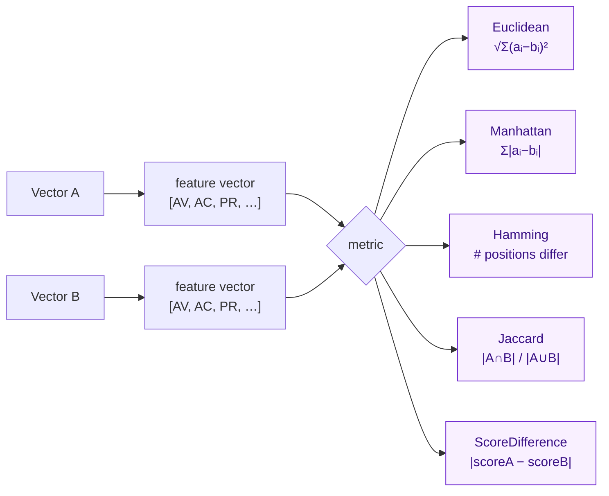

# DistanceCalculator - Vector Distance Calculator

The `DistanceCalculator` is used to calculate the distance between two CVSS vectors. It supports multiple distance algorithms and can be used for vector similarity analysis and clustering.

## How Distances Are Computed

Both vectors are projected into a numeric feature space (each metric → its score weight), then a chosen metric collapses the two feature vectors into a single number:



::: tip Distance vs similarity
Euclidean / Manhattan / Hamming / ScoreDifference return **distances** (0 = identical, larger = more different). Jaccard returns a **similarity** (1 = identical, 0 = disjoint). Pick per use case: clustering favors distances, deduplication favors similarity.
:::

::: info All metrics use base values
The distance metrics compare the **base** metric values of the two vectors. Environmental and temporal metrics are not part of the distance computation. If you need to compare scores that account for environmental modifiers, compute each vector's `GetEnvironmentalScore()` and take their absolute difference yourself.
:::

## Type Definition

`DistanceCalculator` is a struct holding two `*Cvss3x` references. Construct it with `NewDistanceCalculator` and call metric methods on a `*DistanceCalculator` receiver:

```go
type DistanceCalculator struct {
    // unexported: holds the two *Cvss3x vectors
}

func NewDistanceCalculator(vector1, vector2 *Cvss3x) *DistanceCalculator

func (dc *DistanceCalculator) EuclideanDistance() float64
func (dc *DistanceCalculator) ManhattanDistance() float64
func (dc *DistanceCalculator) HammingDistance() int
func (dc *DistanceCalculator) JaccardSimilarity() float64
func (dc *DistanceCalculator) ScoreDifference() float64
```

::: warning No `Checked` or `WithEnv` variants
The distance methods return bare `float64` (or `int` for `HammingDistance`) and have no error-returning or environment-aware variants. A nil receiver or nil vector yields a `0` result silently — validate your inputs before constructing the calculator if you need to guard against that (see [Error Handling](#error-handling)).
:::

## Creating a Calculator

### NewDistanceCalculator

```go
func NewDistanceCalculator(vector1, vector2 *Cvss3x) *DistanceCalculator
```

Creates a new distance calculator for two CVSS vectors.

**Parameters:**
- `vector1`: First CVSS vector
- `vector2`: Second CVSS vector

**Returns:**
- `*DistanceCalculator`: Distance calculator instance

**Example:**
```go
calc := cvss.NewDistanceCalculator(vector1, vector2)
```

## Distance Algorithms

### EuclideanDistance

```go
func (d *DistanceCalculator) EuclideanDistance() float64
```

Calculates the Euclidean distance between two vectors.

**Formula:**
```
distance = √(Σ(xi - yi)²)
```

**Returns:**
- `float64`: Euclidean distance (0.0 to ~3.0)

**Example:**
```go
distance := calc.EuclideanDistance()
fmt.Printf("Euclidean distance: %.3f\n", distance)
```

**Use Cases:**
- General similarity measurement
- Clustering analysis
- Vector classification

### ManhattanDistance

```go
func (d *DistanceCalculator) ManhattanDistance() float64
```

Calculates the Manhattan (L1) distance between two vectors.

**Formula:**
```
distance = Σ|xi - yi|
```

**Returns:**
- `float64`: Manhattan distance

**Example:**
```go
distance := calc.ManhattanDistance()
fmt.Printf("Manhattan distance: %.3f\n", distance)
```

**Use Cases:**
- Robust to outliers
- Grid-based analysis
- Feature importance analysis

### HammingDistance

```go
func (dc *DistanceCalculator) HammingDistance() int
```

Counts the number of metric positions at which the two vectors differ (by short value). Only metrics present on both vectors are compared.

**Formula:**
```
distance = #{ i : xi != yi }
```

**Returns:**
- `int`: Number of differing positions (0 = identical on every shared metric)

**Example:**
```go
distance := calc.HammingDistance()
fmt.Printf("Hamming distance: %d\n", distance)
```

**Use Cases:**
- Categorical difference counting
- Quick "how many metrics changed" check
- Change detection between vector revisions

### ScoreDifference

```go
func (dc *DistanceCalculator) ScoreDifference() float64
```

Returns the absolute difference between the two vectors' computed scores. Unlike the metric-wise distances, this collapses the entire vector to its score first, then takes `|scoreA − scoreB|`.

**Formula:**
```
difference = |Calculate(A) − Calculate(B)|
```

**Returns:**
- `float64`: Absolute score difference (0.0 to 10.0)

**Example:**
```go
diff := calc.ScoreDifference()
fmt.Printf("Score difference: %.3f\n", diff)
```

**Use Cases:**
- Severity-band change detection (e.g. did the score cross 9.0?)
- Prioritizing which vector edits moved the score most
- Triage: rank pairs by real-world impact delta, not metric count

### JaccardSimilarity

```go
func (d *DistanceCalculator) JaccardSimilarity() float64
```

Calculates the Jaccard similarity between two vectors.

**Formula:**
```
similarity = |A ∩ B| / |A ∪ B|
```

**Returns:**
- `float64`: Jaccard similarity (0.0 to 1.0)

**Example:**
```go
similarity := calc.JaccardSimilarity()
fmt.Printf("Jaccard similarity: %.3f\n", similarity)
```

**Use Cases:**
- Set-based comparison
- Binary feature analysis
- Overlap measurement

## Complete Examples

### Basic Distance Calculation

```go
package main

import (
    "fmt"
    "log"
    
    "github.com/scagogogo/cvss-skills/pkg/cvss"
    "github.com/scagogogo/cvss-skills/pkg/parser"
)

func main() {
    // Parse two vectors
    parser1 := parser.NewCvss3xParser("CVSS:3.1/AV:N/AC:L/PR:N/UI:N/S:U/C:H/I:H/A:H")
    vector1, err := parser1.Parse()
    if err != nil {
        log.Fatal(err)
    }
    
    parser2 := parser.NewCvss3xParser("CVSS:3.1/AV:L/AC:H/PR:H/UI:R/S:U/C:L/I:L/A:L")
    vector2, err := parser2.Parse()
    if err != nil {
        log.Fatal(err)
    }
    
    // Create distance calculator
    calc := cvss.NewDistanceCalculator(vector1, vector2)
    
    // Calculate different distances
    fmt.Printf("Vector 1: %s\n", vector1.String())
    fmt.Printf("Vector 2: %s\n", vector2.String())
    fmt.Printf("\nDistance Metrics:\n")
    fmt.Printf("  Euclidean: %.3f\n", calc.EuclideanDistance())
    fmt.Printf("  Manhattan: %.3f\n", calc.ManhattanDistance())
    fmt.Printf("  Hamming:   %d\n", calc.HammingDistance())
    fmt.Printf("  Score diff: %.3f\n", calc.ScoreDifference())
    fmt.Printf("\nSimilarity Metrics:\n")
    fmt.Printf("  Jaccard: %.3f\n", calc.JaccardSimilarity())
}
```

### Vector Clustering

```go
func clusterVectors(vectors []*cvss.Cvss3x, threshold float64) [][]int {
    var clusters [][]int
    used := make([]bool, len(vectors))
    
    for i, vector1 := range vectors {
        if used[i] {
            continue
        }
        
        cluster := []int{i}
        used[i] = true
        
        for j, vector2 := range vectors {
            if i == j || used[j] {
                continue
            }
            
            calc := cvss.NewDistanceCalculator(vector1, vector2)
            distance := calc.EuclideanDistance()
            
            if distance <= threshold {
                cluster = append(cluster, j)
                used[j] = true
            }
        }
        
        clusters = append(clusters, cluster)
    }
    
    return clusters
}

// Usage
vectors := []*cvss.Cvss3x{vector1, vector2, vector3, vector4}
clusters := clusterVectors(vectors, 0.5)

for i, cluster := range clusters {
    fmt.Printf("Cluster %d: %v\n", i+1, cluster)
}
```

### Similarity Matrix

```go
func calculateSimilarityMatrix(vectors []*cvss.Cvss3x) [][]float64 {
    n := len(vectors)
    matrix := make([][]float64, n)

    for i := range matrix {
        matrix[i] = make([]float64, n)
    }

    for i := 0; i < n; i++ {
        for j := 0; j < n; j++ {
            if i == j {
                matrix[i][j] = 1.0 // Perfect similarity with itself
            } else {
                calc := cvss.NewDistanceCalculator(vectors[i], vectors[j])
                matrix[i][j] = calc.JaccardSimilarity()
            }
        }
    }

    return matrix
}

// Usage
matrix := calculateSimilarityMatrix(vectors)

fmt.Println("Similarity Matrix:")
for i, row := range matrix {
    fmt.Printf("Vector %d: ", i+1)
    for _, sim := range row {
        fmt.Printf("%.3f ", sim)
    }
    fmt.Println()
}
```

### Nearest Neighbor Search

```go
func findNearestNeighbors(target *cvss.Cvss3x, candidates []*cvss.Cvss3x, k int) []struct {
    Index    int
    Vector   *cvss.Cvss3x
    Distance float64
} {
    type neighbor struct {
        Index    int
        Vector   *cvss.Cvss3x
        Distance float64
    }
    
    var neighbors []neighbor
    
    for i, candidate := range candidates {
        calc := cvss.NewDistanceCalculator(target, candidate)
        distance := calc.EuclideanDistance()
        
        neighbors = append(neighbors, neighbor{
            Index:    i,
            Vector:   candidate,
            Distance: distance,
        })
    }
    
    // Sort by distance
    sort.Slice(neighbors, func(i, j int) bool {
        return neighbors[i].Distance < neighbors[j].Distance
    })
    
    // Return top k neighbors
    if k > len(neighbors) {
        k = len(neighbors)
    }
    
    return neighbors[:k]
}

// Usage
neighbors := findNearestNeighbors(targetVector, candidateVectors, 3)

fmt.Printf("Top 3 nearest neighbors to %s:\n", targetVector.String())
for i, neighbor := range neighbors {
    fmt.Printf("%d. %s (distance: %.3f)\n", 
        i+1, neighbor.Vector.String(), neighbor.Distance)
}
```

### Anomaly Detection

```go
func detectAnomalies(vectors []*cvss.Cvss3x, threshold float64) []int {
    var anomalies []int
    
    for i, vector1 := range vectors {
        var totalDistance float64
        var count int
        
        for j, vector2 := range vectors {
            if i == j {
                continue
            }
            
            calc := cvss.NewDistanceCalculator(vector1, vector2)
            totalDistance += calc.EuclideanDistance()
            count++
        }
        
        avgDistance := totalDistance / float64(count)
        
        if avgDistance > threshold {
            anomalies = append(anomalies, i)
        }
    }
    
    return anomalies
}

// Usage
anomalies := detectAnomalies(vectors, 2.0)

fmt.Printf("Detected %d anomalies:\n", len(anomalies))
for _, idx := range anomalies {
    fmt.Printf("  Vector %d: %s\n", idx+1, vectors[idx].String())
}
```

## Distance Interpretation

### Distance Ranges

| Metric | Range | Interpretation |
|---------|-------|----------------|
| Euclidean | 0.0 – ~3.0 | 0.0 = identical, >2.0 = very different |
| Manhattan | 0.0 – ~8.0 | 0.0 = identical, >6.0 = very different |
| Hamming | 0 – (metric count) | 0 = no differing positions |
| ScoreDifference | 0.0 – 10.0 | 0.0 = same score, 10.0 = max score gap |
| JaccardSimilarity | 0.0 – 1.0 | 1.0 = identical sets, 0.0 = no overlap |

::: warning Ranges are approximate
The upper bounds for Euclidean/Manhattan depend on which metrics are present and their score weights. Treat the ranges as rough guides, not hard limits.
:::

### Similarity Thresholds

```go
func interpretDistance(distance float64, algorithm string) string {
    switch algorithm {
    case "euclidean":
        if distance < 0.5 {
            return "Very Similar"
        } else if distance < 1.0 {
            return "Similar"
        } else if distance < 2.0 {
            return "Somewhat Different"
        } else {
            return "Very Different"
        }
    case "jaccard":
        // jaccard is a similarity: higher = more similar
        if distance > 0.9 {
            return "Very Similar"
        } else if distance > 0.7 {
            return "Similar"
        } else if distance > 0.3 {
            return "Somewhat Different"
        } else {
            return "Very Different"
        }
    default:
        return "Unknown"
    }
}
```

## Performance Optimization

### Cached Pairwise Calculation

`DistanceCalculator` holds no mutable state, but re-deriving the same pair repeatedly wastes work. A small application-level cache keyed by the vector-pair index gives O(1) repeat lookups. Since the distance methods return bare `float64` (no error variant), validate the vectors once up front, then cache freely:

```go
// Application-level pair cache; the library does not provide one.
type pairCache struct {
    vectors []*cvss.Cvss3x
    cache   map[[2]int]float64
}

func newPairCache(vectors []*cvss.Cvss3x) (*pairCache, error) {
    // Validate once up front so cached lookups never see a bad vector.
    for _, v := range vectors {
        if v == nil {
            return nil, fmt.Errorf("nil vector in input")
        }
        if err := v.Check(); err != nil {
            return nil, fmt.Errorf("invalid vector %s: %w", v.String(), err)
        }
    }
    return &pairCache{vectors: vectors, cache: make(map[[2]int]float64)}, nil
}

// Euclidean returns the cached Euclidean distance for the pair (i, j),
// computing it on first access. Unordered: (i,j) and (j,i) share one entry.
func (c *pairCache) Euclidean(i, j int) float64 {
    if i == j {
        return 0
    }
    if i > j {
        i, j = j, i
    }
    key := [2]int{i, j}
    if d, ok := c.cache[key]; ok {
        return d
    }
    d := cvss.NewDistanceCalculator(c.vectors[i], c.vectors[j]).EuclideanDistance()
    c.cache[key] = d
    return d
}
```

### Parallel Calculation

```go
func calculateDistanceMatrixParallel(vectors []*cvss.Cvss3x) [][]float64 {
    n := len(vectors)
    matrix := make([][]float64, n)
    
    for i := range matrix {
        matrix[i] = make([]float64, n)
    }
    
    var wg sync.WaitGroup
    
    for i := 0; i < n; i++ {
        for j := i; j < n; j++ {
            wg.Add(1)
            go func(row, col int) {
                defer wg.Done()
                
                if row == col {
                    matrix[row][col] = 0.0
                } else {
                    calc := cvss.NewDistanceCalculator(vectors[row], vectors[col])
                    distance := calc.EuclideanDistance()
                    matrix[row][col] = distance
                    matrix[col][row] = distance // Symmetric matrix
                }
            }(i, j)
        }
    }
    
    wg.Wait()
    return matrix
}
```

## Best Practices

### 1. Algorithm Selection

```go
func selectBestAlgorithm(useCase string) string {
    switch useCase {
    case "clustering":
        return "euclidean"
    case "similarity":
        return "jaccard"
    case "anomaly_detection":
        return "manhattan"
    case "classification":
        return "euclidean"
    case "score_impact":
        return "score_difference"
    default:
        return "euclidean"
    }
}
```

### 2. Normalization

```go
func normalizeDistance(distance, maxDistance float64) float64 {
    if maxDistance == 0 {
        return 0
    }
    return distance / maxDistance
}
```

### 3. Error Handling

```go
func safeCalculateDistance(v1, v2 *cvss.Cvss3x) (float64, error) {
    if v1 == nil || v2 == nil {
        return 0, fmt.Errorf("vectors cannot be nil")
    }

    if err := v1.Check(); err != nil {
        return 0, fmt.Errorf("vector 1 invalid: %w", err)
    }
    if err := v2.Check(); err != nil {
        return 0, fmt.Errorf("vector 2 invalid: %w", err)
    }

    calc := cvss.NewDistanceCalculator(v1, v2)
    return calc.EuclideanDistance(), nil
}
```

## Related Documentation

- [Cvss3x Data Structure](/api/cvss/cvss3x)
- [Calculator](/api/cvss/calculator)
- [Usage Examples](/examples/distance) - Includes hierarchical clustering and parallel distance matrix
- [Vector Comparison](/examples/comparison) - Comparing vectors across a fleet
