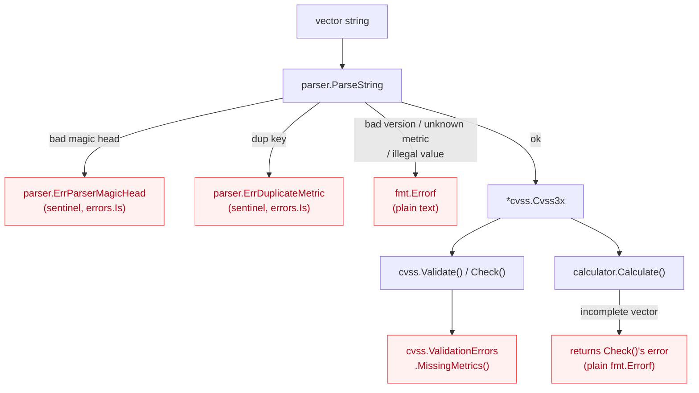
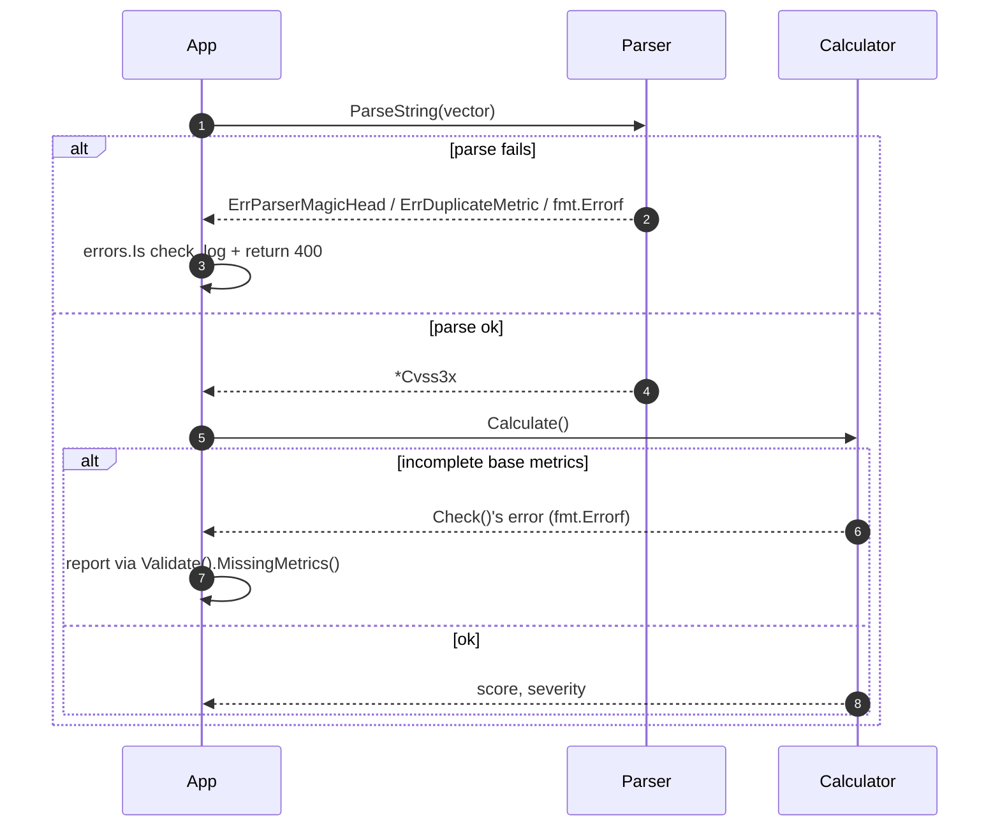

# Error Handling Guide

This guide covers the real error surfaces in CVSS Skills and the patterns for handling them robustly.

## Error Taxonomy

There is no `CVSSError` interface or `ErrorType` enum. Errors come from two places — the **parser** (sentinel errors and `fmt.Errorf`) and the **cvss package** (`ValidationError` / `ValidationErrors`). Completeness and scoring both flow through `ValidationErrors`:



## Handling Flow



## Overview

CVSS Skills error handling is intentionally plain Go — sentinel errors and structured `ValidationErrors`, no custom error interface hierarchy. The building blocks:

- **Sentinel parse errors** (`parser.ErrParserMagicHead`, `parser.ErrDuplicateMetric`) — detect with `errors.Is`
- **Plain `fmt.Errorf`** — for unsupported versions, unknown metric names, illegal metric values, and the first missing metric from `Check()`
- **`cvss.ValidationErrors`** — a slice of `*ValidationError`, each naming a metric and a message; `MissingMetrics()` lists the missing ones

## Error Types

### ValidationError / ValidationErrors

Defined in `pkg/cvss/validate.go`:

```go
// A single failed metric check.
type ValidationError struct {
    Metric  string // short name, e.g. "AV", "PR", "Version"
    Message string // human-readable description
}

func (e *ValidationError) Error() string // "metric AV: is required but not set"

// A collection of all failures from Validate() (does not short-circuit).
type ValidationErrors []*ValidationError

func (ve ValidationErrors) Error() string
func (ve ValidationErrors) MissingMetrics() []string // names of missing metrics
func (ve ValidationErrors) HasErrors() bool
func (ve ValidationErrors) Unwrap() []error          // Go 1.20+ multi-unwrap
```

`Validate()` returns `ValidationErrors`; `Check()` returns a plain `fmt.Errorf` for the *first* missing/invalid metric (it short-circuits). Prefer `Validate()` when you want the full list.

### Parse errors

The parser exports two sentinels; everything else is a `fmt.Errorf`:

```go
var ErrParserMagicHead = errors.New("cvss 3.x parser error: invalid magic head, it must equal 'CVSS'")
var ErrDuplicateMetric = errors.New("cvss 3.x parser error: duplicate metric key")
```

::: warning No *parser.ParseError type
There is no `*parser.ParseError` struct with `Position`/`Input`/`Expected` fields, and no `ErrorType` enum. Do not type-assert parse errors into such a type — use `errors.Is` for the sentinels and treat the rest as opaque `error`.
:::

### CSVReadError

Returned by the batch CSV reader (`CSVRead`), one per row that failed to parse:

```go
type CSVReadError struct {
    Row   int    // 1-based row number
    Value string // the raw field value
    Error error  // the underlying parse error
}

func (e CSVReadError) String() string // "row 3: \"...\": <error>"
```

## Error Handling Patterns

### Basic Error Handling

```go
func ProcessVector(vectorStr string) (*VectorResult, error) {
    if vectorStr == "" {
        return nil, fmt.Errorf("vector string cannot be empty")
    }
    if len(vectorStr) > 500 {
        return nil, fmt.Errorf("vector string too long")
    }

    // Parse
    vector, err := parser.ParseString(vectorStr)
    if err != nil {
        if errors.Is(err, parser.ErrParserMagicHead) {
            return nil, fmt.Errorf("not a CVSS vector (missing 'CVSS:' prefix): %w", err)
        }
        if errors.Is(err, parser.ErrDuplicateMetric) {
            return nil, fmt.Errorf("duplicate metric in vector: %w", err)
        }
        return nil, fmt.Errorf("parse failed: %w", err)
    }

    // Score — Calculate() runs Check() internally and returns its error
    calculator := cvss.NewCalculator(vector)
    score, err := calculator.Calculate()
    if err != nil {
        return nil, fmt.Errorf("cannot score vector: %w", err)
    }

    return &VectorResult{
        Vector:   vectorStr,
        Score:    score,
        Severity: calculator.GetSeverityRating(score),
    }, nil
}
```

### Reporting Missing Metrics

When a vector parses but is incomplete, surface *all* missing metrics via `Validate()`:

```go
func ReportProblems(vectorStr string) error {
    cv, err := parser.ParseString(vectorStr)
    if err != nil {
        return err
    }
    if err := cv.Validate(); err != nil {
        if ve, ok := err.(cvss.ValidationErrors); ok {
            return fmt.Errorf("vector %q is missing metrics: %v", vectorStr, ve.MissingMetrics())
        }
        return err
    }
    return nil
}
```

`errors.As` also works per-entry thanks to `ValidationErrors.Unwrap()`:

```go
var ve *cvss.ValidationError
if errors.As(err, &ve) {
    fmt.Printf("problem metric: %s (%s)\n", ve.Metric, ve.Message)
}
```

### Error Recovery

Real recovery for CVSS is limited — an unknown metric value cannot be "fixed" without changing semantics. A defensible recovery is to retry a prefix-less input with `ParseRelaxed`, or to fall back to a known-good default vector:

```go
func ProcessVectorWithRecovery(vectorStr string) (*VectorResult, error) {
    result, err := ProcessVector(vectorStr)
    if err == nil {
        return result, nil
    }

    // If it failed on the magic head, the input may simply lack the prefix
    if errors.Is(err, parser.ErrParserMagicHead) {
        if cv, relaxErr := parser.ParseRelaxed(vectorStr, "3.1"); relaxErr == nil {
            return ProcessVector(cv.String())
        }
    }

    return nil, err
}
```

::: warning Do not rewrite unknown metric values
Silently substituting `AV:X` → `AV:N` (or similar) changes the score under the user's nose. Prefer to reject and report the offending metric rather than guess.
:::

### Batch Error Handling

`parser.BatchParse` and `parser.BatchValidate` already collect per-input errors in order. For your own batch that also scores, accumulate results and errors:

```go
type BatchResult struct {
    Results []VectorResult
    Errors  []BatchError
}

type BatchError struct {
    Index  int
    Vector string
    Err    error
}

func ProcessVectorsBatch(vectors []string) *BatchResult {
    result := &BatchResult{}
    for i, vectorStr := range vectors {
        vr, err := ProcessVector(vectorStr)
        if err != nil {
            result.Errors = append(result.Errors, BatchError{Index: i, Vector: vectorStr, Err: err})
            continue
        }
        result.Results = append(result.Results, *vr)
    }
    return result
}
```

For CSV input, `cvss.ReadCSVLax` returns both the successfully parsed vectors and a `[]CSVReadError`, one per bad row — iterate the errors to report line numbers.

## HTTP Error Responses

Map the error kind to an HTTP status without inventing error interfaces:

```go
type APIError struct {
    Error   string `json:"error"`
    Details any    `json:"details,omitempty"`
}

func HandleError(w http.ResponseWriter, err error) {
    var apiErr APIError
    var status int

    switch {
    case errors.Is(err, parser.ErrParserMagicHead), errors.Is(err, parser.ErrDuplicateMetric):
        status = http.StatusBadRequest
        apiErr = APIError{Error: "malformed CVSS vector", Details: err.Error()}
    default:
        // Distinguish validation (incomplete/invalid metrics) from other errors
        var ve cvss.ValidationErrors
        if errors.As(err, &ve) {
            status = http.StatusUnprocessableEntity
            apiErr = APIError{Error: "validation failed", Details: ve.MissingMetrics()}
        } else {
            status = http.StatusInternalServerError
            apiErr = APIError{Error: "internal error", Details: err.Error()}
        }
    }

    w.Header().Set("Content-Type", "application/json")
    w.WriteHeader(status)
    json.NewEncoder(w).Encode(apiErr)
}
```

## Testing Error Conditions

Test the real error shapes — sentinels via `errors.Is`, validation via `errors.As`:

```go
func TestParseErrors(t *testing.T) {
    _, err := parser.ParseString("not-a-vector")
    assert.ErrorIs(t, err, parser.ErrParserMagicHead)

    _, err = parser.ParseString("CVSS:3.1/AV:N/AC:L/PR:N/UI:N/S:U/C:H/I:H/A:H/AV:P")
    assert.ErrorIs(t, err, parser.ErrDuplicateMetric)
}

func TestValidationReportsMissingMetrics(t *testing.T) {
    cv, err := parser.ParseString("CVSS:3.1/AV:N/AC:L/PR:N/UI:N/S:U") // missing C/I/A
    require.NoError(t, err)

    err = cv.Validate()
    require.Error(t, err)

    var ve cvss.ValidationErrors
    require.True(t, errors.As(err, &ve))
    assert.ElementsMatch(t, []string{"C", "I", "A"}, ve.MissingMetrics())
}
```

## Best Practices

### Error Handling Guidelines

1. **Use `errors.Is` / `errors.As`** — not type switches on fabricated error types. The only structured parse errors are the two sentinels; the only structured validation type is `cvss.ValidationErrors`.
2. **Prefer `Validate()` over `Check()` for user-facing reports** — it collects every problem instead of stopping at the first.
3. **Wrap with context** — `fmt.Errorf("...: %w", err)` preserves the chain for `errors.Is`/`errors.As`.
4. **Fail fast** — validate input shape before parsing; parse before scoring.
5. **Don't mask parse errors as scoring errors** — `Calculate()` returns `Check()`'s error, so a scoring failure usually means an incomplete vector, not a math bug.

### Recovery Strategies

1. **Retry with `ParseRelaxed`** when the only failure is a missing `CVSS:` prefix.
2. **Reject unknown metric values** rather than substituting defaults — silent substitution changes scores.
3. **Batch resiliently** — collect per-row errors (`CSVRead`, `BatchParse`) so one bad input doesn't abort the run.

## Related Documentation

- [Parser Reference](/api/parser/cvss3x-parser) - `ErrParserMagicHead`, `ErrDuplicateMetric`, batch helpers
- [Cvss3x Data Structure](/api/cvss/cvss3x) - `Check()` / `Validate()` / `MissingMetrics()`
- [Calculator](/api/cvss/calculator) - `Calculate()` and the scoring error path
- [Testing Guide](/api/testing) - Error testing strategies
