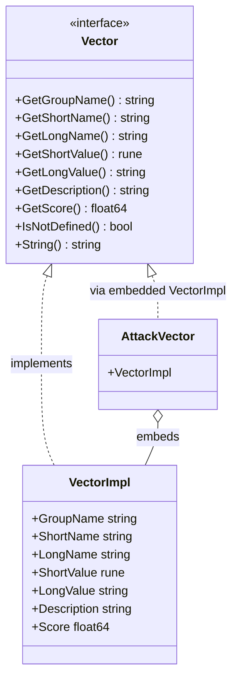

# Vector Interface

The `Vector` interface is the unified abstraction for all metrics in CVSS Skills, defining the basic behavior and properties of a metric value (e.g. Attack Vector = Network).

## Type Hierarchy

Every concrete metric value (e.g. `AttackVectorNetwork`, the "Network" value of the Attack Vector metric) implements the same `Vector` interface, so scoring and formatting code treats all metrics uniformly:



Concrete metric types (such as `AttackVector`, `AttackComplexity`, `Scope`) each embed a `*VectorImpl`, which provides all `Vector` interface methods. Pre-defined package-level variables (e.g. `AttackVectorNetwork`, `AttackVectorLocal`) are ready-to-use singletons of these types.

## Interface Definition

```go
type Vector interface {
    GetGroupName() string    // metric group: "Base Metrics", "Temporal Metrics", or "Environmental Metrics"
    GetShortName() string    // metric short name, e.g. "AV"
    GetLongName() string     // metric full name, e.g. "Attack Vector"
    GetShortValue() rune     // metric short value, e.g. 'N'
    GetLongValue() string    // metric full value, e.g. "Network"
    GetDescription() string  // metric description
    GetScore() float64       // metric score weight
    IsNotDefined() bool      // whether the value is "Not Defined" (X)
    String() string          // string representation, e.g. "AV:N"
}
```

## VectorImpl

`VectorImpl` is the concrete struct that backs every metric value. It is exported, so you can construct a `Vector` directly — though in practice you should use the [pre-defined singletons](#pre-defined-metric-singletons) or the [factory functions](#factory-functions) instead of hand-writing metric values.

```go
type VectorImpl struct {
    GroupName   string
    ShortName   string
    LongName    string
    ShortValue  rune
    LongValue   string
    Description string
    Score       float64
}
```

It implements `Vector` by value receiver. `IsNotDefined()` returns `true` when `ShortValue == 'X'`, and `String()` returns `"<ShortName>:<ShortValue>"`.

```go
v := &vector.VectorImpl{
    GroupName:   "Base Metrics",
    ShortName:   "AV",
    LongName:    "Attack Vector",
    ShortValue:  'N',
    LongValue:   "Network",
    Description: "...",
    Score:       0.85,
}
fmt.Println(v.String())        // AV:N
fmt.Println(v.IsNotDefined())  // false
```

## Concrete Metric Types

Each CVSS metric has a dedicated struct type that embeds `*VectorImpl`. The library ships these types:

| Type | Short Name | Metric | Example Singleton |
|------|-----------|--------|-------------------|
| `AttackVector` | `AV` / `MAV` | Attack Vector | `AttackVectorNetwork`, `AttackVectorLocal`, `ModifiedAttackVectorNetwork` |
| `AttackComplexity` | `AC` / `MAC` | Attack Complexity | `AttackComplexityLow`, `AttackComplexityHigh` |
| `PrivilegesRequired` | `PR` / `MPR` | Privileges Required | `PrivilegesRequiredNone`, `PrivilegesRequiredLow` |
| `UserInteraction` | `UI` / `MUI` | User Interaction | `UserInteractionNone`, `UserInteractionRequired` |
| `Scope` | `S` / `MS` | Scope | `ScopeUnchanged`, `ScopeChanged` |
| `Confidentiality` | `C` / `MC` | Confidentiality | `ConfidentialityHigh`, `ConfidentialityLow` |
| `Integrity` | `I` / `MI` | Integrity | `IntegrityHigh`, `IntegrityLow` |
| `Availability` | `A` / `MA` | Availability | `AvailabilityHigh`, `AvailabilityLow` |
| `ExploitCodeMaturity` | `E` | Exploit Code Maturity | `ExploitCodeMaturityFunctional`, `ExploitCodeMaturityHigh` |
| `RemediationLevel` | `RL` | Remediation Level | `RemediationLevelOfficialFix`, `RemediationLevelUnavailable` |
| `ReportConfidence` | `RC` | Report Confidence | `ReportConfidenceConfirmed`, `ReportConfidenceReasonable` |
| `ConfidentialityRequirement` | `CR` | Confidentiality Requirement | `ConfidentialityRequirementHigh`, `ConfidentialityRequirementMedium` |
| `IntegrityRequirement` | `IR` | Integrity Requirement | `IntegrityRequirementHigh`, `IntegrityRequirementMedium` |
| `AvailabilityRequirement` | `AR` | Availability Requirement | `AvailabilityRequirementHigh`, `AvailabilityRequirementMedium` |

Each type follows the same shape:

```go
type AttackVector struct {
    *VectorImpl
}
```

::: tip Types vs singletons
`AttackVector` is the **type** (it embeds `*VectorImpl`). `AttackVectorNetwork` is a **pre-defined variable** of type `*AttackVector` holding the "Network" value. Do not confuse the two: `&vector.AttackVector{}` (zero value, empty `VectorImpl`) is rarely what you want — use the singletons.
:::

### Pre-defined Metric Singletons

Every legal metric value has a ready-to-use package-level variable. They are the canonical way to reference a metric value, and they are what the factory functions return.

```go
av := vector.AttackVectorNetwork
fmt.Printf("%s\n", av.String())        // AV:N
fmt.Printf("%.2f\n", av.GetScore())    // 0.85
fmt.Printf("%s\n", av.GetGroupName())  // Base Metrics
```

Modified (environmental) values and "Not Defined" (`X`) variants are also exposed as singletons, e.g. `ModifiedAttackVectorNetwork`, `AttackVectorNotDefined`:

```go
nd := vector.AttackVectorNotDefined
fmt.Printf("%v\n", nd.IsNotDefined())  // true
fmt.Printf("%.2f\n", nd.GetScore())    // 1.0
```

## Factory Functions

Rather than referencing singletons by name, use the factory functions to resolve a metric from its short name and value. These return a `(Vector, error)` — the error is non-nil for an unknown metric name or an illegal value.

### GetVectorByShortName

```go
func GetVectorByShortName(shortName string, value string) (Vector, error)
```

Resolves any metric by its short name and single-character value. `value` must be exactly one character.

**Parameters:**
- `shortName`: Metric short name, e.g. `"AV"`, `"MAV"`, `"E"`, `"CR"`
- `value`: Metric short value as a 1-character string, e.g. `"N"`, `"X"`

**Returns:**
- `(Vector, error)`: The metric value, or an error if the name/value is unknown or `value` is not a single character.

**Example:**
```go
v, err := vector.GetVectorByShortName("AV", "N")
if err != nil {
    log.Fatal(err)
}
fmt.Println(v.String())  // AV:N
```

### Per-metric Factories

Each metric has its own factory taking the short value as a `rune`:

| Function | Signature |
|----------|-----------|
| `GetAttackVector` | `(shortValue rune) (Vector, error)` |
| `GetAttackComplexity` | `(shortValue rune) (Vector, error)` |
| `GetPrivilegesRequired` | `(shortValue rune) (Vector, error)` |
| `GetUserInteraction` | `(shortValue rune) (Vector, error)` |
| `GetScope` | `(shortValue rune) (Vector, error)` |
| `GetConfidentiality` | `(shortValue rune) (Vector, error)` |
| `GetIntegrity` | `(shortValue rune) (Vector, error)` |
| `GetAvailability` | `(shortValue rune) (Vector, error)` |
| `GetExploitCodeMaturity` | `(shortValue rune) (Vector, error)` |
| `GetRemediationLevel` | `(shortValue rune) (Vector, error)` |
| `GetReportConfidence` | `(shortValue rune) (Vector, error)` |
| `GetConfidentialityRequirement` | `(shortValue rune) (Vector, error)` |
| `GetIntegrityRequirement` | `(shortValue rune) (Vector, error)` |
| `GetAvailabilityRequirement` | `(shortValue rune) (Vector, error)` |
| `GetModifiedAttackVector` | `(shortValue rune) (Vector, error)` |
| `GetModifiedAttackComplexity` | `(shortValue rune) (Vector, error)` |
| `GetModifiedPrivilegesRequired` | `(shortValue rune) (Vector, error)` |
| `GetModifiedUserInteraction` | `(shortValue rune) (Vector, error)` |
| `GetModifiedScope` | `(shortValue rune) (Vector, error)` |
| `GetModifiedConfidentiality` | `(shortValue rune) (Vector, error)` |
| `GetModifiedIntegrity` | `(shortValue rune) (Vector, error)` |
| `GetModifiedAvailability` | `(shortValue rune) (Vector, error)` |

```go
e, err := vector.GetExploitCodeMaturity('F')
if err != nil {
    log.Fatal(err)
}
fmt.Printf("%s\n", e.String())        // E:F
fmt.Printf("%s\n", e.GetGroupName())  // Temporal Metrics
fmt.Printf("%.2f\n", e.GetScore())    // 0.97
```

## Method Details

### GetGroupName

```go
GetGroupName() string
```

Returns the group the metric belongs to.

**Returns:**
- `string`: One of `"Base Metrics"`, `"Temporal Metrics"`, `"Environmental Metrics"`

**Example:**
```go
av := vector.AttackVectorNetwork
fmt.Printf("Group: %s\n", av.GetGroupName()) // Base Metrics
```

### GetShortName

```go
GetShortName() string
```

Returns the short name (abbreviation) of the metric.

**Returns:**
- `string`: e.g. `"AV"`, `"E"`, `"MAV"`

**Example:**
```go
av := vector.AttackVectorNetwork
fmt.Printf("Short name: %s\n", av.GetShortName()) // AV
```

### GetLongName

```go
GetLongName() string
```

Returns the full name of the metric.

**Returns:**
- `string`: e.g. `"Attack Vector"`, `"Exploit Code Maturity"`

**Example:**
```go
av := vector.AttackVectorNetwork
fmt.Printf("Long name: %s\n", av.GetLongName()) // Attack Vector
```

### GetShortValue

```go
GetShortValue() rune
```

Returns the short value (single character) of the metric.

**Returns:**
- `rune`: e.g. `'N'`, `'F'`, `'X'`

**Example:**
```go
av := vector.AttackVectorNetwork
fmt.Printf("Short value: %c\n", av.GetShortValue()) // N
```

### GetLongValue

```go
GetLongValue() string
```

Returns the full value description of the metric.

**Returns:**
- `string`: e.g. `"Network"`, `"Functional"`, `"Not Defined"`

**Example:**
```go
av := vector.AttackVectorNetwork
fmt.Printf("Long value: %s\n", av.GetLongValue()) // Network
```

### GetDescription

```go
GetDescription() string
```

Returns the detailed description of the metric value, as defined by the CVSS specification.

**Returns:**
- `string`: The metric description

**Example:**
```go
av := vector.AttackVectorNetwork
fmt.Printf("Description: %s\n", av.GetDescription())
// "The vulnerable component is bound to the network stack..."
```

### GetScore

```go
GetScore() float64
```

Returns the numerical score weight of the metric value used in CVSS calculations. For "Not Defined" (`X`) values the score is `1.0` (a multiplicative no-op).

**Returns:**
- `float64`: Metric score weight (typically between 0.0 and 1.0)

**Example:**
```go
av := vector.AttackVectorNetwork
fmt.Printf("Score: %.2f\n", av.GetScore()) // 0.85
```

::: warning Privileges Required is scope-dependent
`PrivilegesRequired.GetScore()` returns the **Scope-Unchanged** weight. The real CVSS score for PR depends on whether Scope is Changed. Use [`GetPrivilegesRequiredScore`](#getprivilegesrequiredscore) to get the correct weight for a given scope.
:::

### IsNotDefined

```go
IsNotDefined() bool
```

Returns whether this metric value is "Not Defined" (`X`). "Not Defined" means the metric should not modify the base metric value; its score is `1.0`.

**Returns:**
- `bool`: `true` if `ShortValue == 'X'`

**Example:**
```go
nd := vector.AttackVectorNotDefined
fmt.Printf("Is not defined: %v\n", nd.IsNotDefined()) // true

av := vector.AttackVectorNetwork
fmt.Printf("Is not defined: %v\n", av.IsNotDefined()) // false
```

### String

```go
String() string
```

Returns the string representation of the metric in CVSS vector format (`<ShortName>:<ShortValue>`).

**Returns:**
- `string`: e.g. `"AV:N"`, `"E:F"`

**Example:**
```go
av := vector.AttackVectorNetwork
fmt.Printf("String: %s\n", av.String()) // AV:N
```

## Scoring Helpers

A few metrics have score weights that depend on context (other metrics or the CVSS minor version). The package exposes dedicated helper functions for these — do not rely on `GetScore()` alone for them.

### GetPrivilegesRequiredScore

```go
func GetPrivilegesRequiredScore(pr Vector, scopeChanged bool) float64
```

Returns the correct Privileges Required weight for the given scope. PR is the only base metric whose weight depends on whether Scope is Changed.

**Parameters:**
- `pr`: The PR (or MPR) `Vector`
- `scopeChanged`: Whether Scope (or Modified Scope) is Changed

**Returns:**
- `float64`: The PR score weight. Returns `1.0` if `pr` is `nil` or `Not Defined` (`X`).

**Example:**
```go
pr, _ := vector.GetPrivilegesRequired('L')
fmt.Printf("%.2f\n", vector.GetPrivilegesRequiredScore(pr, false)) // 0.62
fmt.Printf("%.2f\n", vector.GetPrivilegesRequiredScore(pr, true))  // 0.68
```

### GetUserInteractionScore

```go
func GetUserInteractionScore(ui Vector, minorVersion int) float64
```

Returns the User Interaction weight. UI scoring differs slightly between CVSS 3.0 and 3.1, so the minor version is required.

**Parameters:**
- `ui`: The UI (or MUI) `Vector`
- `minorVersion`: The CVSS minor version (`0` for 3.0, `1` for 3.1)

**Returns:**
- `float64`: The UI score weight. Returns `1.0` if `ui` is `nil` or `Not Defined` (`X`).

**Example:**
```go
ui, _ := vector.GetUserInteraction('R')
fmt.Printf("%.2f\n", vector.GetUserInteractionScore(ui, 1)) // 0.62 (CVSS 3.1)
```

### IsScopeChanged

```go
func IsScopeChanged(scope Vector) bool
```

Returns whether the given Scope vector is Changed. Returns `false` if `scope` is `nil` or its value is not `'C'`.

**Example:**
```go
scope, _ := vector.GetScope('C')
fmt.Printf("%v\n", vector.IsScopeChanged(scope)) // true
```

### IsModifiedScopeChanged

```go
func IsModifiedScopeChanged(modifiedScope Vector, baseScope Vector) bool
```

Returns whether Modified Scope is Changed. If `modifiedScope` is `nil` or `Not Defined` (`X`), it falls back to `IsScopeChanged(baseScope)`.

**Example:**
```go
ms, _ := vector.GetModifiedScope('X')
base, _ := vector.GetScope('C')
fmt.Printf("%v\n", vector.IsModifiedScopeChanged(ms, base)) // true (falls back to base)
```

## Interface Usage Patterns

### Generic Vector Processing

```go
func processVector(v vector.Vector) {
    fmt.Printf("Processing %s metric\n", v.GetLongName())
    fmt.Printf("  Group: %s\n", v.GetGroupName())
    fmt.Printf("  Value: %s (%c)\n", v.GetLongValue(), v.GetShortValue())
    fmt.Printf("  Score: %.3f\n", v.GetScore())
    fmt.Printf("  Not defined: %v\n", v.IsNotDefined())
    fmt.Printf("  Vector: %s\n", v.String())
}

// Usage
processVector(vector.AttackVectorNetwork)
```

### Vector Collection Processing

```go
func processVectorCollection(vectors []vector.Vector) {
    for i, v := range vectors {
        fmt.Printf("Vector %d:\n", i+1)
        processVector(v)
        fmt.Println()
    }
}

// Usage
vectors := []vector.Vector{
    vector.AttackVectorNetwork,
    vector.AttackComplexityLow,
    vector.ConfidentialityHigh,
}
processVectorCollection(vectors)
```

### Vector Validation

```go
func validateVector(v vector.Vector) error {
    if v == nil {
        return fmt.Errorf("vector is nil")
    }
    if v.GetShortName() == "" {
        return fmt.Errorf("metric short name cannot be empty")
    }
    if v.GetShortValue() == 0 {
        return fmt.Errorf("metric short value cannot be empty")
    }
    if v.GetLongValue() == "" {
        return fmt.Errorf("metric long value cannot be empty")
    }
    return nil
}

// Usage
if err := validateVector(vector.AttackVectorNetwork); err != nil {
    log.Printf("Validation failed: %v", err)
}
```

### Vector Comparison by Score

```go
func compareVectors(v1, v2 vector.Vector) int {
    score1 := v1.GetScore()
    score2 := v2.GetScore()

    if score1 < score2 {
        return -1
    } else if score1 > score2 {
        return 1
    }
    return 0
}

// Usage
av1 := vector.AttackVectorNetwork // 0.85
av2 := vector.AttackVectorLocal   // 0.55

result := compareVectors(av1, av2)
switch result {
case -1:
    fmt.Printf("%s has lower score than %s\n", av1.GetLongValue(), av2.GetLongValue())
case 1:
    fmt.Printf("%s has higher score than %s\n", av1.GetLongValue(), av2.GetLongValue())
case 0:
    fmt.Printf("%s has same score as %s\n", av1.GetLongValue(), av2.GetLongValue())
}
```

## Best Practices

### 1. Prefer singletons and factories over hand-constructed values

The pre-defined singletons and factory functions encode the entire CVSS specification — every legal value, its score, and its description. Constructing a `VectorImpl` by hand risks typos and out-of-spec values.

```go
// Good: canonical, validated against the spec
av, err := vector.GetAttackVector('N')

// Good: direct reference to a known singleton
av := vector.AttackVectorNetwork

// Avoid: hand-rolled, no validation, easy to get wrong
av := &vector.VectorImpl{ShortName: "AV", ShortValue: 'N', /* ... */}
```

### 2. Use IsNotDefined to short-circuit environmental modifiers

When applying a modified (environmental) metric, check `IsNotDefined()` first — a value of `X` means "do not modify the base metric" and its score is the no-op `1.0`.

```go
func applyModified(base, modified vector.Vector) vector.Vector {
    if modified != nil && !modified.IsNotDefined() {
        return modified
    }
    return base
}
```

### 3. Use the scope-aware helper for Privileges Required

Because PR's weight depends on Scope, always use `GetPrivilegesRequiredScore` when scoring — never `pr.GetScore()` directly.

```go
score := vector.GetPrivilegesRequiredScore(pr, vector.IsScopeChanged(scope))
```

### 4. Guard against nil

Interface methods on a `nil` `Vector` will panic. The scoring helpers (`GetPrivilegesRequiredScore`, `GetUserInteractionScore`, `IsScopeChanged`) tolerate `nil` and return safe defaults, but direct method calls do not — check for `nil` first when a metric may be absent.

```go
func safeGetScore(v vector.Vector) (float64, error) {
    if v == nil {
        return 0, fmt.Errorf("vector is nil")
    }
    return v.GetScore(), nil
}
```

## Related Documentation

- [vector Package Overview](/api/vector/)
- [Cvss3x Data Structure](/api/cvss/cvss3x)
- [Calculator](/api/cvss/calculator)
- [Parser Implementation](/api/parser/cvss3x-parser)
- [Usage Examples](/examples/basic)
