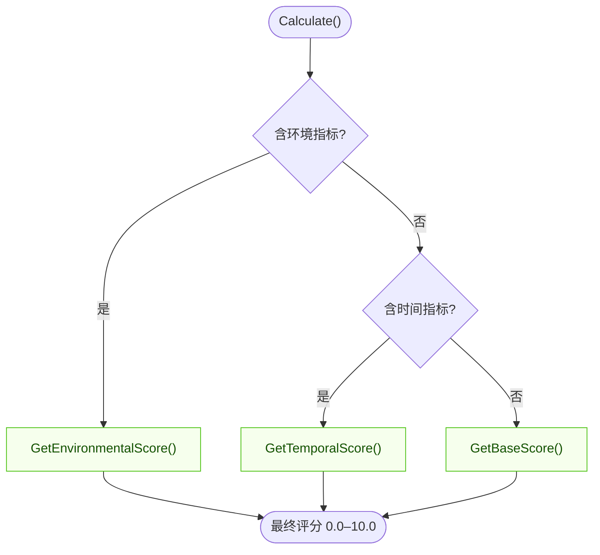
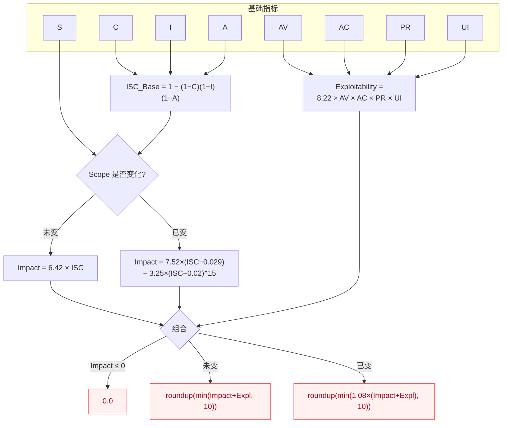

# Calculator 计算器

`Calculator` 是 CVSS Skills 中用于计算 CVSS 评分的核心组件。它提供了完整的 CVSS 3.x 评分计算功能，包括基础评分、时间评分和环境评分。

## `Calculate()` 如何选择评分

`Calculate()` 会检查向量包含哪些指标组，返回可用的最具体评分 —— 环境 > 时间 > 基础：



::: info 内部原理
`Calculate()` 内部分发到与公开方法 `GetBaseScore()`、`GetTemporalScore()`、`GetEnvironmentalScore()` 相同的私有例程。分发顺序为：环境 → 时间 → 基础。
:::

## 基础评分公式（CVSS v3.1）

基础评分由两个子分 —— 影响子分（Impact）与可利用性子分（Exploitability）—— 组合而成，组合方式取决于影响范围 `S` 是否变化：



::: tip 版本差异
`PR` 与 `UI` 的取值权重在 v3.0 与 v3.1 之间不同（例如 `UI:R` 在 v3.0 为 0.56，v3.1 为 0.62）。计算器具备版本感知能力，会根据解析出的 `CVSS:3.0` / `CVSS:3.1` 前缀自动套用正确的权重表。
:::

## 类型定义

`Calculator` 是一个结构体，内部持有已解析的 `*Cvss3x` 向量。通过 `NewCalculator` 构造，评分方法定义在 `*Calculator` 接收者上：

```go
type Calculator struct {
    // 非导出：持有传入 NewCalculator 的 *Cvss3x
}

func NewCalculator(cvss *Cvss3x) *Calculator

func (c *Calculator) Calculate() (float64, error)
func (c *Calculator) GetBaseScore() (float64, error)
func (c *Calculator) GetTemporalScore() (float64, error)
func (c *Calculator) GetEnvironmentalScore() (float64, error)
func (c *Calculator) GetSeverityRating(score float64) Severity
```

::: warning 不可跨向量重用
`Calculator` 只持有一个 `*Cvss3x`，且不提供 setter。请为每个向量新建 `Calculator` —— 构造开销极低。
:::

## 创建计算器

### NewCalculator

```go
func NewCalculator(cvss *Cvss3x) *Calculator
```

创建一个绑定到指定向量的新计算器。

**参数：**
- `cvss`: 已解析的 CVSS 3.x 向量（`*Cvss3x`）

**返回值：**
- `*Calculator`: 计算器实例

**示例：**
```go
calculator := cvss.NewCalculator(cvssVector)
```

## 主要方法

### Calculate

```go
func (c *Calculator) Calculate() (float64, error)
```

计算最终的 CVSS 评分。根据向量中包含的指标类型，自动选择合适的计算方法：
- 仅基础指标：返回基础评分
- 包含时间指标：返回时间评分
- 包含环境指标：返回环境评分

**返回值：**
- `float64`: CVSS 评分 (0.0-10.0)
- `error`: 计算错误

**示例：**
```go
score, err := calculator.Calculate()
if err != nil {
    log.Fatalf("计算失败: %v", err)
}
fmt.Printf("CVSS 评分: %.1f\n", score)
```

### GetBaseScore

```go
func (c *Calculator) GetBaseScore() (float64, error)
```

计算 CVSS 基础评分，仅基于基础指标。

**计算公式：**
```
如果 (影响子分 <= 0)
    基础评分 = 0
否则
    如果 (范围 == 不变)
        基础评分 = 向上取整(最小值((影响 + 可利用性), 10))
    否则
        基础评分 = 向上取整(最小值(1.08 × (影响 + 可利用性), 10))
```

**示例：**
```go
baseScore, err := calculator.GetBaseScore()
if err != nil {
    log.Fatalf("基础评分计算失败: %v", err)
}
fmt.Printf("基础评分: %.1f\n", baseScore)
```

### GetTemporalScore

```go
func (c *Calculator) GetTemporalScore() (float64, error)
```

计算时间评分，基于基础评分和时间指标（`E`、`RL`、`RC`）。

**计算公式：**
```
时间评分 = 向上取整(基础评分 × 利用代码成熟度 × 修复级别 × 报告置信度)
```

**示例：**
```go
temporalScore, err := calculator.GetTemporalScore()
if err != nil {
    log.Fatalf("时间评分计算失败: %v", err)
}
fmt.Printf("时间评分: %.1f\n", temporalScore)
```

### GetEnvironmentalScore

```go
func (c *Calculator) GetEnvironmentalScore() (float64, error)
```

计算环境评分，基于修改后的基础指标和环境需求指标。

**计算公式：**
```
修改后影响 = 最小值(1 - [(1-机密性需求×修改后机密性影响) × (1-完整性需求×修改后完整性影响) × (1-可用性需求×修改后可用性影响)], 0.915)

修改后可利用性 = 8.22 × 修改后攻击向量 × 修改后攻击复杂性 × 修改后权限要求 × 修改后用户交互

如果 (修改后影响 <= 0)
    环境评分 = 0
否则
    如果 (修改后范围 == 不变)
        环境评分 = 向上取整(向上取整(最小值((修改后影响 + 修改后可利用性), 10)) × 利用代码成熟度 × 修复级别 × 报告置信度)
    否则
        环境评分 = 向上取整(向上取整(最小值(1.08 × (修改后影响 + 修改后可利用性), 10)) × 利用代码成熟度 × 修复级别 × 报告置信度)
```

**示例：**
```go
envScore, err := calculator.GetEnvironmentalScore()
if err != nil {
    log.Fatalf("环境评分计算失败: %v", err)
}
fmt.Printf("环境评分: %.1f\n", envScore)
```

### GetSeverityRating

```go
func (c *Calculator) GetSeverityRating(score float64) Severity
```

根据 CVSS 评分获取对应的严重性等级。`Severity` 是以 `string` 为底层类型的类型，并实现了 `String()` 方法，因此可直接用 `%s` 打印。

**评分范围和等级：**

| 评分范围 | 严重性等级 | 英文 |
|----------|------------|------|
| 0.0 | 无 | None |
| 0.1-3.9 | 低危 | Low |
| 4.0-6.9 | 中危 | Medium |
| 7.0-8.9 | 高危 | High |
| 9.0-10.0 | 严重 | Critical |

**示例：**
```go
score := 7.5
severity := calculator.GetSeverityRating(score)
fmt.Printf("评分 %.1f 对应严重性: %s\n", score, severity) // "High"
```

## 完整示例

### 基本使用

```go
package main

import (
    "fmt"
    "log"
    
    "github.com/scagogogo/cvss-skills/pkg/cvss"
    "github.com/scagogogo/cvss-skills/pkg/parser"
)

func main() {
    // 解析 CVSS 向量
    vectorStr := "CVSS:3.1/AV:N/AC:L/PR:N/UI:N/S:U/C:H/I:H/A:H"
    p := parser.NewCvss3xParser(vectorStr)
    vector, err := p.Parse()
    if err != nil {
        log.Fatalf("解析失败: %v", err)
    }
    
    // 创建计算器
    calculator := cvss.NewCalculator(vector)

    // 计算各种评分
    baseScore, err := calculator.GetBaseScore()
    if err != nil {
        log.Fatalf("基础评分计算失败: %v", err)
    }
    
    finalScore, err := calculator.Calculate()
    if err != nil {
        log.Fatalf("最终评分计算失败: %v", err)
    }
    
    severity := calculator.GetSeverityRating(finalScore)
    
    // 输出结果
    fmt.Printf("CVSS 向量: %s\n", vectorStr)
    fmt.Printf("基础评分: %.1f\n", baseScore)
    fmt.Printf("最终评分: %.1f\n", finalScore)
    fmt.Printf("严重性等级: %s\n", severity)
}
```

### 批量计算

```go
func calculateBatch(vectors []string) {
    for _, vectorStr := range vectors {
        p := parser.NewCvss3xParser(vectorStr)
        vector, err := p.Parse()
        if err != nil {
            fmt.Printf("解析失败 %s: %v\n", vectorStr, err)
            continue
        }
        
        calculator := cvss.NewCalculator(vector)
        score, err := calculator.Calculate()
        if err != nil {
            fmt.Printf("计算失败 %s: %v\n", vectorStr, err)
            continue
        }
        
        severity := calculator.GetSeverityRating(score)
        fmt.Printf("%s -> %.1f (%s)\n", vectorStr, score, severity)
    }
}
```

### 详细分析

```go
func detailedAnalysis(vectorStr string) {
    p := parser.NewCvss3xParser(vectorStr)
    vector, err := p.Parse()
    if err != nil {
        log.Fatalf("解析失败: %v", err)
    }
    
    calculator := cvss.NewCalculator(vector)
    
    // 计算所有类型的评分
    baseScore, _ := calculator.GetBaseScore()

    var temporalScore, envScore float64

    // 检查是否有时间指标
    if vector.Cvss3xTemporal != nil {
        temporalScore, _ = calculator.GetTemporalScore()
    }

    // 检查是否有环境指标
    if vector.Cvss3xEnvironmental != nil {
        envScore, _ = calculator.GetEnvironmentalScore()
    }
    
    finalScore, _ := calculator.Calculate()
    severity := calculator.GetSeverityRating(finalScore)
    
    fmt.Printf("=== CVSS 评分分析 ===\n")
    fmt.Printf("向量: %s\n", vectorStr)
    fmt.Printf("基础评分: %.1f\n", baseScore)
    
    if temporalScore > 0 {
        fmt.Printf("时间评分: %.1f\n", temporalScore)
    }
    
    if envScore > 0 {
        fmt.Printf("环境评分: %.1f\n", envScore)
    }
    
    fmt.Printf("最终评分: %.1f\n", finalScore)
    fmt.Printf("严重性等级: %s\n", severity)
}
```

## 错误处理

`Calculate()` 在向量不完整或非法时返回普通 `error`（内部执行 `Cvss3x.Check()`，后者以字符串形式报告第一个缺失的指标）。若需要逐指标的结构化诊断，请先调用 `Validate()` —— 它返回 `ValidationErrors`，即 `*ValidationError` 的切片，每项含 `Metric` 与 `Message` 字段：

```go
// 评分前进行结构化校验
if err := vector.Validate(); err != nil {
    if ve, ok := err.(cvss.ValidationErrors); ok {
        for _, e := range ve {
            fmt.Printf("指标 %s: %s\n", e.Metric, e.Message)
        }
        fmt.Printf("缺失指标: %v\n", ve.MissingMetrics())
    } else {
        fmt.Printf("校验错误: %v\n", err)
    }
    return
}

// 此时可安全评分
score, err := calculator.Calculate()
if err != nil {
    fmt.Printf("计算错误: %v\n", err) // 例如 "calculator or cvss is nil"
    return
}
```

::: tip Check() 与 Validate() 的区别
`Check()`（`Calculate()` 内部使用）返回单个 `error`，只描述第一个问题；`Validate()` 将所有问题收集到 `ValidationErrors`。当你希望一次性报告全部缺失指标时，应使用 `Validate()`。
:::

### 验证向量

```go
func validateVector(vector *cvss.Cvss3x) error {
    // 检查基础指标是否完整
    if vector.Cvss3xBase.AttackVector == nil {
        return fmt.Errorf("缺少攻击向量指标")
    }
    
    if vector.Cvss3xBase.AttackComplexity == nil {
        return fmt.Errorf("缺少攻击复杂性指标")
    }
    
    // ... 检查其他必需指标
    
    return nil
}
```

## 性能优化

### 按向量新建计算器

`Calculator` 不持有可复用的内部状态，也无 setter，因此对每个向量都应新建一个实例。构造本身只做一次指针赋值，开销极低：

```go
// 批量评分：为每个向量新建 Calculator
for _, vector := range vectors {
    calculator := cvss.NewCalculator(vector)
    score, err := calculator.Calculate()
    if err != nil {
        continue
    }

    // 处理评分...
}
```

### 并发计算

```go
func concurrentCalculation(vectors []*cvss.Cvss3x) []float64 {
    results := make([]float64, len(vectors))
    var wg sync.WaitGroup
    
    for i, vector := range vectors {
        wg.Add(1)
        go func(index int, v *cvss.Cvss3x) {
            defer wg.Done()
            
            calculator := cvss.NewCalculator(v)
            score, err := calculator.Calculate()
            if err != nil {
                results[index] = 0
                return
            }
            
            results[index] = score
        }(i, vector)
    }
    
    wg.Wait()
    return results
}
```

## 相关文档

- [Cvss3x 数据结构](/zh/api/cvss/cvss3x)
- [DistanceCalculator 距离计算](/zh/api/cvss/distance)
- [使用示例](/zh/examples/basic)
- [CVSS 规范](https://www.first.org/cvss/v3.1/specification-document)
