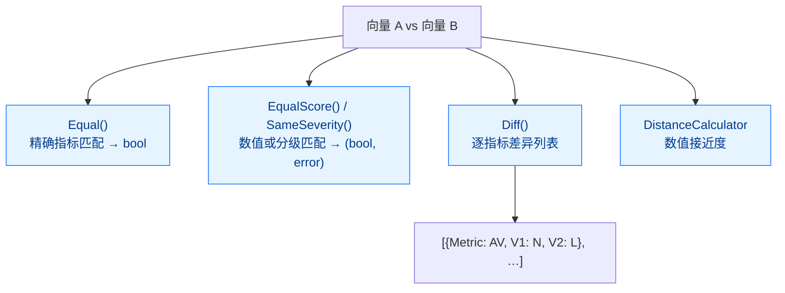

# 向量比较 API

CVSS Skills 通过 `Cvss3x` 自身的方法比较向量——没有独立的比较器类型。比较表面跨四个粒度层级，从单个布尔值到完整的逐指标明细。

## 比较维度

两个向量可以在四个粒度层级上比较——从单个布尔值到完整的逐指标明细：



| 问题 | 方法 | 返回 |
|------|------|------|
| 两个向量是否逐指标完全相同？ | `Equal(other)` | `bool` |
| 是否产生相同的基础分数？ | `EqualScore(other)` | `(bool, error)` |
| 是否落在同一严重性分级？ | `SameSeverity(other)` | `(bool, error)` |
| 具体哪些指标不同？ | `Diff(other)` | `[]DiffEntry` |
| 数值上有多接近？ | `NewDistanceCalculator(a, b)` | 距离 / 相似度 |
| 合并两个向量的指标？ | `Merge(other)` | `*Cvss3x` |

## DiffEntry

`Diff()` 返回 `DiffEntry` 的切片，两个向量间短值不同的每个指标一条：

```go
type DiffEntry struct {
    Metric string // 短名，例如 "AV"、"PR"
    V1     string // 向量 A 的短值，例如 "N"
    V2     string // 向量 B 的短值，例如 "L"
    V1Long string // 向量 A 的长值，例如 "Network"
    V2Long string // 向量 B 的长值，例如 "Local"
}

func (d DiffEntry) String() string // "AV: N vs L"
```

::: tip Diff 只报告已设置且不同的指标
`Diff` 遍历两个向量上都存在的指标，在每个短值不一致的位置产生一条记录。某一边缺失的指标不会被报告为差异——用 `MissingMetrics()` 来检测缺失。
:::

## 方法

### Equal

```go
func (x *Cvss3x) Equal(other *Cvss3x) bool
```

报告两个向量在版本、基础、时间和环境指标上是否完全相同。`nil` 接收者只与 `nil` 参数比较相等。

**返回：**
- `bool`：每个指标组都精确匹配时为 `true`

**示例：**
```go
if v1.Equal(v2) {
    fmt.Println("向量完全相同")
}
```

### EqualScore

```go
func (x *Cvss3x) EqualScore(other *Cvss3x) (bool, error)
```

报告两个向量是否产生相同的**基础分数**。指标不同的两个向量可能分数相同（例如不同的 AV/AC 组合最终得到相同的 Exploitability）。

**返回：**
- `bool`：两者的 `GetBaseScore()` 相等时为 `true`
- `error`：任一向量无法评分（基础指标不完整/无效）时非 nil

**示例：**
```go
same, err := v1.EqualScore(v2)
if err != nil {
    log.Fatalf("无法比较分数: %v", err)
}
fmt.Printf("基础分数相同: %t\n", same)
```

### SameSeverity

```go
func (x *Cvss3x) SameSeverity(other *Cvss3x) (bool, error)
```

报告两个向量是否落在同一**严重性分级**（None / Low / Medium / High / Critical）。比 `EqualScore` 更粗——7.1 和 8.9 是不同的分数但同一严重性（High）。

**返回：**
- `bool`：两个向量的基础分数映射到同一严重性时为 `true`
- `error`：任一向量无法评分时非 nil

**示例：**
```go
same, err := v1.SameSeverity(v2)
if err != nil {
    log.Fatal(err)
}
fmt.Printf("同一严重性分级: %t\n", same)
```

### Diff

```go
func (x *Cvss3x) Diff(other *Cvss3x) []DiffEntry
```

返回两个向量间短值不同的每个指标一条 `DiffEntry`。

**返回：**
- `[]DiffEntry`：不同的指标（完全相同时为空；任一接收者为 nil 时为 `nil`）

**示例：**
```go
for _, d := range v1.Diff(v2) {
    fmt.Printf("  %s: %s vs %s\n", d.Metric, d.V1, d.V2)
}
```

### Merge

```go
func (x *Cvss3x) Merge(other *Cvss3x) *Cvss3x
```

返回一个组合了 `x` 与 `other` 的新 `*Cvss3x`：对每个指标，如果 `other` 已设置，结果取 `other` 的值；否则保留 `x` 的值。这就是你把一个向量的时间/环境指标叠加到基础向量上的方式。接收者不会被修改。

**返回：**
- `*Cvss3x`：合并后的向量

**示例：**
```go
// baseOnly 只有 8 个基础指标；temporalOnly 有 E/RL/RC
combined := baseOnly.Merge(temporalOnly)
fmt.Println(combined.String()) // 基础 + 时间
```

## 完整示例

```go
package main

import (
    "fmt"
    "log"

    "github.com/scagogogo/cvss-skills/pkg/cvss"
    "github.com/scagogogo/cvss-skills/pkg/parser"
)

func main() {
    v1, err := parser.ParseString("CVSS:3.1/AV:N/AC:L/PR:N/UI:N/S:U/C:H/I:H/A:H")
    if err != nil {
        log.Fatal(err)
    }
    v2, err := parser.ParseString("CVSS:3.1/AV:L/AC:H/PR:H/UI:R/S:U/C:L/I:L/A:L")
    if err != nil {
        log.Fatal(err)
    }

    // 相等性
    fmt.Printf("Equal:        %t\n", v1.Equal(v2))

    // 分数 / 严重性比较
    sameScore, err := v1.EqualScore(v2)
    if err != nil {
        log.Fatal(err)
    }
    sameSev, err := v1.SameSeverity(v2)
    if err != nil {
        log.Fatal(err)
    }
    fmt.Printf("EqualScore:   %t\n", sameScore)
    fmt.Printf("SameSeverity: %t\n", sameSev)

    // 逐指标差异
    fmt.Println("差异:")
    for _, d := range v1.Diff(v2) {
        fmt.Printf("  %s: %s (%s) vs %s (%s)\n", d.Metric, d.V1, d.V1Long, d.V2, d.V2Long)
    }

    // 数值距离（见 DistanceCalculator 文档）
    dc := cvss.NewDistanceCalculator(v1, v2)
    fmt.Printf("Euclidean:    %.3f\n", dc.EuclideanDistance())
    fmt.Printf("Score diff:   %.3f\n", dc.ScoreDifference())
}
```

## 排序与聚类

没有内置的 `RankVectors` 或 `ClusterVectors`——这些是基于上述原语构建的应用层关注点。惯用模式：

### 按分数排序

```go
sort.Slice(vectors, func(i, j int) bool {
    ci, _ := cvss.NewCalculator(vectors[i]).GetBaseScore()
    cj, _ := cvss.NewCalculator(vectors[j]).GetBaseScore()
    return ci > cj
})
```

### 按严重性分级分组

```go
buckets := map[cvss.Severity][]*cvss.Cvss3x{}
for _, v := range vectors {
    score, err := cvss.NewCalculator(v).GetBaseScore()
    if err != nil {
        continue
    }
    buckets[cvss.GetSeverity(score)] = append(buckets[cvss.GetSeverity(score)], v)
}
```

### 按距离阈值聚类

```go
func cluster(vectors []*cvss.Cvss3x, threshold float64) [][]int {
    var clusters [][]int
    used := make([]bool, len(vectors))
    for i, a := range vectors {
        if used[i] {
            continue
        }
        cluster := []int{i}
        used[i] = true
        for j, b := range vectors {
            if i == j || used[j] {
                continue
            }
            if cvss.NewDistanceCalculator(a, b).EuclideanDistance() <= threshold {
                cluster = append(cluster, j)
                used[j] = true
            }
        }
        clusters = append(clusters, cluster)
    }
    return clusters
}
```

## 错误处理

`Equal` 不会失败（对 nil/invalid 返回 `false`）。当一个向量的基础指标不完整、无法评分时，`EqualScore` 和 `SameSeverity` 返回错误——应处理而非忽略：

```go
same, err := v1.SameSeverity(v2)
if err != nil {
    // 其中一个向量缺少必需的基础指标
    return fmt.Errorf("无法比较严重性: %w", err)
}
```

比较前若需结构化的逐指标校验，调用 `Validate()`：

```go
if err := v1.Validate(); err != nil {
    if ve, ok := err.(cvss.ValidationErrors); ok {
        return fmt.Errorf("v1 缺失指标: %v", ve.MissingMetrics())
    }
    return err
}
```

## 相关文档

- [DistanceCalculator](/zh/api/cvss/distance) - 数学距离与相似度度量
- [Cvss3x 数据结构](/zh/api/cvss/cvss3x) - 这些方法所属的类型
- [计算器](/zh/api/cvss/calculator) - 评分（EqualScore / SameSeverity 使用）
- [比较示例](/zh/examples/comparison) - 端到端使用示例
