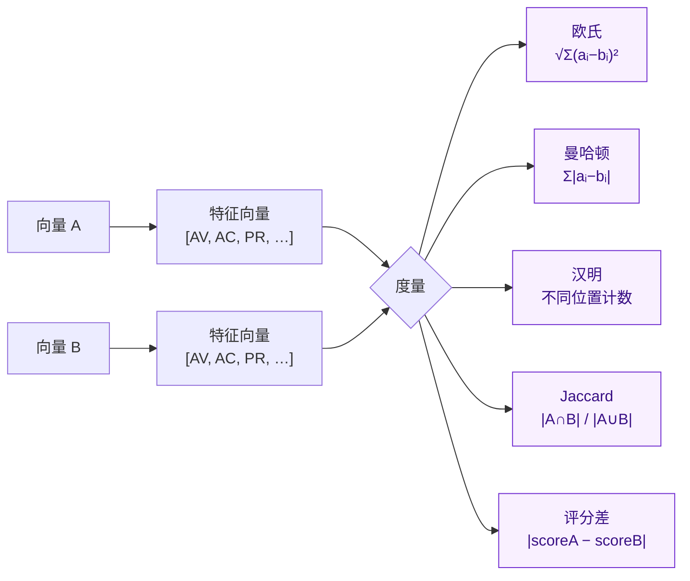

# DistanceCalculator - 向量距离计算器

`DistanceCalculator` 用于计算两个 CVSS 向量之间的距离。它支持多种距离算法，可用于向量相似性分析和聚类。

## 距离是如何计算的

两个向量先被投影到数值特征空间（每个指标 → 其评分权重），再由所选度量将两个特征向量归并为一个数：



::: tip 距离与相似度
欧氏 / 曼哈顿 / 汉明 / 评分差返回**距离**（0 表示完全相同，越大越不同）；Jaccard 返回**相似度**（1 表示完全相同，0 表示完全不相交）。按场景选择：聚类偏向距离，去重偏向相似度。
:::

::: info 所有度量均使用基础值
距离度量比较两个向量的**基础**指标取值。时间与环境指标不参与距离计算。若需比较考虑环境修正后的评分，请自行计算各向量的 `GetEnvironmentalScore()` 再取绝对差。
:::

## 类型定义

`DistanceCalculator` 是一个持有两个 `*Cvss3x` 引用的结构体。通过 `NewDistanceCalculator` 构造，度量方法定义在 `*DistanceCalculator` 接收者上：

```go
type DistanceCalculator struct {
    // 非导出：持有两个 *Cvss3x 向量
}

func NewDistanceCalculator(vector1, vector2 *Cvss3x) *DistanceCalculator

func (dc *DistanceCalculator) EuclideanDistance() float64
func (dc *DistanceCalculator) ManhattanDistance() float64
func (dc *DistanceCalculator) HammingDistance() int
func (dc *DistanceCalculator) JaccardSimilarity() float64
func (dc *DistanceCalculator) ScoreDifference() float64
```

::: warning 没有 `Checked` 或 `WithEnv` 变体
距离方法返回裸 `float64`（`HammingDistance` 返回 `int`），没有返回错误或环境感知的变体。nil 接收者或 nil 向量会静默返回 `0` —— 若需防范，请在构造计算器前自行校验输入（见[错误处理](#错误处理)）。
:::

## 创建计算器

### NewDistanceCalculator

```go
func NewDistanceCalculator(vector1, vector2 *Cvss3x) *DistanceCalculator
```

为两个 CVSS 向量创建新的距离计算器。

**参数:**
- `vector1`: 第一个 CVSS 向量
- `vector2`: 第二个 CVSS 向量

**返回值:**
- `*DistanceCalculator`: 距离计算器实例

**示例:**
```go
calc := cvss.NewDistanceCalculator(vector1, vector2)
```

## 距离算法

### EuclideanDistance

```go
func (dc *DistanceCalculator) EuclideanDistance() float64
```

计算两个向量之间的欧几里得距离。

**公式:**
```
distance = √(Σ(xi - yi)²)
```

其中 xi 和 yi 是两个向量在第 i 个维度上的值。

**返回值:**
- `float64`: 欧几里得距离值 (0.0 到 ~3.0，取决于所含指标)

**示例:**
```go
distance := calc.EuclideanDistance()
fmt.Printf("欧几里得距离: %.3f\n", distance)
```

**用途:**
- 向量相似性分析
- 聚类算法
- 异常检测

### ManhattanDistance

```go
func (dc *DistanceCalculator) ManhattanDistance() float64
```

计算两个向量之间的曼哈顿距离（也称为城市街区距离）。

**公式:**
```
distance = Σ|xi - yi|
```

**返回值:**
- `float64`: 曼哈顿距离值 (0.0 到 ~8.0，取决于所含指标)

**示例:**
```go
distance := calc.ManhattanDistance()
fmt.Printf("曼哈顿距离: %.3f\n", distance)
```

**特点:**
- 对异常值不敏感
- 计算效率高
- 适用于高维数据

### HammingDistance

```go
func (dc *DistanceCalculator) HammingDistance() int
```

统计两个向量在指标位置上不同（按短值）的个数。仅比较两个向量上都存在的指标。

**公式:**
```
distance = #{ i : xi != yi }
```

**返回值:**
- `int`: 不同的位置数（0 表示每个共有指标都相同）

**示例:**
```go
distance := calc.HammingDistance()
fmt.Printf("汉明距离: %d\n", distance)
```

**应用场景:**
- 类别型差异计数
- 快速检查"改动了几项指标"
- 向量修订间的变更检测

## 评分差度量

### ScoreDifference

```go
func (dc *DistanceCalculator) ScoreDifference() float64
```

返回两个向量计算所得评分之差的绝对值。与逐指标距离不同，它先将整个向量塌缩为评分，再取 `|scoreA − scoreB|`。

**公式:**
```
difference = |Calculate(A) − Calculate(B)|
```

**返回值:**
- `float64`: 评分差的绝对值 (0.0 到 10.0)

**示例:**
```go
diff := calc.ScoreDifference()
fmt.Printf("评分差: %.3f\n", diff)

if diff < 0.5 {
    fmt.Println("评分几乎相同")
} else if diff < 2.0 {
    fmt.Println("评分有差异")
} else {
    fmt.Println("评分差异显著")
}
```

**优势:**
- 直接反映真实影响差距，而非指标数量
- 适合判断评分是否跨越严重性边界（如是否越过 9.0）
- 优先级排序：按真实影响增量而非指标计数来排列向量对

### JaccardSimilarity

```go
func (dc *DistanceCalculator) JaccardSimilarity() float64
```

计算两个向量之间的雅卡德相似度。

**公式:**
```
similarity = |A ∩ B| / |A ∪ B|
```

**返回值:**
- `float64`: 雅卡德相似度值 (0.0 到 1.0)
  - 1.0: 完全相同
  - 0.0: 完全不同

**示例:**
```go
similarity := calc.JaccardSimilarity()
fmt.Printf("雅卡德相似度: %.3f\n", similarity)
```

**应用:**
- 集合相似性分析
- 二进制特征比较
- 推荐系统

## 实际应用示例

### 基本距离计算

```go
package main

import (
    "fmt"
    "github.com/scagogogo/cvss-skills/pkg/cvss"
    "github.com/scagogogo/cvss-skills/pkg/parser"
)

func main() {
    // 解析两个 CVSS 向量
    vector1Str := "CVSS:3.1/AV:N/AC:L/PR:N/UI:N/S:U/C:H/I:H/A:H"
    vector2Str := "CVSS:3.1/AV:L/AC:H/PR:H/UI:R/S:U/C:L/I:L/A:L"

    parser1 := parser.NewCvss3xParser(vector1Str)
    vector1, _ := parser1.Parse()

    parser2 := parser.NewCvss3xParser(vector2Str)
    vector2, _ := parser2.Parse()

    // 创建距离计算器
    calc := cvss.NewDistanceCalculator(vector1, vector2)

    // 计算各种距离
    fmt.Printf("欧几里得距离: %.3f\n", calc.EuclideanDistance())
    fmt.Printf("曼哈顿距离: %.3f\n", calc.ManhattanDistance())
    fmt.Printf("汉明距离: %d\n", calc.HammingDistance())
    fmt.Printf("评分差: %.3f\n", calc.ScoreDifference())
    fmt.Printf("雅卡德相似度: %.3f\n", calc.JaccardSimilarity())
}
```

### 向量聚类分析

```go
func clusterVectors(vectors []*cvss.Cvss3x, threshold float64) [][]int {
    var clusters [][]int
    used := make([]bool, len(vectors))

    for i, vector1 := range vectors {
        if used[i] {
            continue
        }

        cluster := []int{i}
        used[i] = true

        for j, vector2 := range vectors {
            if i == j || used[j] {
                continue
            }

            calc := cvss.NewDistanceCalculator(vector1, vector2)
            distance := calc.EuclideanDistance()

            if distance <= threshold {
                cluster = append(cluster, j)
                used[j] = true
            }
        }

        clusters = append(clusters, cluster)
    }

    return clusters
}
```

### 相似性分析

```go
func analyzeSimilarity(v1, v2 *cvss.Cvss3x) {
    calc := cvss.NewDistanceCalculator(v1, v2)

    euclidean := calc.EuclideanDistance()
    jaccard := calc.JaccardSimilarity()

    fmt.Printf("向量1: %s\n", v1.String())
    fmt.Printf("向量2: %s\n", v2.String())
    fmt.Printf("欧几里得距离: %.3f\n", euclidean)
    fmt.Printf("雅卡德相似度: %.3f\n", jaccard)

    // 相似性判断（Jaccard：越大越相似）
    if jaccard > 0.9 {
        fmt.Println("结论: 向量非常相似")
    } else if jaccard > 0.7 {
        fmt.Println("结论: 向量相似")
    } else if jaccard > 0.3 {
        fmt.Println("结论: 向量有一定相似性")
    } else {
        fmt.Println("结论: 向量差异较大")
    }
}
```

## 性能优化

### 带缓存的成对计算

`DistanceCalculator` 不持有可变状态，但反复重算同一向量对是浪费。用按向量对索引的应用层小缓存可实现 O(1) 重复查询。由于距离方法返回裸 `float64`（无 error 变体），先一次性校验所有向量，之后即可放心缓存：

```go
// 应用层向量对缓存；库不提供。
type pairCache struct {
    vectors []*cvss.Cvss3x
    cache   map[[2]int]float64
}

func newPairCache(vectors []*cvss.Cvss3x) (*pairCache, error) {
    // 先一次性校验，确保缓存查询永不遇到坏向量。
    for _, v := range vectors {
        if v == nil {
            return nil, fmt.Errorf("nil vector in input")
        }
        if err := v.Check(); err != nil {
            return nil, fmt.Errorf("invalid vector %s: %w", v.String(), err)
        }
    }
    return &pairCache{vectors: vectors, cache: make(map[[2]int]float64)}, nil
}

// Euclidean 返回向量对 (i, j) 的缓存欧氏距离，首次访问时计算。
// 顺序无关：(i,j) 与 (j,i) 共享同一缓存项。
func (c *pairCache) Euclidean(i, j int) float64 {
    if i == j {
        return 0
    }
    if i > j {
        i, j = j, i
    }
    key := [2]int{i, j}
    if d, ok := c.cache[key]; ok {
        return d
    }
    d := cvss.NewDistanceCalculator(c.vectors[i], c.vectors[j]).EuclideanDistance()
    c.cache[key] = d
    return d
}
```

## 最佳实践

### 算法选择指南

1. **欧几里得距离**
   - 适用于连续数值特征
   - 对异常值敏感
   - 常用于聚类分析

2. **曼哈顿距离**
   - 适用于高维数据
   - 对异常值不敏感
   - 计算效率高

3. **汉明距离**
   - 适用于类别型差异计数
   - "改了几项指标"的直观度量
   - 变更检测

4. **评分差（ScoreDifference）**
   - 直接反映真实影响差距
   - 判断是否跨越严重性边界
   - 按影响增量排序向量对

5. **雅卡德相似度**
   - 适用于集合/二进制特征
   - 集合相似性分析
   - 去重场景

### 错误处理

```go
func safeDistanceCalculation(v1, v2 *cvss.Cvss3x) (float64, error) {
    if v1 == nil || v2 == nil {
        return 0, fmt.Errorf("向量不能为空")
    }

    if err := v1.Check(); err != nil {
        return 0, fmt.Errorf("向量1无效: %w", err)
    }
    if err := v2.Check(); err != nil {
        return 0, fmt.Errorf("向量2无效: %w", err)
    }

    calc := cvss.NewDistanceCalculator(v1, v2)
    return calc.EuclideanDistance(), nil
}
```

## 相关文档

- [CVSS 数据结构](/zh/api/cvss/cvss3x) - 了解 CVSS 向量结构
- [距离计算示例](/zh/examples/distance) - 详细使用示例
- [向量比较](/zh/examples/comparison) - 向量比较方法
