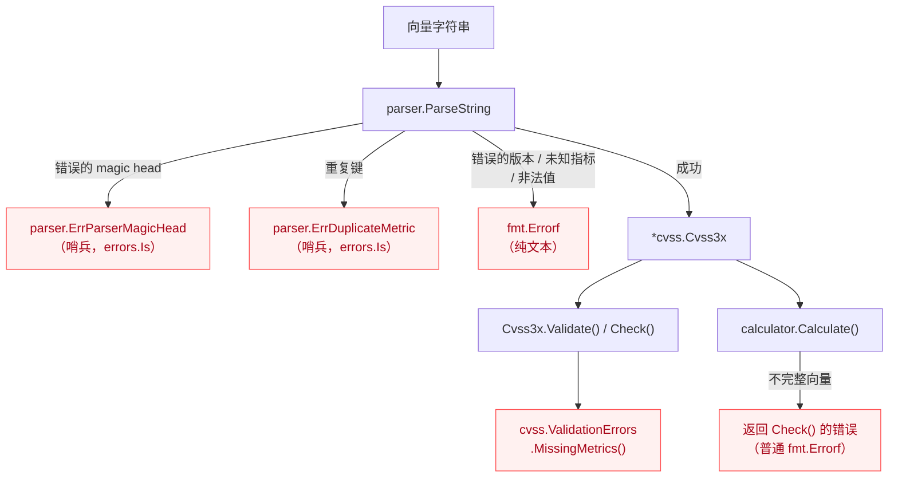
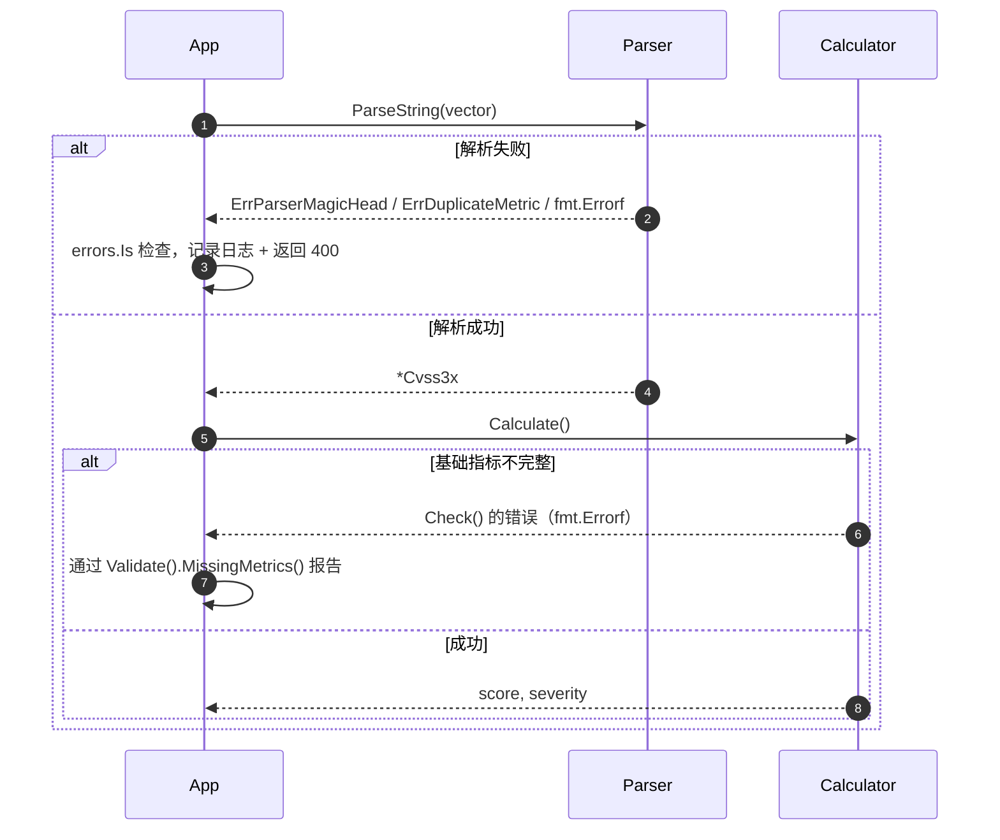

# 错误处理指南

本指南涵盖 CVSS Skills 真实的错误表面，以及健壮处理它们的模式。

## 错误分类

不存在 `CVSSError` 接口或 `ErrorType` 枚举。错误来自两处——**parser**（哨兵错误与 `fmt.Errorf`）和 **cvss 包**（`ValidationError` / `ValidationErrors`）。完整性与评分都流经 `ValidationErrors`：



## 处理流程



## 概述

CVSS Skills 的错误处理是刻意的纯 Go 风格——哨兵错误与结构化的 `ValidationErrors`，没有自定义错误接口层级。基本构件：

- **哨兵解析错误**（`parser.ErrParserMagicHead`、`parser.ErrDuplicateMetric`）——用 `errors.Is` 检测
- **普通 `fmt.Errorf`**——用于不支持的版本、未知的指标名、非法的指标值，以及 `Check()` 返回的第一个缺失指标
- **`cvss.ValidationErrors`**——`*ValidationError` 的切片，每条命名一个指标和一条消息；`MissingMetrics()` 列出缺失的指标

## 错误类型

### ValidationError / ValidationErrors

定义在 `pkg/cvss/validate.go`：

```go
// 单个失败的指标检查。
type ValidationError struct {
    Metric  string // 短名，例如 "AV"、"PR"、"Version"
    Message string // 人类可读的描述
}

func (e *ValidationError) Error() string // "metric AV: is required but not set"

// Validate() 返回的所有失败的集合（不短路）。
type ValidationErrors []*ValidationError

func (ve ValidationErrors) Error() string
func (ve ValidationErrors) MissingMetrics() []string // 缺失指标的名字
func (ve ValidationErrors) HasErrors() bool
func (ve ValidationErrors) Unwrap() []error          // Go 1.20+ 多重 unwrap
```

`Validate()` 返回 `ValidationErrors`；`Check()` 返回普通 `fmt.Errorf`，表示*第一个*缺失/无效指标（它短路）。当你想要完整列表时优先用 `Validate()`。

### 解析错误

解析器导出两个哨兵；其余都是 `fmt.Errorf`：

```go
var ErrParserMagicHead = errors.New("cvss 3.x parser error: invalid magic head, it must equal 'CVSS'")
var ErrDuplicateMetric = errors.New("cvss 3.x parser error: duplicate metric key")
```

::: warning 没有 *parser.ParseError 类型
不存在带 `Position`/`Input`/`Expected` 字段的 `*parser.ParseError` 结构体，也没有 `ErrorType` 枚举。不要把解析错误类型断言为这样的类型——哨兵用 `errors.Is`，其余当作不透明的 `error` 处理。
:::

### CSVReadError

由批量 CSV 读取器（`ReadCSVLax`）返回，每个解析失败的行一条：

```go
type CSVReadError struct {
    Row   int    // 1 起的行号
    Value string // 原始字段值
    Error error  // 底层解析错误
}

func (e CSVReadError) String() string // "row 3: \"...\": <error>"
```

## 错误处理模式

### 基本错误处理

```go
func ProcessVector(vectorStr string) (*VectorResult, error) {
    if vectorStr == "" {
        return nil, fmt.Errorf("向量字符串不能为空")
    }
    if len(vectorStr) > 500 {
        return nil, fmt.Errorf("向量字符串过长")
    }

    // 解析
    vector, err := parser.ParseString(vectorStr)
    if err != nil {
        if errors.Is(err, parser.ErrParserMagicHead) {
            return nil, fmt.Errorf("非 CVSS 向量（缺少 'CVSS:' 前缀）: %w", err)
        }
        if errors.Is(err, parser.ErrDuplicateMetric) {
            return nil, fmt.Errorf("向量中有重复指标: %w", err)
        }
        return nil, fmt.Errorf("解析失败: %w", err)
    }

    // 评分——Calculate() 内部运行 Check() 并返回其错误
    calculator := cvss.NewCalculator(vector)
    score, err := calculator.Calculate()
    if err != nil {
        return nil, fmt.Errorf("无法对向量评分: %w", err)
    }

    return &VectorResult{
        Vector:   vectorStr,
        Score:    score,
        Severity: calculator.GetSeverityRating(score),
    }, nil
}
```

### 报告缺失指标

当向量解析成功但不完整时，通过 `Validate()` 呈现*所有*缺失指标：

```go
func ReportProblems(vectorStr string) error {
    cv, err := parser.ParseString(vectorStr)
    if err != nil {
        return err
    }
    if err := cv.Validate(); err != nil {
        if ve, ok := err.(cvss.ValidationErrors); ok {
            return fmt.Errorf("向量 %q 缺失指标: %v", vectorStr, ve.MissingMetrics())
        }
        return err
    }
    return nil
}
```

得益于 `ValidationErrors.Unwrap()`，`errors.As` 也可以按条目工作：

```go
var ve *cvss.ValidationError
if errors.As(err, &ve) {
    fmt.Printf("问题指标: %s (%s)\n", ve.Metric, ve.Message)
}
```

### 错误恢复

CVSS 真正的恢复手段有限——一个未知的指标值在不改变语义的情况下无法被"修复"。一种站得住脚的恢复是用 `ParseRelaxed` 重试无前缀的输入，或回退到一个已知良好的默认向量：

```go
func ProcessVectorWithRecovery(vectorStr string) (*VectorResult, error) {
    result, err := ProcessVector(vectorStr)
    if err == nil {
        return result, nil
    }

    // 如果是 magic head 失败，输入可能只是缺少前缀
    if errors.Is(err, parser.ErrParserMagicHead) {
        if cv, relaxErr := parser.ParseRelaxed(vectorStr, "3.1"); relaxErr == nil {
            return ProcessVector(cv.String())
        }
    }

    return nil, err
}
```

::: warning 不要改写未知的指标值
静默地把 `AV:X` 替换为 `AV:N`（或类似做法）会在用户不知情的情况下改变评分。优先拒绝并报告出问题的指标，而不是猜测。
:::

### 批量错误处理

`parser.BatchParse` 和 `parser.BatchValidate` 已经按顺序收集每个输入的错误。对于你自己也要评分的批量处理，累积结果和错误：

```go
type BatchResult struct {
    Results []VectorResult
    Errors  []BatchError
}

type BatchError struct {
    Index  int
    Vector string
    Err    error
}

func ProcessVectorsBatch(vectors []string) *BatchResult {
    result := &BatchResult{}
    for i, vectorStr := range vectors {
        vr, err := ProcessVector(vectorStr)
        if err != nil {
            result.Errors = append(result.Errors, BatchError{Index: i, Vector: vectorStr, Err: err})
            continue
        }
        result.Results = append(result.Results, *vr)
    }
    return result
}
```

对于 CSV 输入，`cvss.ReadCSVLax` 同时返回成功解析的向量和一个 `[]CSVReadError`（每个坏行一条）——遍历这些错误来报告行号。

## HTTP 错误响应

无需发明错误接口，把错误种类映射到 HTTP 状态码：

```go
type APIError struct {
    Error   string `json:"error"`
    Details any    `json:"details,omitempty"`
}

func HandleError(w http.ResponseWriter, err error) {
    var apiErr APIError
    var status int

    switch {
    case errors.Is(err, parser.ErrParserMagicHead), errors.Is(err, parser.ErrDuplicateMetric):
        status = http.StatusBadRequest
        apiErr = APIError{Error: "malformed CVSS vector", Details: err.Error()}
    default:
        // 区分验证错误（不完整/无效指标）与其他错误
        var ve cvss.ValidationErrors
        if errors.As(err, &ve) {
            status = http.StatusUnprocessableEntity
            apiErr = APIError{Error: "validation failed", Details: ve.MissingMetrics()}
        } else {
            status = http.StatusInternalServerError
            apiErr = APIError{Error: "internal error", Details: err.Error()}
        }
    }

    w.Header().Set("Content-Type", "application/json")
    w.WriteHeader(status)
    json.NewEncoder(w).Encode(apiErr)
}
```

## 测试错误条件

测试真实的错误形状——哨兵用 `errors.Is`，验证用 `errors.As`：

```go
func TestParseErrors(t *testing.T) {
    _, err := parser.ParseString("not-a-vector")
    assert.ErrorIs(t, err, parser.ErrParserMagicHead)

    _, err = parser.ParseString("CVSS:3.1/AV:N/AC:L/PR:N/UI:N/S:U/C:H/I:H/A:H/AV:P")
    assert.ErrorIs(t, err, parser.ErrDuplicateMetric)
}

func TestValidationReportsMissingMetrics(t *testing.T) {
    cv, err := parser.ParseString("CVSS:3.1/AV:N/AC:L/PR:N/UI:N/S:U") // 缺少 C/I/A
    require.NoError(t, err)

    err = cv.Validate()
    require.Error(t, err)

    var ve cvss.ValidationErrors
    require.True(t, errors.As(err, &ve))
    assert.ElementsMatch(t, []string{"C", "I", "A"}, ve.MissingMetrics())
}
```

## 最佳实践

### 错误处理准则

1. **用 `errors.Is` / `errors.As`**——不要对虚构的错误类型做类型 switch。唯一的结构化解析错误是两个哨兵；唯一的结构化验证类型是 `cvss.ValidationErrors`。
2. **面向用户的报告优先用 `Validate()` 而非 `Check()`**——它收集每个问题而不是停在第一个。
3. **带上上下文包装**——`fmt.Errorf("...: %w", err)` 保留链式结构供 `errors.Is`/`errors.As` 使用。
4. **快速失败**——解析前校验输入形状；评分前先解析。
5. **不要把解析错误伪装成评分错误**——`Calculate()` 返回 `Check()` 的错误，因此评分失败通常意味着向量不完整，而非数学 bug。

### 恢复策略

1. **当唯一的失败是缺少 `CVSS:` 前缀时，用 `ParseRelaxed` 重试**。
2. **拒绝未知的指标值**而非替换为默认值——静默替换会改变评分。
3. **弹性批量处理**——收集每行的错误（`ReadCSVLax`、`BatchParse`），这样一个坏输入不会中止整个运行。

## 相关文档

- [解析器参考](/zh/api/parser/cvss3x-parser) - `ErrParserMagicHead`、`ErrDuplicateMetric`、批量辅助函数
- [Cvss3x 数据结构](/zh/api/cvss/cvss3x) - `Check()` / `Validate()` / `MissingMetrics()`
- [计算器](/zh/api/cvss/calculator) - `Calculate()` 与评分错误路径
- [测试指南](/zh/api/testing) - 错误测试策略
