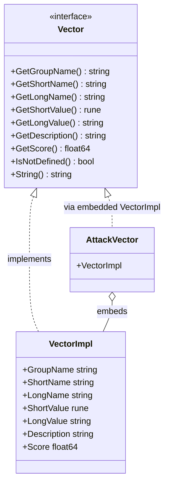

# Vector 接口

`Vector` 接口是 CVSS Skills 中所有指标的统一抽象，定义了一个指标取值（例如 Attack Vector = Network）的基本行为和属性。

## 类型层次

每个具体的指标取值（例如 `AttackVectorNetwork`，即 Attack Vector 指标的 "Network" 值）都实现同一个 `Vector` 接口，因此评分与格式化代码可以统一处理所有指标：



具体的指标类型（如 `AttackVector`、`AttackComplexity`、`Scope`）各自嵌入了 `*VectorImpl`，由后者提供全部 `Vector` 接口方法。预定义的包级变量（如 `AttackVectorNetwork`、`AttackVectorLocal`）是这些类型的开箱即用单例。

## 接口定义

```go
type Vector interface {
    GetGroupName() string    // 指标分组："Base Metrics"、"Temporal Metrics" 或 "Environmental Metrics"
    GetShortName() string    // 指标短名，如 "AV"
    GetLongName() string     // 指标全名，如 "Attack Vector"
    GetShortValue() rune     // 指标短值，如 'N'
    GetLongValue() string    // 指标全值，如 "Network"
    GetDescription() string  // 指标描述
    GetScore() float64       // 指标评分权重
    IsNotDefined() bool      // 是否为 "Not Defined" (X) 值
    String() string          // 字符串表示，如 "AV:N"
}
```

## VectorImpl

`VectorImpl` 是支撑每个指标取值的具体结构体。它是导出的，因此你可以直接构造一个 `Vector` —— 但实践中应使用[预定义单例](#预定义指标单例)或[工厂函数](#工厂函数)，而非手写指标取值。

```go
type VectorImpl struct {
    GroupName   string
    ShortName   string
    LongName    string
    ShortValue  rune
    LongValue   string
    Description string
    Score       float64
}
```

它以值接收者实现 `Vector`。`IsNotDefined()` 在 `ShortValue == 'X'` 时返回 `true`，`String()` 返回 `"<ShortName>:<ShortValue>"`。

```go
v := &vector.VectorImpl{
    GroupName:   "Base Metrics",
    ShortName:   "AV",
    LongName:    "Attack Vector",
    ShortValue:  'N',
    LongValue:   "Network",
    Description: "...",
    Score:       0.85,
}
fmt.Println(v.String())        // AV:N
fmt.Println(v.IsNotDefined())  // false
```

## 具体指标类型

每个 CVSS 指标都有专门的结构体类型，嵌入 `*VectorImpl`。库提供以下类型：

| 类型 | 短名 | 指标 | 单例示例 |
|------|------|------|----------|
| `AttackVector` | `AV` / `MAV` | 攻击向量 | `AttackVectorNetwork`、`AttackVectorLocal`、`ModifiedAttackVectorNetwork` |
| `AttackComplexity` | `AC` / `MAC` | 攻击复杂度 | `AttackComplexityLow`、`AttackComplexityHigh` |
| `PrivilegesRequired` | `PR` / `MPR` | 所需权限 | `PrivilegesRequiredNone`、`PrivilegesRequiredLow` |
| `UserInteraction` | `UI` / `MUI` | 用户交互 | `UserInteractionNone`、`UserInteractionRequired` |
| `Scope` | `S` / `MS` | 范围 | `ScopeUnchanged`、`ScopeChanged` |
| `Confidentiality` | `C` / `MC` | 机密性 | `ConfidentialityHigh`、`ConfidentialityLow` |
| `Integrity` | `I` / `MI` | 完整性 | `IntegrityHigh`、`IntegrityLow` |
| `Availability` | `A` / `MA` | 可用性 | `AvailabilityHigh`、`AvailabilityLow` |
| `ExploitCodeMaturity` | `E` | 利用代码成熟度 | `ExploitCodeMaturityFunctional`、`ExploitCodeMaturityHigh` |
| `RemediationLevel` | `RL` | 修复级别 | `RemediationLevelOfficialFix`、`RemediationLevelUnavailable` |
| `ReportConfidence` | `RC` | 报告可信度 | `ReportConfidenceConfirmed`、`ReportConfidenceReasonable` |
| `ConfidentialityRequirement` | `CR` | 机密性需求 | `ConfidentialityRequirementHigh`、`ConfidentialityRequirementMedium` |
| `IntegrityRequirement` | `IR` | 完整性需求 | `IntegrityRequirementHigh`、`IntegrityRequirementMedium` |
| `AvailabilityRequirement` | `AR` | 可用性需求 | `AvailabilityRequirementHigh`、`AvailabilityRequirementMedium` |

每个类型都遵循相同的形状：

```go
type AttackVector struct {
    *VectorImpl
}
```

::: tip 类型与单例的区别
`AttackVector` 是**类型**（嵌入了 `*VectorImpl`）。`AttackVectorNetwork` 是 `*AttackVector` 类型的**预定义变量**，持有 "Network" 取值。不要混淆两者：`&vector.AttackVector{}`（零值，空 `VectorImpl`）通常不是你想要的 —— 请使用单例。
:::

### 预定义指标单例

每个合法的指标取值都有开箱即用的包级变量。它们是引用指标取值的规范方式，也是工厂函数的返回值。

```go
av := vector.AttackVectorNetwork
fmt.Printf("%s\n", av.String())        // AV:N
fmt.Printf("%.2f\n", av.GetScore())    // 0.85
fmt.Printf("%s\n", av.GetGroupName())  // Base Metrics
```

修改后（环境）取值和 "Not Defined"（`X`）变体也作为单例暴露，例如 `ModifiedAttackVectorNetwork`、`AttackVectorNotDefined`：

```go
nd := vector.AttackVectorNotDefined
fmt.Printf("%v\n", nd.IsNotDefined())  // true
fmt.Printf("%.2f\n", nd.GetScore())    // 1.0
```

## 工厂函数

与其按名称引用单例，不如使用工厂函数从短名和取值解析指标。它们返回 `(Vector, error)` —— 当短名未知或取值非法时返回非 nil 错误。

### GetVectorByShortName

```go
func GetVectorByShortName(shortName string, value string) (Vector, error)
```

根据短名和单字符取值解析任意指标。`value` 必须恰好是一个字符。

**参数:**
- `shortName`: 指标短名，如 `"AV"`、`"MAV"`、`"E"`、`"CR"`
- `value`: 作为 1 字符字符串的指标短值，如 `"N"`、`"X"`

**返回值:**
- `(Vector, error)`: 指标取值；若短名/取值未知或 `value` 不是单字符则返回错误。

**示例:**
```go
v, err := vector.GetVectorByShortName("AV", "N")
if err != nil {
    log.Fatal(err)
}
fmt.Println(v.String())  // AV:N
```

### 每指标工厂

每个指标都有自己的工厂函数，接收 `rune` 类型的短值：

| 函数 | 签名 |
|------|------|
| `GetAttackVector` | `(shortValue rune) (Vector, error)` |
| `GetAttackComplexity` | `(shortValue rune) (Vector, error)` |
| `GetPrivilegesRequired` | `(shortValue rune) (Vector, error)` |
| `GetUserInteraction` | `(shortValue rune) (Vector, error)` |
| `GetScope` | `(shortValue rune) (Vector, error)` |
| `GetConfidentiality` | `(shortValue rune) (Vector, error)` |
| `GetIntegrity` | `(shortValue rune) (Vector, error)` |
| `GetAvailability` | `(shortValue rune) (Vector, error)` |
| `GetExploitCodeMaturity` | `(shortValue rune) (Vector, error)` |
| `GetRemediationLevel` | `(shortValue rune) (Vector, error)` |
| `GetReportConfidence` | `(shortValue rune) (Vector, error)` |
| `GetConfidentialityRequirement` | `(shortValue rune) (Vector, error)` |
| `GetIntegrityRequirement` | `(shortValue rune) (Vector, error)` |
| `GetAvailabilityRequirement` | `(shortValue rune) (Vector, error)` |
| `GetModifiedAttackVector` | `(shortValue rune) (Vector, error)` |
| `GetModifiedAttackComplexity` | `(shortValue rune) (Vector, error)` |
| `GetModifiedPrivilegesRequired` | `(shortValue rune) (Vector, error)` |
| `GetModifiedUserInteraction` | `(shortValue rune) (Vector, error)` |
| `GetModifiedScope` | `(shortValue rune) (Vector, error)` |
| `GetModifiedConfidentiality` | `(shortValue rune) (Vector, error)` |
| `GetModifiedIntegrity` | `(shortValue rune) (Vector, error)` |
| `GetModifiedAvailability` | `(shortValue rune) (Vector, error)` |

```go
e, err := vector.GetExploitCodeMaturity('F')
if err != nil {
    log.Fatal(err)
}
fmt.Printf("%s\n", e.String())        // E:F
fmt.Printf("%s\n", e.GetGroupName())  // Temporal Metrics
fmt.Printf("%.2f\n", e.GetScore())    // 0.97
```

## 方法详情

### GetGroupName

```go
GetGroupName() string
```

返回指标所属的分组。

**返回值:**
- `string`: `"Base Metrics"`、`"Temporal Metrics"`、`"Environmental Metrics"` 之一

**示例:**
```go
av := vector.AttackVectorNetwork
fmt.Printf("Group: %s\n", av.GetGroupName()) // Base Metrics
```

### GetShortName

```go
GetShortName() string
```

返回指标的短名（缩写）。

**返回值:**
- `string`: 如 `"AV"`、`"E"`、`"MAV"`

**示例:**
```go
av := vector.AttackVectorNetwork
fmt.Printf("Short name: %s\n", av.GetShortName()) // AV
```

### GetLongName

```go
GetLongName() string
```

返回指标的全名。

**返回值:**
- `string`: 如 `"Attack Vector"`、`"Exploit Code Maturity"`

**示例:**
```go
av := vector.AttackVectorNetwork
fmt.Printf("Long name: %s\n", av.GetLongName()) // Attack Vector
```

### GetShortValue

```go
GetShortValue() rune
```

返回指标的短值（单个字符）。

**返回值:**
- `rune`: 如 `'N'`、`'F'`、`'X'`

**示例:**
```go
av := vector.AttackVectorNetwork
fmt.Printf("Short value: %c\n", av.GetShortValue()) // N
```

### GetLongValue

```go
GetLongValue() string
```

返回指标的全值描述。

**返回值:**
- `string`: 如 `"Network"`、`"Functional"`、`"Not Defined"`

**示例:**
```go
av := vector.AttackVectorNetwork
fmt.Printf("Long value: %s\n", av.GetLongValue()) // Network
```

### GetDescription

```go
GetDescription() string
```

返回指标取值的详细描述，依据 CVSS 规范。

**返回值:**
- `string`: 指标描述

**示例:**
```go
av := vector.AttackVectorNetwork
fmt.Printf("Description: %s\n", av.GetDescription())
// "The vulnerable component is bound to the network stack..."
```

### GetScore

```go
GetScore() float64
```

返回指标取值在 CVSS 计算中使用的数值评分权重。对于 "Not Defined"（`X`）取值，评分为 `1.0`（乘法意义上的无操作）。

**返回值:**
- `float64`: 指标评分权重（通常在 0.0 到 1.0 之间）

**示例:**
```go
av := vector.AttackVectorNetwork
fmt.Printf("Score: %.2f\n", av.GetScore()) // 0.85
```

::: warning 所需权限的评分依赖范围
`PrivilegesRequired.GetScore()` 返回 **Scope-Unchanged** 权重。PR 的真实 CVSS 评分取决于 Scope 是否为 Changed。请使用 [`GetPrivilegesRequiredScore`](#getprivilegesrequiredscore) 获取给定范围下的正确权重。
:::

### IsNotDefined

```go
IsNotDefined() bool
```

返回此指标取值是否为 "Not Defined"（`X`）。"Not Defined" 表示该指标不应修改基础指标值，其评分为 `1.0`。

**返回值:**
- `bool`: `ShortValue == 'X'` 时为 `true`

**示例:**
```go
nd := vector.AttackVectorNotDefined
fmt.Printf("Is not defined: %v\n", nd.IsNotDefined()) // true

av := vector.AttackVectorNetwork
fmt.Printf("Is not defined: %v\n", av.IsNotDefined()) // false
```

### String

```go
String() string
```

返回指标的 CVSS 向量格式字符串表示（`<ShortName>:<ShortValue>`）。

**返回值:**
- `string`: 如 `"AV:N"`、`"E:F"`

**示例:**
```go
av := vector.AttackVectorNetwork
fmt.Printf("String: %s\n", av.String()) // AV:N
```

## 评分辅助函数

少数指标的评分权重依赖上下文（其他指标或 CVSS 次版本号）。包为这些指标提供了专用辅助函数 —— 不要仅依赖 `GetScore()`。

### GetPrivilegesRequiredScore

```go
func GetPrivilegesRequiredScore(pr Vector, scopeChanged bool) float64
```

返回给定范围下正确的所需权限权重。PR 是唯一一个权重依赖 Scope 是否为 Changed 的基础指标。

**参数:**
- `pr`: PR（或 MPR）的 `Vector`
- `scopeChanged`: Scope（或 Modified Scope）是否为 Changed

**返回值:**
- `float64`: PR 评分权重。若 `pr` 为 `nil` 或 `Not Defined`（`X`）则返回 `1.0`。

**示例:**
```go
pr, _ := vector.GetPrivilegesRequired('L')
fmt.Printf("%.2f\n", vector.GetPrivilegesRequiredScore(pr, false)) // 0.62
fmt.Printf("%.2f\n", vector.GetPrivilegesRequiredScore(pr, true))  // 0.68
```

### GetUserInteractionScore

```go
func GetUserInteractionScore(ui Vector, minorVersion int) float64
```

返回用户交互权重。UI 的评分在 CVSS 3.0 与 3.1 之间略有不同，因此需要次版本号。

**参数:**
- `ui`: UI（或 MUI）的 `Vector`
- `minorVersion`: CVSS 次版本号（3.0 为 `0`，3.1 为 `1`）

**返回值:**
- `float64`: UI 评分权重。若 `ui` 为 `nil` 或 `Not Defined`（`X`）则返回 `1.0`。

**示例:**
```go
ui, _ := vector.GetUserInteraction('R')
fmt.Printf("%.2f\n", vector.GetUserInteractionScore(ui, 1)) // 0.62 (CVSS 3.1)
```

### IsScopeChanged

```go
func IsScopeChanged(scope Vector) bool
```

返回给定 Scope 向量是否为 Changed。若 `scope` 为 `nil` 或其取值不为 `'C'`，返回 `false`。

**示例:**
```go
scope, _ := vector.GetScope('C')
fmt.Printf("%v\n", vector.IsScopeChanged(scope)) // true
```

### IsModifiedScopeChanged

```go
func IsModifiedScopeChanged(modifiedScope Vector, baseScope Vector) bool
```

返回 Modified Scope 是否为 Changed。若 `modifiedScope` 为 `nil` 或 `Not Defined`（`X`），则回退到 `IsScopeChanged(baseScope)`。

**示例:**
```go
ms, _ := vector.GetModifiedScope('X')
base, _ := vector.GetScope('C')
fmt.Printf("%v\n", vector.IsModifiedScopeChanged(ms, base)) // true（回退到 base）
```

## 接口使用模式

### 通用向量处理

```go
func processVector(v vector.Vector) {
    fmt.Printf("Processing %s metric\n", v.GetLongName())
    fmt.Printf("  Group: %s\n", v.GetGroupName())
    fmt.Printf("  Value: %s (%c)\n", v.GetLongValue(), v.GetShortValue())
    fmt.Printf("  Score: %.3f\n", v.GetScore())
    fmt.Printf("  Not defined: %v\n", v.IsNotDefined())
    fmt.Printf("  Vector: %s\n", v.String())
}

// 用法
processVector(vector.AttackVectorNetwork)
```

### 向量集合处理

```go
func processVectorCollection(vectors []vector.Vector) {
    for i, v := range vectors {
        fmt.Printf("Vector %d:\n", i+1)
        processVector(v)
        fmt.Println()
    }
}

// 用法
vectors := []vector.Vector{
    vector.AttackVectorNetwork,
    vector.AttackComplexityLow,
    vector.ConfidentialityHigh,
}
processVectorCollection(vectors)
```

### 向量校验

```go
func validateVector(v vector.Vector) error {
    if v == nil {
        return fmt.Errorf("vector is nil")
    }
    if v.GetShortName() == "" {
        return fmt.Errorf("metric short name cannot be empty")
    }
    if v.GetShortValue() == 0 {
        return fmt.Errorf("metric short value cannot be empty")
    }
    if v.GetLongValue() == "" {
        return fmt.Errorf("metric long value cannot be empty")
    }
    return nil
}

// 用法
if err := validateVector(vector.AttackVectorNetwork); err != nil {
    log.Printf("Validation failed: %v", err)
}
```

### 按评分比较向量

```go
func compareVectors(v1, v2 vector.Vector) int {
    score1 := v1.GetScore()
    score2 := v2.GetScore()

    if score1 < score2 {
        return -1
    } else if score1 > score2 {
        return 1
    }
    return 0
}

// 用法
av1 := vector.AttackVectorNetwork // 0.85
av2 := vector.AttackVectorLocal   // 0.55

result := compareVectors(av1, av2)
switch result {
case -1:
    fmt.Printf("%s has lower score than %s\n", av1.GetLongValue(), av2.GetLongValue())
case 1:
    fmt.Printf("%s has higher score than %s\n", av1.GetLongValue(), av2.GetLongValue())
case 0:
    fmt.Printf("%s has same score as %s\n", av1.GetLongValue(), av2.GetLongValue())
}
```

## 最佳实践

### 1. 优先使用单例和工厂，而非手工构造

预定义单例和工厂函数编码了完整的 CVSS 规范 —— 每个合法取值、其评分与描述。手工构造 `VectorImpl` 容易出现拼写错误和超出规范的取值。

```go
// 推荐：规范、经规格校验
av, err := vector.GetAttackVector('N')

// 推荐：直接引用已知单例
av := vector.AttackVectorNetwork

// 避免：手工构造，无校验，易出错
av := &vector.VectorImpl{ShortName: "AV", ShortValue: 'N', /* ... */}
```

### 2. 用 IsNotDefined 短路环境修正

应用修改后（环境）指标时，先检查 `IsNotDefined()` —— 取值为 `X` 表示"不修改基础指标"，其评分为无操作的 `1.0`。

```go
func applyModified(base, modified vector.Vector) vector.Vector {
    if modified != nil && !modified.IsNotDefined() {
        return modified
    }
    return base
}
```

### 3. 对所需权限使用范围感知辅助函数

由于 PR 的权重依赖 Scope，评分时务必使用 `GetPrivilegesRequiredScore` —— 切勿直接使用 `pr.GetScore()`。

```go
score := vector.GetPrivilegesRequiredScore(pr, vector.IsScopeChanged(scope))
```

### 4. 防范 nil

对 `nil` 的 `Vector` 调用接口方法会 panic。评分辅助函数（`GetPrivilegesRequiredScore`、`GetUserInteractionScore`、`IsScopeChanged`）容忍 `nil` 并返回安全默认值，但直接方法调用不会 —— 当指标可能缺失时先检查 `nil`。

```go
func safeGetScore(v vector.Vector) (float64, error) {
    if v == nil {
        return 0, fmt.Errorf("vector is nil")
    }
    return v.GetScore(), nil
}
```

## 相关文档

- [vector 包概述](/zh/api/vector/)
- [Cvss3x 数据结构](/zh/api/cvss/cvss3x)
- [计算器](/zh/api/cvss/calculator)
- [解析器实现](/zh/api/parser/cvss3x-parser)
- [使用示例](/zh/examples/basic)
