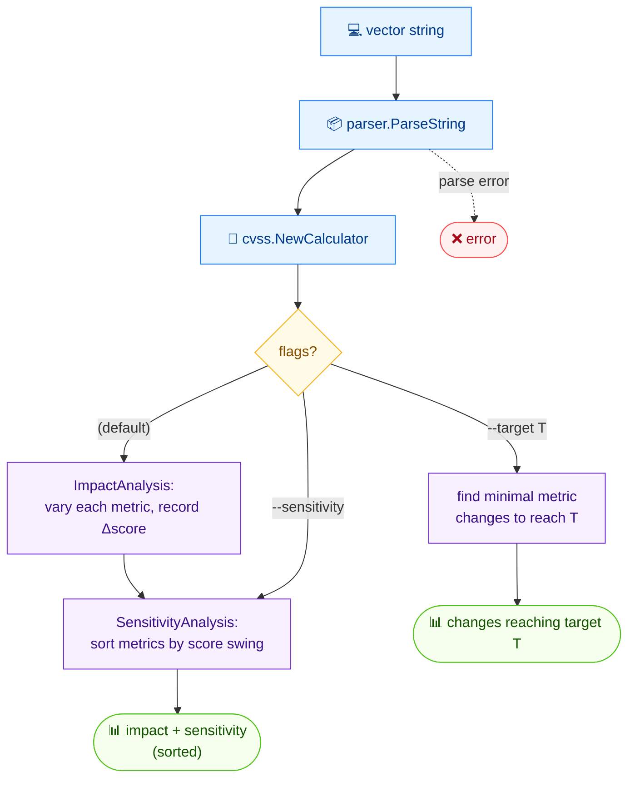

# 🔬 analyze

🔬 Analysis · 🟢 stable

## Synopsis

`cvss analyze` dissects how every metric influences the overall CVSS score. It reports an **impact analysis** (how changing each metric value moves the score) and a **sensitivity analysis** (which metrics have the largest score swing). Use `--target` to find the minimal metric changes needed to reach a desired score, and `--sensitivity` to print only the sensitivity section.

## How It Works

For each metric the command recomputes the score while varying that metric, producing an impact analysis and (sorted) sensitivity analysis; `--target` instead searches for minimal metric changes that reach a desired score.



## Usage

```bash
cvss analyze [vector-string] [flags]
```

### Flags

| Flag            | Type   | Default | Description                                      |
| --------------- | ------ | ------- | ------------------------------------------------ |
| `-h, --help`    | bool   | `false` | Help for `analyze`                               |
| `--sensitivity` | bool   | `false` | Only show the sensitivity analysis               |
| `--target`      | float  | `0`     | Find metric changes to reach a target score      |

## Examples

::: code-group

```bash [impact + sensitivity]
cvss analyze "CVSS:3.1/AV:N/AC:L/PR:N/UI:N/S:U/C:H/I:H/A:H"
```

```text [output]
=== Impact Analysis ===
AV (current: N, score: 9.8)
  A (Adjacent): 8.8 (High) [-1.0]
  L (Local): 8.4 (High) [-1.4]
  P (Physical): 6.8 (Medium) [-3.0]
PR (current: N, score: 9.8)
  L (Low): 8.8 (High) [-1.0]
  H (High): 7.2 (High) [-2.6]
AC (current: L, score: 9.8)
  H (High): 8.1 (High) [-1.7]
UI (current: N, score: 9.8)
  R (Required): 8.8 (High) [-1.0]
C (current: H, score: 9.8)
  L (Low): 9.4 (Critical) [-0.4]
  N (None): 9.1 (Critical) [-0.7]
I (current: H, score: 9.8)
  L (Low): 9.4 (Critical) [-0.4]
  N (None): 9.1 (Critical) [-0.7]
A (current: H, score: 9.8)
  L (Low): 9.4 (Critical) [-0.4]
  N (None): 9.1 (Critical) [-0.7]
S (current: U, score: 9.8)
  C (Changed): 10.0 (Critical) [+0.2]

=== Sensitivity Analysis ===
AV: 6.8 ~ 9.8 (swing: 3.0, current: 9.8)
PR: 7.2 ~ 9.8 (swing: 2.6, current: 9.8)
AC: 8.1 ~ 9.8 (swing: 1.7, current: 9.8)
UI: 8.8 ~ 9.8 (swing: 1.0, current: 9.8)
C: 9.1 ~ 9.8 (swing: 0.7, current: 9.8)
```

:::

::: tip Read the delta column
Each alternative value is annotated with `[Δ]` — the score change versus the current value. `[-3.0]` means that alternative lowers the score by 3.0; `[+0.2]` means it raises it by 0.2.
:::

## Underlying API

Parses the vector with [`parser.ParseString`](/sdk/parser), then runs [`cvss.ImpactAnalysis`](/sdk/impact) and [`cvss.SensitivityAnalysis`](/sdk/impact). With `--target`, it additionally calls [`cvss.FindMetricChangesToReachTarget`](/sdk/impact).

```go
import (
    "log"

    "github.com/scagogogo/cvss-skills/pkg/cvss"
    "github.com/scagogogo/cvss-skills/pkg/parser"
)

cv, err := parser.ParseString("CVSS:3.1/AV:N/AC:L/PR:N/UI:N/S:U/C:H/I:H/A:H")
if err != nil {
    log.Fatal(err)
}

impacts, err := cvss.ImpactAnalysis(cv)
if err != nil {
    log.Fatal(err)
}
for _, imp := range impacts {
    // imp.Metric, imp.CurrentValue, imp.Alternatives ...
}

sensitivities, err := cvss.SensitivityAnalysis(cv)
if err != nil {
    log.Fatal(err)
}

// minimal metric changes to reach a target score
changes, err := cvss.FindMetricChangesToReachTarget(cv, 7.0)
```

## Related

- [score](/cli/commands/score) — the score being analyzed
- [range](/cli/commands/range) — best/worst-case score range for a partial vector
- [Impact & Sensitivity](/sdk/impact) — Go SDK reference
