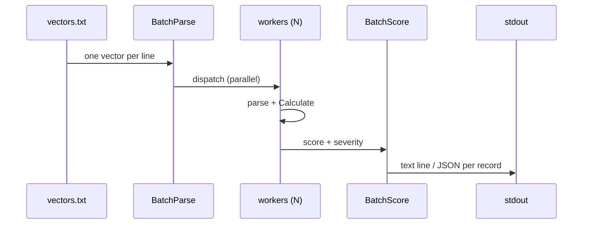

# ⚡ batch score

<span class="badge">CVSS v3.0</span>
<span class="badge">CVSS v3.1</span>
<span class="badge badge-info">text + json</span>

## Synopsis

`cvss batch score` reads one CVSS vector per line from a file (or stdin) and scores them in parallel. Each input line becomes one output record: a `score (severity)  vector` text line, or a JSON object carrying `line`, `vector`, `score`, and `severity`. It is the bulk-scoring workhorse for triaging a backlog of vectors.

`batch` is the parent command for batch operations; `score` is its scoring subcommand (the sibling is `batch validate`).

## How It Works

Input lines are fanned out to a worker pool that parses and scores each vector in parallel, then reassembled into per-line output records preserving line order.



## Usage

```
cvss batch score [file] [flags]
```

### Flags

| Flag | Default | Description |
| --- | --- | --- |
| `--format string` | `text` | output format: `text` or `json` |
| `--workers int` | `4` | number of parallel workers |
| `-h, --help` | — | help for `score` |

::: tip File or stdin
Pass a file path, or use `-` (or pipe) to read from stdin. Blank lines and lines starting with `#` are skipped automatically.
:::

## Examples

::: code-group

```bash [Score a file of vectors]
cat > vectors.txt <<'EOF'
CVSS:3.1/AV:N/AC:L/PR:N/UI:N/S:U/C:H/I:H/A:H
CVSS:3.1/AV:N/AC:L/PR:N/UI:N/S:C/C:H/I:H/A:H
EOF
cvss batch score vectors.txt
```

```bash [JSON output piped to jq]
cvss batch score --format json --workers 8 vectors.txt | jq 'select(.score >= 9.0)'
```

```bash [From stdin]
cat vectors.txt | cvss batch score -
```

:::

::: warning Parse errors go to stderr
Lines that fail to parse are reported on stderr as `Line N: parse error: ...` and are skipped; the remaining valid vectors are still scored. Per-vector scoring errors are emitted as `{"line":N,"error":"..."}` JSON objects (in JSON mode) or stderr lines (in text mode).
:::

## Underlying API

```go
import (
    "github.com/scagogogo/cvss-skills/pkg/cvss"
    "github.com/scagogogo/cvss-skills/pkg/parser"
)

lines := readLines("vectors.txt") // []string, one vector per line

// Parse in parallel (workerCount workers).
parseResults := parser.BatchParse(lines, 8) // []BatchParseResult

var vectors []*cvss.Cvss3x
var validIndices []int
for _, r := range parseResults {
    if r.Error != nil {
        continue
    }
    vectors = append(vectors, r.Vector)
    validIndices = append(validIndices, r.Index)
}

// Score in parallel.
scoreResults := cvss.BatchScore(vectors, 8) // []BatchScoreResult
for i, r := range scoreResults {
    fmt.Printf("%.1f (%s)  %s\n", r.Score, r.Severity, r.Vector.String())
}
```

`parser.BatchParse(vectors []string, workerCount int) []BatchParseResult` parses the lines in parallel; each result carries `Index`, `Vector`, and `Error`. `cvss.BatchScore(vectors []*Cvss3x, workerCount int) []BatchScoreResult` scores the parsed vectors in parallel; each result carries `Vector`, `Score`, `Severity`, and `Error`.

## Related

- [`batch validate`](/cli/commands/batch-validate) — validate (not score) many vectors
- [`score`](/cli/commands/score) — score a single vector
- [`sort`](/cli/commands/sort) — sort vectors by score
