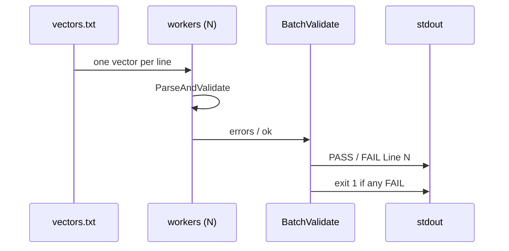

# ✅ batch validate

<span class="badge">CVSS v3.0</span>
<span class="badge">CVSS v3.1</span>
<span class="badge badge-info">text output</span>

## Synopsis

`cvss batch validate` reads one CVSS vector per line from a file (or stdin) and validates them in parallel. Each line prints `PASS Line N: <vector>` or `FAIL Line N: <vector>` followed by the per-line error reasons. The command exits `1` if any line failed, making it a CI gate.

`batch` is the parent command for batch operations; `validate` is its validation subcommand (the sibling is `batch score`).

## How It Works

Input lines are fanned out to a worker pool that validates each vector in parallel; each line prints PASS or FAIL with its reasons, and the command exits 1 if any line failed.



## Usage

```
cvss batch validate [file] [flags]
```

### Flags

| Flag | Default | Description |
| --- | --- | --- |
| `--workers int` | `4` | number of parallel workers |
| `-h, --help` | — | help for `validate` |

::: warning No `--format` flag
Unlike `batch score`, `batch validate` has no `--format json` flag — it always prints `PASS`/`FAIL` text lines.
:::

## Examples

::: code-group

```bash [Validate a file of vectors]
cat > vectors.txt <<'EOF'
CVSS:3.1/AV:N/AC:L/PR:N/UI:N/S:U/C:H/I:H/A:H
CVSS:3.1/AV:N
EOF
cvss batch validate vectors.txt
```

```bash [From stdin]
cat vectors.txt | cvss batch validate -
```

:::

::: tip Exit code is the gate
Exit `0` means every line validated; exit `1` means at least one line failed. Use `cvss batch validate vectors.txt && deploy` to gate a pipeline on vector validity.
:::

## Underlying API

```go
import "github.com/scagogogo/cvss-skills/pkg/parser"

lines := readLines("vectors.txt") // []string, one vector per line

results := parser.BatchValidate(lines, 4) // []BatchValidateResult
hasErrors := false
for _, r := range results {
    if r.Valid {
        fmt.Printf("PASS Line %d: %s\n", r.Index+1, lines[r.Index])
    } else {
        hasErrors = true
        fmt.Printf("FAIL Line %d: %s\n", r.Index+1, lines[r.Index])
        for _, e := range r.Errors {
            fmt.Printf("  - %s\n", e)
        }
    }
}
if hasErrors {
    os.Exit(1)
}
```

`parser.BatchValidate(vectors []string, workerCount int) []BatchValidateResult` validates the lines in parallel. Each result carries `Index`, `Valid`, and `Errors` (a `[]string` of human-readable failure reasons).

## Related

- [`batch score`](/cli/commands/batch-score) — score (not validate) many vectors
- [`validate`](/cli/commands/validate) — validate a single vector string
- [`enumerate`](/cli/commands/enumerate) — list valid values for a metric
