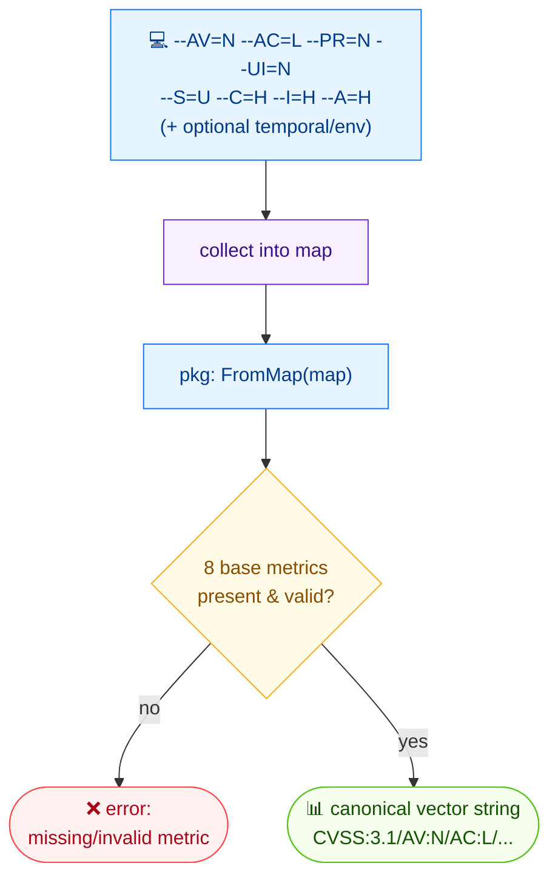

# 🏗️ build

🏗️ Build · 🟢 stable

## Synopsis

`cvss build` constructs a CVSS vector string from individual metric values passed as flags (`--AV=N`, `--AC=L`, …). All eight base metrics are required; temporal and environmental metrics are optional. Use `--cvss-version` to target v3.0 or v3.1.

## How It Works

Flag values for each metric are collected into a map and handed to `FromMap`; the eight base metrics are mandatory, temporal/environmental entries are optional, and the result is a canonical vector string.



## Usage

```bash
cvss build [flags]
```

### Flags

| Flag              | Type   | Default | Description                                          |
| ----------------- | ------ | ------- | ---------------------------------------------------- |
| `--A`             | string |         | Availability (H/L/N)                                 |
| `--AC`            | string |         | Attack Complexity (L/H)                              |
| `--AR`            | string |         | Availability Requirement (X/H/M/L)                    |
| `--AV`            | string |         | Attack Vector (N/A/L/P)                              |
| `--C`             | string |         | Confidentiality (H/L/N)                              |
| `--CR`            | string |         | Confidentiality Requirement (X/H/M/L)                 |
| `--E`             | string |         | Exploit Code Maturity (X/U/P/F/H)                     |
| `--I`             | string |         | Integrity (H/L/N)                                    |
| `--IR`            | string |         | Integrity Requirement (X/H/M/L)                       |
| `--MA`            | string |         | Modified Availability (X/H/L/N)                       |
| `--MAC`           | string |         | Modified Attack Complexity (X/L/H)                    |
| `--MAV`           | string |         | Modified Attack Vector (X/N/A/L/P)                    |
| `--MC`            | string |         | Modified Confidentiality (X/H/L/N)                    |
| `--MI`            | string |         | Modified Integrity (X/H/L/N)                          |
| `--MPR`           | string |         | Modified Privileges Required (X/N/L/H)                |
| `--MS`            | string |         | Modified Scope (X/U/C)                                |
| `--MUI`           | string |         | Modified User Interaction (X/N/R)                     |
| `--PR`            | string |         | Privileges Required (N/L/H)                           |
| `--RC`            | string |         | Report Confidence (X/U/R/C)                           |
| `--RL`            | string |         | Remediation Level (X/O/T/W/U)                         |
| `--S`             | string |         | Scope (U/C)                                           |
| `--UI`            | string |         | User Interaction (N/R)                                |
| `--cvss-version`  | string | `3.1`   | CVSS spec version: `3.0` or `3.1`                     |
| `-h, --help`      | bool   | `false` | Help for `build`                                     |

::: warning All 8 base metrics are required
`--AV`, `--AC`, `--PR`, `--UI`, `--S`, `--C`, `--I`, `--A` must all be supplied. Temporal (`E`/`RL`/`RC`) and environmental (`CR`/`IR`/`AR` and all `M*`) metrics are optional and omitted from the output when not set.
:::

## Examples

::: code-group

```bash [base metrics]
cvss build --AV=N --AC=L --PR=N --UI=N --S=U --C=H --I=H --A=H
```

```text [output]
CVSS:3.1/AV:N/AC:L/PR:N/UI:N/S:U/C:H/I:H/A:H
```

:::

::: code-group

```bash [with temporal metrics]
cvss build --AV=N --AC=L --PR=N --UI=N --S=U --C=H --I=H --A=H --E=F --RL=T --RC=C
```

```text [output]
CVSS:3.1/AV:N/AC:L/PR:N/UI:N/S:U/C:H/I:H/A:H/E:F/RL:T/RC:C
```

:::

::: code-group

```bash [targeting v3.0]
cvss build --cvss-version=3.0 --AV=N --AC=L --PR=N --UI=N --S=C --C=H --I=H --A=H
```

```text [output]
CVSS:3.0/AV:N/AC:L/PR:N/UI:N/S:C/C:H/I:H/A:H
```

:::

## Underlying API

Collects the flag values into a `map[string]string` and calls [`cvss.FromMap`](/sdk/cvss), then prints `cv.String()`.

```go
import (
    "fmt"

    "github.com/scagogogo/cvss-skills/pkg/cvss"
)

m := map[string]string{
    "AV": "N", "AC": "L", "PR": "N", "UI": "N",
    "S": "U", "C": "H", "I": "H", "A": "H",
    // optional temporal / environmental entries omitted when absent
    "E": "F", "RL": "T", "RC": "C",
}

cv, err := cvss.FromMap(m)
if err != nil {
    log.Fatal(err)
}
fmt.Println(cv.String()) // CVSS:3.1/AV:N/AC:L/PR:N/UI:N/S:U/C:H/I:H/A:H/E:F/RL:T/RC:C
```

## Related

- [modify](/cli/commands/modify) — change a few metrics in an existing vector
- [parse](/cli/commands/parse) — verify the built vector parses back cleanly
- [validate](/cli/commands/validate) — validate the result
- [FromMap](/sdk/cvss) — Go SDK reference
