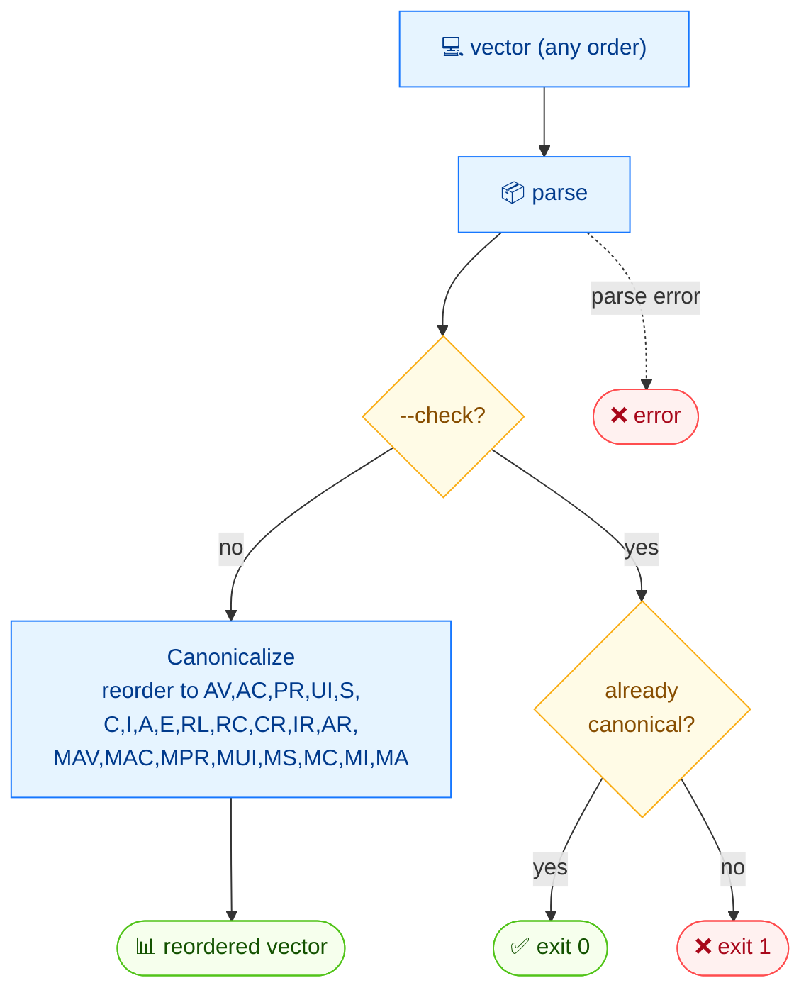

# 🔢 canonicalize

🔢 Normalize · 🟢 stable

## Synopsis

`cvss canonicalize` reorders a CVSS vector string into the canonical metric order (AV, AC, PR, UI, S, C, I, A, E, RL, RC, CR, IR, AR, MAV, MAC, MPR, MUI, MS, MC, MI, MA). Use `--check` to test whether a vector is already canonical without rewriting it.

## How It Works

Metrics are parsed and re-emitted in the fixed canonical order; `--check` skips the rewrite and only answers whether the input was already canonical (exit 0/1).



## Usage

```bash
cvss canonicalize [vector-string] [flags]
```

### Flags

| Flag         | Type   | Default | Description                                          |
| ------------ | ------ | ------- | ---------------------------------------------------- |
| `--check`    | bool   | `false` | Only check if the vector is canonical (exit 0=yes, 1=no) |
| `--format`   | string | `text`  | Output format: `text` or `json`                      |
| `-h, --help` | bool   | `false` | Help for `canonicalize`                              |

::: tip Scriptable `--check`
`--check` exits `0` when the vector is already canonical and `1` otherwise, so you can use it directly in shell `if` statements and CI gates.
:::

## Examples

::: code-group

```bash [already canonical]
cvss canonicalize "CVSS:3.1/AV:N/AC:L/PR:N/UI:N/S:U/C:H/I:H/A:H"
```

```text [output]
CVSS:3.1/AV:N/AC:L/PR:N/UI:N/S:U/C:H/I:H/A:H
```

:::

::: code-group

```bash [check mode]
cvss canonicalize --check "CVSS:3.1/AV:N/AC:L/PR:N/UI:N/S:U/C:H/I:H/A:H"
```

```text [output]
Canonical [PASS]
```

:::

::: warning A non-canonical example
`canonicalize "CVSS:3.1/S:U/C:H/I:H/A:H/AV:N/AC:L/PR:N/UI:N"` (metrics out of order) would rewrite the vector to canonical order; with `--check` it prints `Canonical [FAIL]` and exits `1`.
:::

## Underlying API

Uses [`cvss.Canonicalize(str)`](/sdk/sql-sort) to reorder and [`cvss.IsCanonical(str)`](/sdk/sql-sort) for the `--check` path.

```go
import (
    "fmt"

    "github.com/scagogogo/cvss-skills/pkg/cvss"
)

// rewrite into canonical order
canonical, err := cvss.Canonicalize("CVSS:3.1/AV:N/AC:L/PR:N/UI:N/S:U/C:H/I:H/A:H")
if err != nil {
    log.Fatal(err)
}
fmt.Println(canonical)

// check only
if cvss.IsCanonical("CVSS:3.1/AV:N/AC:L/PR:N/UI:N/S:U/C:H/I:H/A:H") {
    fmt.Println("Canonical [PASS]")
}
```

## Related

- [parse](/cli/commands/parse) — normalize the vector string too (via the parser)
- [validate](/cli/commands/validate) — validate before/after reordering
- [SQL & Sorting](/sdk/sql-sort) — Go SDK reference
