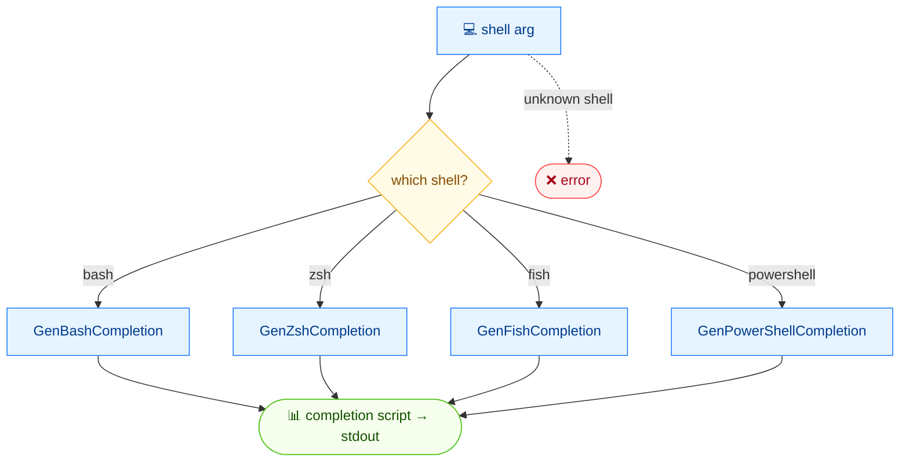

# 🐚 completion

<span class="badge">bash</span>
<span class="badge">zsh</span>
<span class="badge">fish</span>
<span class="badge">powershell</span>

## Synopsis

`cvss completion` generates a shell completion script for the `cvss` command. It supports four shells — `bash`, `zsh`, `fish`, and `powershell` — and prints the script to stdout. Source it (or write it to the appropriate completions directory) to get tab-completion for commands, flags, and metric values.

## How It Works

The shell argument selects the matching generator, which emits a completion script to stdout for sourcing or saving into the shell's completions directory.



## Usage

```
cvss completion [bash|zsh|fish|powershell] [flags]
```

### Flags

| Flag | Description |
| --- | --- |
| `-h, --help` | help for `completion` |

::: tip Required shell argument
`completion` takes exactly one argument, one of `bash`, `zsh`, `fish`, or `powershell`. Any other value is rejected.
:::

## Examples

::: code-group

```bash [Generate the bash script (head)]
cvss completion bash
# Output (first lines — full script is ~1400 lines):
# # bash completion for cvss                                 -*- shell-script -*-
#
# __cvss_debug()
# {
#     if [[ -n ${BASH_COMP_DEBUG_FILE:-} ]]; then
#         echo "$*" >> "${BASH_COMP_DEBUG_FILE}"
#     fi
# }
#
# # Homebrew on Macs have version 1.3 of bash-completion which doesn't include
# # _init_completion. This is a very minimal version of that function.
# __cvss_init_completion()
# {
#     COMPREPLY=()
#     _get_comp_words_by_ref "$@" cur prev words cword
# }
# ...
```

```bash [Install for bash]
source <(cvss completion bash)
# Or, persistently:
cvss completion bash > /etc/bash_completion.d/cvss
```

```bash [Install for zsh]
autoload -Uz compinit && compinit
cvss completion zsh > "${fpath[1]}/_cvss"
```

```bash [Install for fish]
cvss completion fish > ~/.config/fish/completions/cvss.fish
```

```powershell [Install for PowerShell]
cvss completion powershell | Out-String | Invoke-Expression
# Or add to profile:
cvss completion powershell >> $PROFILE
```

:::

::: warning The output is a script, not data
The completion script is large (the bash script alone is ~1400 lines) and is meant to be `source`d or written to a file, not parsed. The example above shows only the head of the output.
:::

## Underlying API

```go
import "github.com/spf13/cobra"

// rootCmd is the *cobra.Command root of the cvss CLI.
switch shell {
case "bash":
    err = rootCmd.GenBashCompletion(os.Stdout)
case "zsh":
    err = rootCmd.GenZshCompletion(os.Stdout)
case "fish":
    err = rootCmd.GenFishCompletion(os.Stdout, true)
case "powershell":
    err = rootCmd.GenPowerShellCompletion(os.Stdout)
}
```

`completion` delegates to cobra's built-in completion generators: `GenBashCompletion`, `GenZshCompletion`, `GenFishCompletion`, and `GenPowerShellCompletion` on the root `*cobra.Command`. Each writes the shell-specific script to the given `io.Writer`.

## Related

- [CLI Reference](/cli/) — overview of all commands and installation
- [Downloads](/downloads/) — pre-built binaries that ship `completion`
