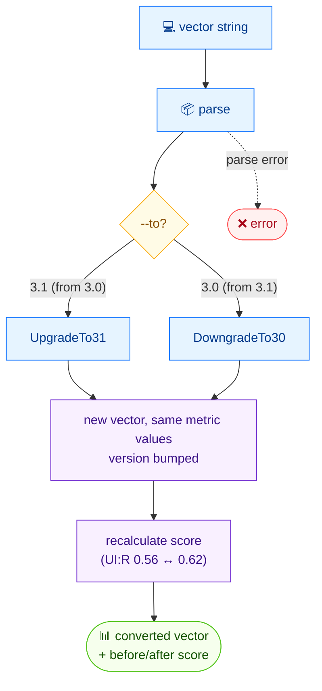

# 🔁 convert

🔁 Convert · 🟢 stable

## Synopsis

`cvss convert` converts a CVSS vector between v3.0 and v3.1. Metric values stay the same; only the version number changes — but because the `UI:R` constant differs between versions (0.56 in v3.0, 0.62 in v3.1), the resulting score may shift.

## How It Works

Only the version number changes — metric values are carried over — but because the `UI:R` constant differs between v3.0 (0.56) and v3.1 (0.62), the recalculated score may shift, which the command surfaces for comparison.



## Usage

```bash
cvss convert [vector-string] [flags]
```

### Flags

| Flag         | Type   | Default | Description                          |
| ------------ | ------ | ------- | ------------------------------------ |
| `-h, --help` | bool   | `false` | Help for `convert`                   |
| `--to`       | string | `3.1`   | Target version: `3.0` or `3.1`       |

### Supported conversions

| From  | To    | Operation  |
| ----- | ----- | ---------- |
| v3.0  | v3.1  | upgrade    |
| v3.1  | v3.0  | downgrade  |

::: warning Scores may change
Metric values are carried over unchanged, but the version-dependent `UI:R` constant (0.56 in v3.0 vs 0.62 in v3.1) means a vector with `UI:R` can score differently after conversion. The command prints both the original and converted scores so the delta is visible.
:::

## Examples

::: code-group

```bash [v3.1 → v3.0]
cvss convert --to 3.0 "CVSS:3.1/AV:N/AC:L/PR:N/UI:N/S:C/C:H/I:H/A:H"
```

```text [output]
Original:  CVSS:3.1/AV:N/AC:L/PR:N/UI:N/S:C/C:H/I:H/A:H (10.0)
Converted: CVSS:3.0/AV:N/AC:L/PR:N/UI:N/S:C/C:H/I:H/A:H (10.0)
```

:::

## Underlying API

Parses the vector with [`parser.ParseString`](/sdk/parser), then dispatches to [`cv.UpgradeTo31()`](/sdk/cvss) or [`cv.DowngradeTo30()`](/sdk/cvss) — both of which delegate to [`cv.ConvertToVersion(3, 0|1)`](/sdk/cvss). Scores for the before/after display come from a [`cvss.Calculator`](/sdk/calculator) over each vector.

```go
import (
    "fmt"

    "github.com/scagogogo/cvss-skills/pkg/cvss"
    "github.com/scagogogo/cvss-skills/pkg/parser"
)

cv, err := parser.ParseString("CVSS:3.1/AV:N/AC:L/PR:N/UI:N/S:C/C:H/I:H/A:H")
if err != nil {
    log.Fatal(err)
}

// downgrade to v3.0 (or use cv.UpgradeTo31() the other way)
converted, err := cv.DowngradeTo30()
if err != nil {
    log.Fatal(err)
}

fmt.Printf("Original:  %s\n", cv.String())
fmt.Printf("Converted: %s\n", converted.String())
```

## Related

- [parse](/cli/commands/parse) — verify the converted vector
- [score](/cli/commands/score) — recompute the score independently
- [v3.0 vs v3.1](/concepts/version-diff) — concept page on the version difference
- [Conversion](/sdk/cvss) — Go SDK reference
