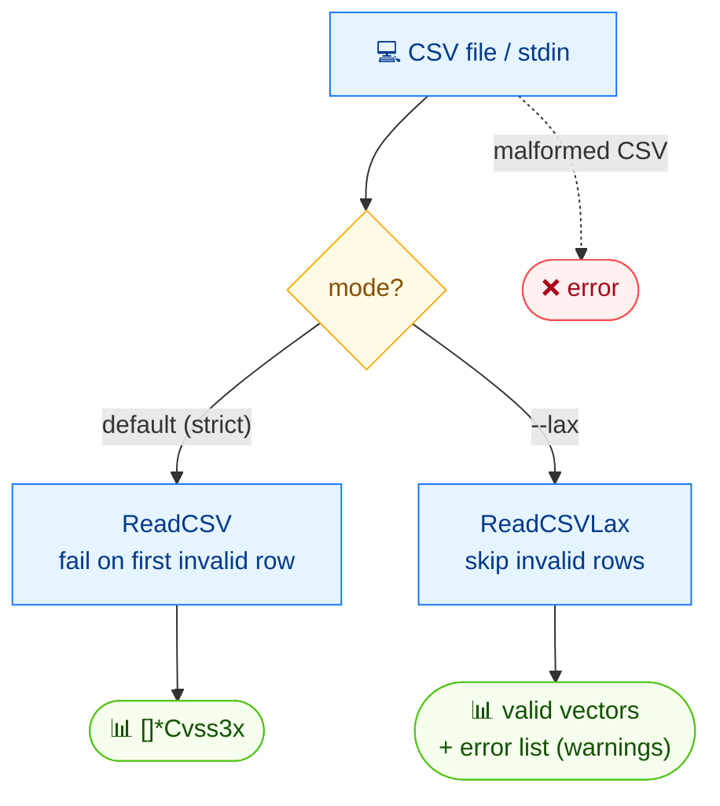

# 📖 csv read

<span class="badge">CVSS v3.0</span>
<span class="badge">CVSS v3.1</span>
<span class="badge badge-info">text output</span>

## Synopsis

`cvss csv read` reads CVSS vectors from a CSV file (or stdin) and prints each parsed vector string on its own line. The CSV format puts the vector string in the first column. By default the command fails on the first invalid row; pass `--lax` to skip invalid rows and report them as warnings instead.

`csv` is the parent command for CSV I/O; `read` is its reader subcommand (the sibling is `csv write`).

## How It Works

The CSV is read row by row; strict mode fails on the first invalid row, while `--lax` skips bad rows and reports them as warnings, returning the valid vectors and an error list.



## Usage

```
cvss csv read [file] [flags]
```

### Flags

| Flag | Default | Description |
| --- | --- | --- |
| `--lax` | `false` | tolerant mode: skip invalid rows instead of failing |
| `-h, --help` | — | help for `read` |

## Examples

::: code-group

```bash [Read a CSV file]
cvss csv read input.csv
```

```bash [From stdin]
cat vectors.csv | cvss csv read -
```

```bash [Tolerant mode]
cvss csv read --lax messy.csv
```

:::

::: tip Default vs `--lax`
In strict (default) mode, the first malformed row aborts the read with an error. In `--lax` mode, malformed rows are skipped and reported on stderr as `Warning: ...`; all valid rows are still parsed and printed.
:::

## Underlying API

```go
import "github.com/scagogogo/cvss-skills/pkg/cvss"

// Strict mode — fails on the first invalid row.
vectors, err := cvss.ReadCSV(os.Stdin) // ([]*Cvss3x, error)
if err != nil {
    log.Fatal(err)
}
for _, cv := range vectors {
    fmt.Println(cv.String())
}

// Tolerant mode — skips invalid rows, collects warnings.
vectors, readErrors, err := cvss.ReadCSVLax(os.Stdin) // ([]*Cvss3x, []CSVReadError, error)
if err != nil {
    log.Fatal(err)
}
for _, cv := range vectors {
    fmt.Println(cv.String())
}
for _, e := range readErrors {
    fmt.Fprintln(os.Stderr, "Warning:", e.String())
}
```

`cvss.ReadCSV(r io.Reader) ([]*Cvss3x, error)` is the strict reader. `cvss.ReadCSVLax(r io.Reader) ([]*Cvss3x, []CSVReadError, error)` is the tolerant reader — it returns parsed vectors alongside a `[]CSVReadError` describing each skipped row, and only returns a non-nil `error` for I/O or structural CSV failures.

## Related

- [`csv write`](/cli/commands/csv-write) — write vectors to CSV
- [`validate`](/cli/commands/validate) — validate a single vector string
- [`batch validate`](/cli/commands/batch-validate) — validate many vectors from a text file
