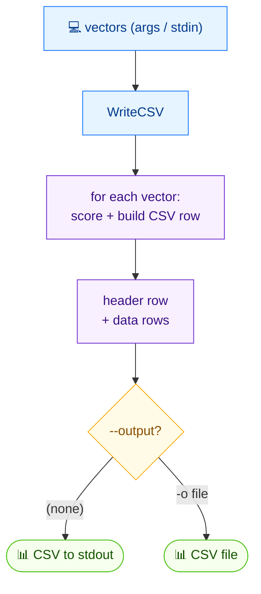

# 📝 csv write

<span class="badge">CVSS v3.0</span>
<span class="badge">CVSS v3.1</span>
<span class="badge badge-info">text (csv)</span>

## Synopsis

`cvss csv write` writes CVSS vectors to a CSV file with their computed scores. Vectors come from positional arguments or from stdin (one per line). The CSV format puts the vector string in the first column, followed by score columns. With no `-o`, output goes to stdout.

`csv` is the parent command for CSV I/O; `write` is its writer subcommand (the sibling is `csv read`).

## How It Works

Vectors from arguments or stdin are scored and written as CSV rows — vector string in the first column, followed by score columns — to a file or stdout.



## Usage

```
cvss csv write [vector-strings...] [flags]
```

### Flags

| Flag | Default | Description |
| --- | --- | --- |
| `-o, --output string` | `""` (stdout) | output file (default: stdout) |
| `-h, --help` | — | help for `write` |

## Examples

::: code-group

```bash [Multiple vectors to a file]
cvss csv write -o output.csv "CVSS:3.1/AV:N/AC:L/PR:N/UI:N/S:U/C:H/I:H/A:H" "CVSS:3.1/AV:L/AC:H/PR:H/UI:R/S:C/C:L/I:L/A:N"
```

```bash [Single vector piped via stdin]
echo "CVSS:3.1/AV:N/AC:L/PR:N/UI:N/S:U/C:H/I:H/A:H" | cvss csv write -
```

```bash [To stdout (no -o)]
cvss csv write "CVSS:3.1/AV:N/AC:L/PR:N/UI:N/S:U/C:H/I:H/A:H"
```

:::

::: tip Three input modes
`csv write` accepts vectors as: (1) positional arguments, (2) an explicit `-` arg meaning read stdin, or (3) no args at all — in which case it reads stdin automatically when stdin is not a terminal.
:::

::: warning Invalid vectors are skipped
Lines that fail to parse are reported on stderr as `Skipping invalid vector: <line> (<error>)` and excluded from the CSV. If no valid vectors remain, the command exits non-zero with `No valid vectors to write`.
:::

## Underlying API

```go
import (
    "github.com/scagogogo/cvss-skills/pkg/cvss"
    "github.com/scagogogo/cvss-skills/pkg/parser"
)

var vectors []*cvss.Cvss3x
for _, s := range []string{
    "CVSS:3.1/AV:N/AC:L/PR:N/UI:N/S:U/C:H/I:H/A:H",
    "CVSS:3.1/AV:L/AC:H/PR:H/UI:R/S:C/C:L/I:L/A:N",
} {
    cv, err := parser.ParseString(s)
    if err != nil {
        continue
    }
    vectors = append(vectors, cv)
}

// Write to any io.Writer (os.Stdout or a *os.File).
if err := cvss.WriteCSV(os.Stdout, vectors); err != nil {
    log.Fatal(err)
}
```

`cvss.WriteCSV(w io.Writer, vectors []*Cvss3x) error` serializes the vectors to CSV, computing scores via an internal calculator. The first column is the vector string; subsequent columns carry the scores.

## Related

- [`csv read`](/cli/commands/csv-read) — read vectors back from CSV
- [`sort`](/cli/commands/sort) — sort vectors by score
- [`score`](/cli/commands/score) — score a single vector
