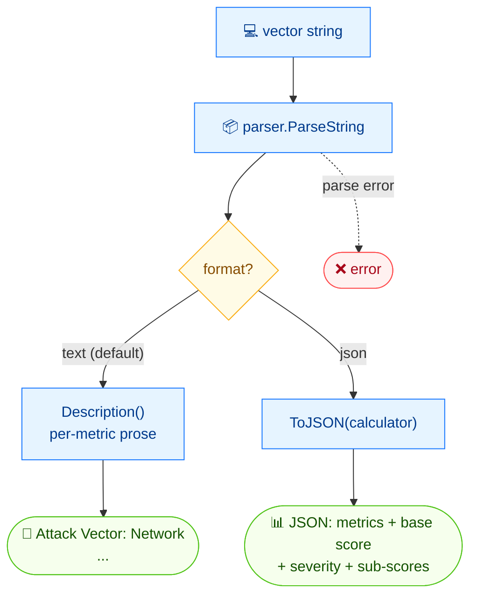

# 📝 describe

📝 Describe · 🟢 stable

## Synopsis

`cvss describe` turns a CVSS vector string into a plain-English list of every metric and its value (e.g. "Attack Vector: Network"). With `--format json` it returns the full structured document — including the base score, severity, and exploitability/impact sub-scores.

## How It Works

The vector is parsed once; the command then either walks the metrics into human-readable text, or with `--format json` emits the full structured document including scores and sub-scores.



## Usage

```bash
cvss describe [vector-string] [flags]
```

### Flags

| Flag         | Type   | Default | Description                     |
| ------------ | ------ | ------- | ------------------------------- |
| `--format`   | string | `text`  | Output format: `text` or `json` |
| `-h, --help` | bool   | `false` | Help for `describe`             |

## Examples

::: code-group

```bash [text]
cvss describe "CVSS:3.1/AV:N/AC:L/PR:N/UI:N/S:C/C:H/I:H/A:H"
```

```text [output]
Attack Vector: Network, Attack Complexity: Low, Privileges Required: None, User Interaction: None, Scope: Changed, Confidentiality: High, Integrity: High, Availability: High
```

:::

::: code-group

```bash [json]
cvss describe --format json "CVSS:3.1/AV:N/AC:L/PR:N/UI:N/S:C/C:H/I:H/A:H"
```

```json [output]
{
  "version": "3.1",
  "vectorString": "CVSS:3.1/AV:N/AC:L/PR:N/UI:N/S:C/C:H/I:H/A:H",
  "baseScore": 10,
  "baseSeverity": "Critical",
  "metrics": {
    "base": {
      "attackVector": "Network",
      "attackComplexity": "Low",
      "privilegesRequired": "None",
      "userInteraction": "None",
      "scope": "Changed",
      "confidentiality": "High",
      "integrity": "High",
      "availability": "High",
      "exploitabilityScore": 3.8870427750000003,
      "impactScore": 6.128026328809978
    }
  }
}
```

:::

## Underlying API

Parses the vector with [`parser.ParseString`](/sdk/parser). In text mode it prints `cv.Description()`; in JSON mode it serializes [`cv.ToJSON(calc)`](/sdk/json), which embeds the score and sub-scores computed by a [`cvss.Calculator`](/sdk/calculator).

```go
import (
    "fmt"

    "github.com/scagogogo/cvss-skills/pkg/cvss"
    "github.com/scagogogo/cvss-skills/pkg/parser"
)

cv, err := parser.ParseString("CVSS:3.1/AV:N/AC:L/PR:N/UI:N/S:C/C:H/I:H/A:H")
if err != nil {
    log.Fatal(err)
}

// plain-text description
fmt.Println(cv.Description())

// structured JSON document (includes scores + sub-scores)
calc := cvss.NewCalculator(cv)
out, _ := cv.ToJSON(calc)
fmt.Println(string(out))
```

## Related

- [parse](/cli/commands/parse) — inspect version / completeness / raw vector
- [groups](/cli/commands/groups) — group metrics by Base / Temporal / Environmental
- [json](/cli/commands/json) — equivalent structured JSON output
- [JSON Serialization](/sdk/json) — Go SDK reference
