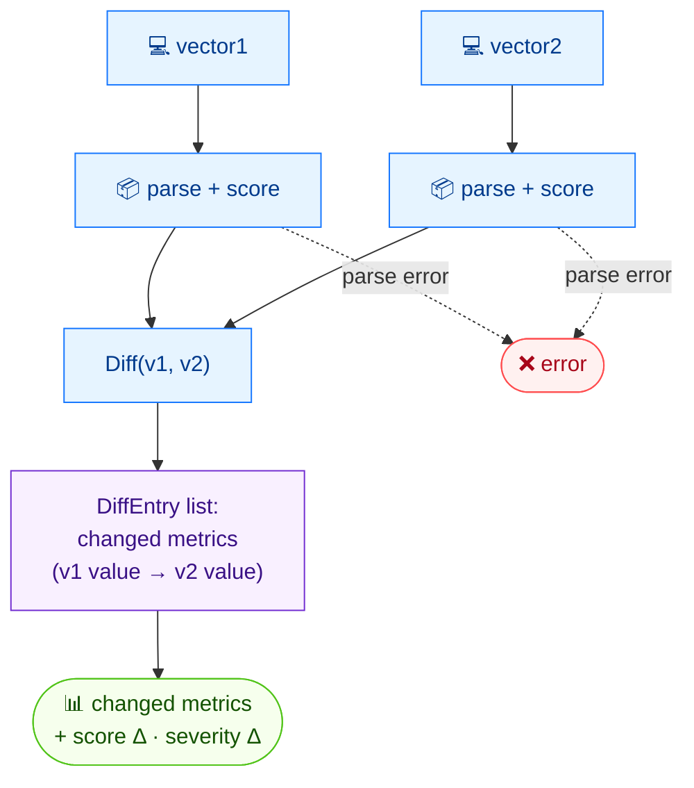

# 🔀 diff

<span class="badge">CVSS v3.0</span>
<span class="badge">CVSS v3.1</span>
<span class="badge badge-info">text + json</span>

## Synopsis

`cvss diff` compares two CVSS vectors and reports which metrics differ, then shows how the score and severity change as a result. It is the command to reach for when triaging "what changed between these two assessments".

## How It Works

Both vectors are parsed and scored, then a per-metric diff lists every changed field together with the score and severity deltas.



## Usage

```
cvss diff [vector1] [vector2] [flags]
```

### Flags

| Flag | Default | Description |
| --- | --- | --- |
| `--format string` | `text` | output format: `text` or `json` |
| `-h, --help` | — | help for `diff` |

## Examples

::: code-group

```bash [Scope change, same metrics otherwise]
cvss diff "CVSS:3.1/AV:N/AC:L/PR:N/UI:N/S:U/C:H/I:H/A:H" "CVSS:3.1/AV:N/AC:L/PR:N/UI:N/S:C/C:H/I:H/A:H"
# Output:
# Found 1 difference(s):
#
#   S: U (Unchanged) → C (Changed)
#
# Score: 9.8 (Critical) → 10.0 (Critical)  [Δ=0.2]
```

:::

::: tip Identical vectors
When the two vectors are identical, `diff` prints `Vectors are identical` and exits `0`.
:::

## Underlying API

```go
import (
    "github.com/scagogogo/cvss-skills/pkg/cvss"
    "github.com/scagogogo/cvss-skills/pkg/parser"
)

cv1, _ := parser.ParseString("CVSS:3.1/AV:N/AC:L/PR:N/UI:N/S:U/C:H/I:H/A:H")
cv2, _ := parser.ParseString("CVSS:3.1/AV:N/AC:L/PR:N/UI:N/S:C/C:H/I:H/A:H")

diffs := cv1.Diff(cv2) // []DiffEntry (Metric, V1, V1Long, V2, V2Long)

calc1 := cvss.NewCalculator(cv1)
calc2 := cvss.NewCalculator(cv2)
s1, _ := calc1.Calculate()
s2, _ := calc2.Calculate()

fmt.Printf("Score: %.1f → %.1f  [Δ=%.1f]\n", s1, s2, s2-s1)
```

`Diff(other *Cvss3x) []DiffEntry` returns one entry per metric whose value differs. Each `DiffEntry` carries `Metric`, `V1`/`V2` (short values) and `V1Long`/`V2Long` (long names). Scores come from a separate `cvss.NewCalculator` on each side.

## Related

- [`equal`](/cli/commands/equal) — boolean equality check with exit code
- [`distance`](/cli/commands/distance) — numeric distance metrics between two vectors
- [`score`](/cli/commands/score) — score a single vector
