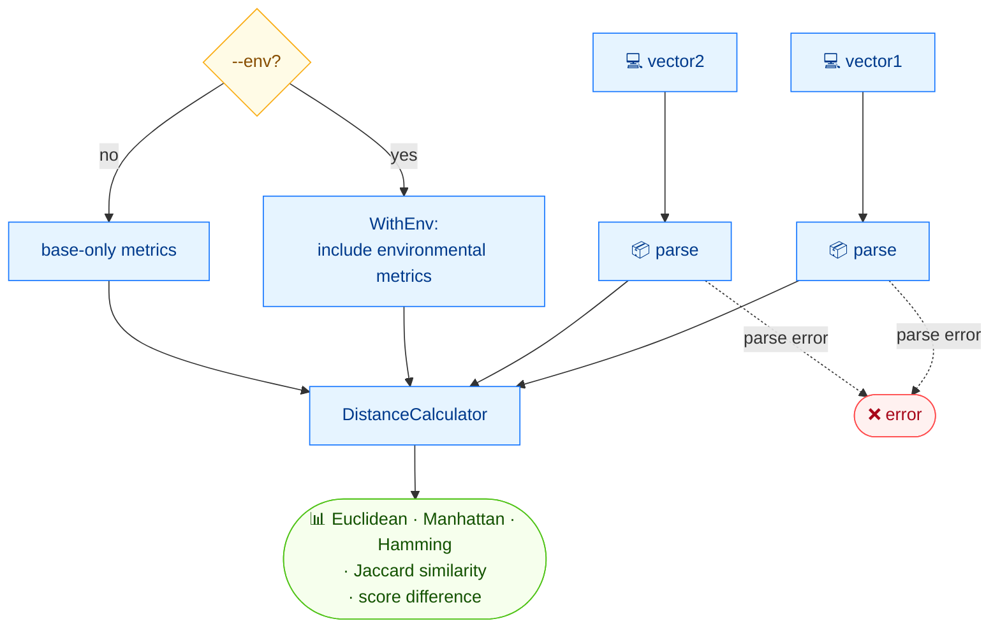

# 📏 distance

<span class="badge">CVSS v3.0</span>
<span class="badge">CVSS v3.1</span>
<span class="badge badge-info">text + json</span>

## Synopsis

`cvss distance` computes five distance/similarity metrics between two CVSS vectors: Euclidean, Manhattan, Hamming, Jaccard similarity, and the absolute score difference. Pass `--env` to include environmental (and modified) metrics in the four structural metrics.

## How It Works

Two vectors are compared by a distance calculator that yields five metrics; `--env` widens the four structural metrics (Euclidean, Manhattan, Hamming, Jaccard) to include environmental/modified metrics.



## Usage

```
cvss distance [vector1] [vector2] [flags]
```

### Flags

| Flag | Default | Description |
| --- | --- | --- |
| `--env` | `false` | include environmental metrics in distance calculations |
| `--format string` | `text` | output format: `text` or `json` |
| `-h, --help` | — | help for `distance` |

### Available distance metrics

- **Euclidean distance** — numeric score differences
- **Manhattan distance** — sum of absolute score differences
- **Hamming distance** — count of different metrics
- **Jaccard similarity** — ratio of same metrics
- **Score difference** — absolute score difference

## Examples

::: code-group

```bash [Base metrics only]
cvss distance "CVSS:3.1/AV:N/AC:L/PR:N/UI:N/S:U/C:H/I:H/A:H" "CVSS:3.1/AV:N/AC:L/PR:N/UI:N/S:C/C:H/I:H/A:H"
# Output:
# Euclidean:  1.0000
# Manhattan:  1.0000
# Hamming:    1
# Jaccard:    0.8750
# Score diff: 0.2
```

```bash [With environmental metrics]
cvss distance --env "CVSS:3.1/AV:N/AC:L/PR:N/UI:N/S:U/C:H/I:H/A:H/CR:H/IR:M/AR:L/MAV:L/MC:N" "CVSS:3.1/AV:N/AC:L/PR:N/UI:N/S:U/C:H/I:H/A:H"
# Output:
# Euclidean (with env):  0.0000
# Manhattan (with env):  0.0000
# Hamming (with env):    0
# Jaccard (with env):    1.0000
# Score diff: 2.8
```

:::

::: tip `Score diff` is always base-score based
`Score diff` reflects the absolute difference of the two vectors' scores and is **not** affected by `--env`. The other four metrics switch to their `*WithEnv` variants when `--env` is set, comparing modified/environmental metrics too.
:::

## Underlying API

```go
import (
    "github.com/scagogogo/cvss-skills/pkg/cvss"
    "github.com/scagogogo/cvss-skills/pkg/parser"
)

cv1, _ := parser.ParseString("CVSS:3.1/AV:N/AC:L/PR:N/UI:N/S:U/C:H/I:H/A:H")
cv2, _ := parser.ParseString("CVSS:3.1/AV:N/AC:L/PR:N/UI:N/S:C/C:H/I:H/A:H")

dc := cvss.NewDistanceCalculator(cv1, cv2)
fmt.Printf("Euclidean:  %.4f\n", dc.EuclideanDistance())
fmt.Printf("Manhattan:  %.4f\n", dc.ManhattanDistance())
fmt.Printf("Hamming:    %d\n", dc.HammingDistance())
fmt.Printf("Jaccard:    %.4f\n", dc.JaccardSimilarity())
fmt.Printf("Score diff: %.1f\n", dc.ScoreDifference())

// With --env, use the *WithEnv variants:
// dc.EuclideanDistanceWithEnv(), dc.ManhattanDistanceWithEnv(),
// dc.HammingDistanceWithEnv(), dc.JaccardSimilarityWithEnv()
```

`NewDistanceCalculator(vector1, vector2 *Cvss3x) *DistanceCalculator` builds the calculator; each metric is a method on it. The `*WithEnv` family includes modified and environmental metrics in the structural comparison.

## Related

- [`diff`](/cli/commands/diff) — which specific metrics differ
- [`equal`](/cli/commands/equal) — boolean equality with exit code
- [`score`](/cli/commands/score) — score a single vector
