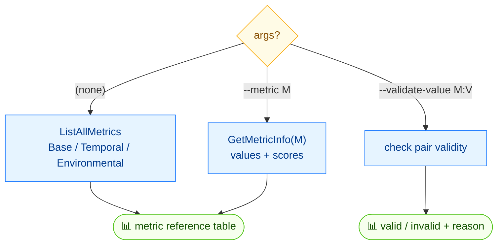

# 📋 enumerate

<span class="badge">CVSS v3.0</span>
<span class="badge">CVSS v3.1</span>
<span class="badge badge-info">text + json</span>

## Synopsis

`cvss enumerate` is a reference command: it lists all CVSS v3.x metrics, their valid values, and per-value scores, grouped by Base / Temporal / Environmental. Use `--metric` to focus on one metric, or `--validate-value` to check whether a `METRIC:VALUE` pair is valid.

## How It Works

With no arguments the command lists every CVSS v3.x metric with valid values and per-value scores; `--metric` focuses on one metric, and `--validate-value` checks a single `METRIC:VALUE` pair.



## Usage

```
cvss enumerate [flags]
```

### Flags

| Flag | Default | Description |
| --- | --- | --- |
| `--format string` | `text` | output format: `text` or `json` |
| `--metric string` | `""` | show details for a specific metric (e.g. `AV`) |
| `--validate-value string` | `""` | validate a `metric:value` pair (e.g. `AV:N`) |
| `-h, --help` | — | help for `enumerate` |

## Examples

::: code-group

```bash [One metric's values and scores]
cvss enumerate --metric AV
# Output:
# AV (Attack Vector) [Base]:
#   N = Network (score: 0.85)
#   A = Adjacent (score: 0.62)
#   L = Local (score: 0.55)
#   P = Physical (score: 0.20)
```

```bash [All metrics]
cvss enumerate
```

```bash [Validate a value]
cvss enumerate --validate-value AV:N
```

```bash [JSON]
cvss enumerate --format json
```

:::

::: tip `--validate-value` exit code
`--validate-value` exits `0` when the pair is valid and `1` when invalid (printing `Invalid: X is not a valid value for METRIC`). This makes it usable as a guard in scripts.
:::

## Underlying API

```go
import "github.com/scagogogo/cvss-skills/pkg/cvss"

// List every metric, grouped by Base/Temporal/Environmental.
metrics := cvss.ListAllMetrics() // []MetricInfo
for _, m := range metrics {
    fmt.Print(m.String())
}

// Focus on one metric.
info, err := cvss.GetMetricInfo("AV") // (MetricInfo, error)
if err != nil {
    log.Fatal(err)
}
fmt.Print(info.String())

// Check a single value (rune).
valid := cvss.IsValidMetricValue("AV", 'N') // bool
```

The three building blocks are `ListAllMetrics() []MetricInfo`, `GetMetricInfo(shortName string) (MetricInfo, error)`, and `IsValidMetricValue(shortName string, value rune) bool`.

## Related

- [`validate`](/cli/commands/validate) — validate a whole vector string
- [`get`](/cli/commands/get) — read one metric's value from a vector
- [`build`](/cli/commands/build) — assemble a vector from metric flags
