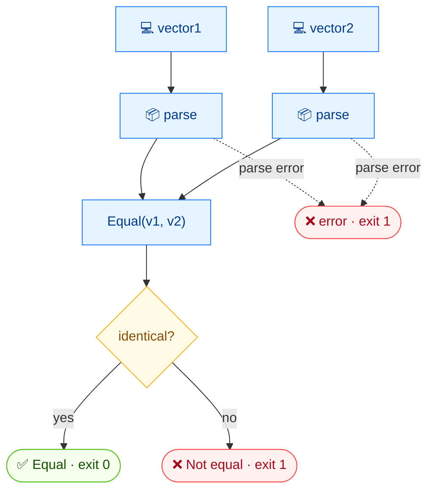

# ⚖️ equal

<span class="badge">CVSS v3.0</span>
<span class="badge">CVSS v3.1</span>
<span class="badge badge-info">text + json</span>

## Synopsis

`cvss equal` performs a deep equality check on two CVSS vectors. It prints `Equal` or `Not equal` and uses its exit code as the result: `0` if identical, `1` if different or on error. This makes it ideal for shell `if` guards and CI gates.

## How It Works

Both vectors are parsed and compared by deep equality; the command prints `Equal`/`Not equal` and encodes the result in its exit code (0 equal, 1 different or error).



## Usage

```
cvss equal [vector1] [vector2] [flags]
```

### Flags

| Flag | Default | Description |
| --- | --- | --- |
| `--format string` | `text` | output format: `text` or `json` |
| `-h, --help` | — | help for `equal` |

## Examples

::: code-group

```bash [Different vectors — non-zero exit]
cvss equal "CVSS:3.1/AV:N/AC:L/PR:N/UI:N/S:U/C:H/I:H/A:H" "CVSS:3.1/AV:N/AC:L/PR:N/UI:N/S:C/C:H/I:H/A:H"
# Output:
# Not equal
# (stderr: not equal, exit=1)
```

```bash [Identical vectors — zero exit]
cvss equal "CVSS:3.1/AV:N/AC:L/PR:N/UI:N/S:U/C:H/I:H/A:H" "CVSS:3.1/AV:N/AC:L/PR:N/UI:N/S:U/C:H/I:H/A:H"
# Output:
# Equal
```

:::

::: warning Exit code is the contract
In text mode, `Not equal` is printed to stdout **and** `not equal` is printed to stderr, then the process exits `1`. Script against the exit code, not the stdout text. In JSON mode, the result is `{"equal": false, ...}` with exit `1` when unequal.
:::

## Underlying API

```go
import "github.com/scagogogo/cvss-skills/pkg/parser"

cv1, _ := parser.ParseString("CVSS:3.1/AV:N/AC:L/PR:N/UI:N/S:U/C:H/I:H/A:H")
cv2, _ := parser.ParseString("CVSS:3.1/AV:N/AC:L/PR:N/UI:N/S:C/C:H/I:H/A:H")

eq := cv1.Equal(cv2) // bool
if eq {
    fmt.Println("Equal")
} else {
    fmt.Println("Not equal")
    os.Exit(1)
}
```

`Equal(other *Cvss3x) bool` is a deep comparison of the two vectors' metric values.

## Related

- [`diff`](/cli/commands/diff) — shows *what* differs, not just whether
- [`distance`](/cli/commands/distance) — numeric measure of how far apart two vectors are
- [`validate`](/cli/commands/validate) — check one vector's validity
