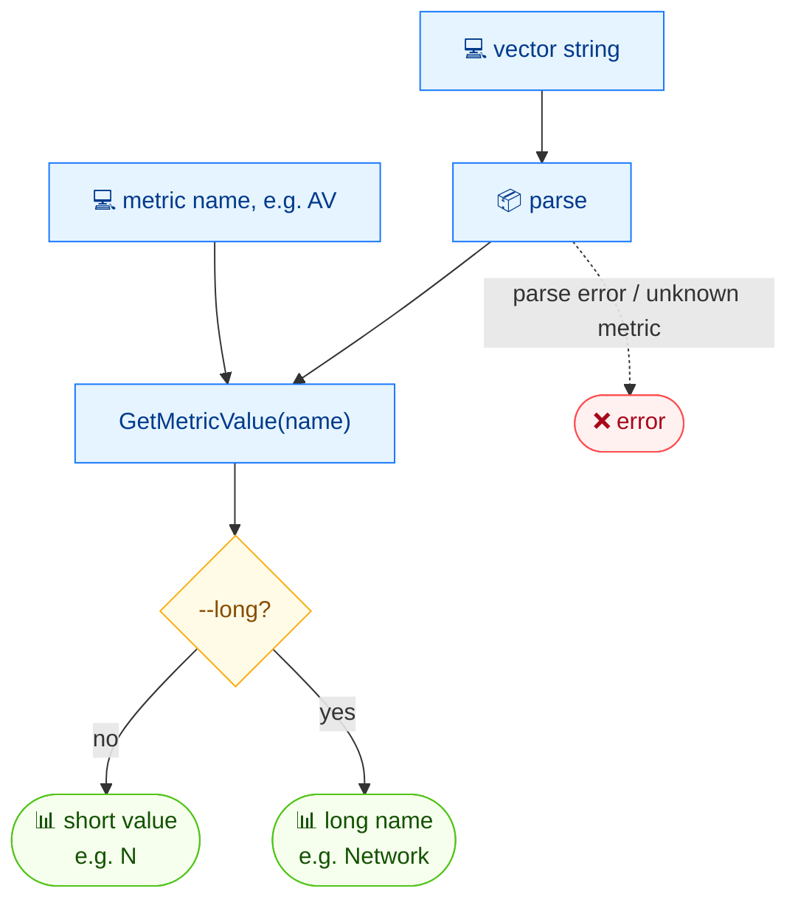

# 🔎 get

<span class="badge">CVSS v3.0</span>
<span class="badge">CVSS v3.1</span>
<span class="badge badge-info">text output</span>

## Synopsis

`cvss get` extracts the value of a single metric from a CVSS vector string. By default it prints the short value character (e.g. `N`); pass `--long` to print the human-readable long name (e.g. `Network`). It is the lightest way to inspect one field of a vector in a script.

## How It Works

The vector is parsed and the named metric is looked up; the command prints the short value character by default, or the long human-readable name with `--long`.



## Usage

```
cvss get [vector-string] [metric-name] [flags]
```

### Flags

| Flag | Default | Description |
| --- | --- | --- |
| `--long` | `false` | show long metric name instead of short value |
| `-h, --help` | — | help for `get` |

::: tip Positional arguments
The first positional argument is the vector string and the second is the metric short name (e.g. `AV`, `PR`, `S`). Both are required — `get` takes exactly two arguments.
:::

## Examples

::: code-group

```bash [Short value]
cvss get "CVSS:3.1/AV:N/AC:L/PR:N/UI:N/S:C/C:H/I:H/A:H" AV
# Output:
# N
```

```bash [Long name]
cvss get --long "CVSS:3.1/AV:N/AC:L/PR:N/UI:N/S:C/C:H/I:H/A:H" AV
# Output:
# Network
```

:::

::: warning `get` has no `--format json`
Unlike most commands, `get` prints a single token (`N` or `Network`) and does not accept `--format json`. Use [`cvss map`](/cli/commands/map) or [`cvss json`](/cli/commands/json) for structured output.
:::

## Underlying API

```go
import "github.com/scagogogo/cvss-skills/pkg/parser"

cv, err := parser.ParseString("CVSS:3.1/AV:N/AC:L/PR:N/UI:N/S:C/C:H/I:H/A:H")
if err != nil {
    log.Fatal(err)
}

// shortVal is a rune; longVal is the human-readable name.
shortVal, longVal, err := cv.GetMetricValue("AV")
if err != nil {
    log.Fatal(err)
}
fmt.Println(string(shortVal)) // N
fmt.Println(longVal)          // Network
```

`GetMetricValue(shortName string) (rune, string, error)` is defined on `*cvss.Cvss3x`.

## Related

- [`map`](/cli/commands/map) — output the whole vector as `key=value` pairs
- [`groups`](/cli/commands/groups) — inspect metrics grouped by Base / Temporal / Environmental
- [`enumerate`](/cli/commands/enumerate) — list valid values and scores for a metric
