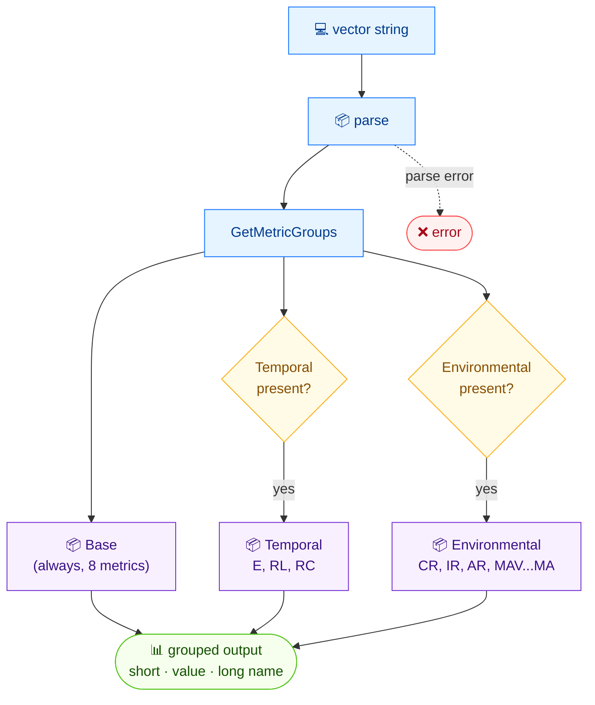

# 🗂️ groups

<span class="badge">CVSS v3.0</span>
<span class="badge">CVSS v3.1</span>
<span class="badge badge-info">text + json</span>

## Synopsis

`cvss groups` displays every metric of a vector organized into its CVSS group — **Base**, **Temporal**, and **Environmental** (the latter two only when present). Each metric line shows the short name, current value, and long name, making it easy to scan a vector at a glance.

## How It Works

The parsed vector's metrics are bucketed by CVSS group — Base always, Temporal and Environmental only when present — each shown with short name, value, and long name.



## Usage

```
cvss groups [vector-string] [flags]
```

### Flags

| Flag | Default | Description |
| --- | --- | --- |
| `--format string` | `text` | output format: `text` or `json` |
| `-h, --help` | — | help for `groups` |

## Examples

::: code-group

```bash [Text — vector with temporal metrics]
cvss groups "CVSS:3.1/AV:N/AC:L/PR:N/UI:N/S:U/C:H/I:H/A:H/E:U/RL:O/RC:C"
# Output:

# [Base]
#   AV:N  Attack Vector = Network
#   AC:L  Attack Complexity = Low
#   PR:N  Privileges Required = None
#   UI:N  User Interaction = None
#   S:U  Scope = Unchanged
#   C:H  Confidentiality = High
#   I:H  Integrity = High
#   A:H  Availability = High

# [Temporal]
#   E:U  Exploit Code Maturity = Unproven
#   RL:O  Remediation Level = Official Fix
#   RC:C  Report Confidence = Confirmed
```

```bash [JSON]
cvss groups --format json "CVSS:3.1/AV:N/AC:L/PR:N/UI:N/S:U/C:H/I:H/A:H/E:F/RL:T/RC:C"
```

:::

::: tip Sections appear only when present
A base-only vector prints only the `[Base]` section. The `[Temporal]` and `[Environmental]` sections appear only when the vector carries those metrics.
:::

## Underlying API

```go
import "github.com/scagogogo/cvss-skills/pkg/parser"

cv, err := parser.ParseString("CVSS:3.1/AV:N/AC:L/PR:N/UI:N/S:U/C:H/I:H/A:H/E:U/RL:O/RC:C")
if err != nil {
    log.Fatal(err)
}

groups := cv.GetMetricGroups() // []MetricGroup{Name, Metrics}
for _, g := range groups {
    fmt.Printf("\n[%s]\n", g.Name)
    for _, m := range g.Metrics { // m is a MetricValuePair
        fmt.Printf("  %s:%s  %s = %s\n", m.ShortName, m.Value, m.LongName, m.LongValue)
    }
}
```

`GetMetricGroups() []MetricGroup` returns groups whose `Metrics` field is a `[]MetricValuePair` carrying `ShortName`, `LongName`, `Value` (short), and `LongValue`.

## Related

- [`get`](/cli/commands/get) — read a single metric's value
- [`map`](/cli/commands/map) — flat `key=value` view of all metrics
- [`parse`](/cli/commands/parse) — full structured breakdown of a vector
