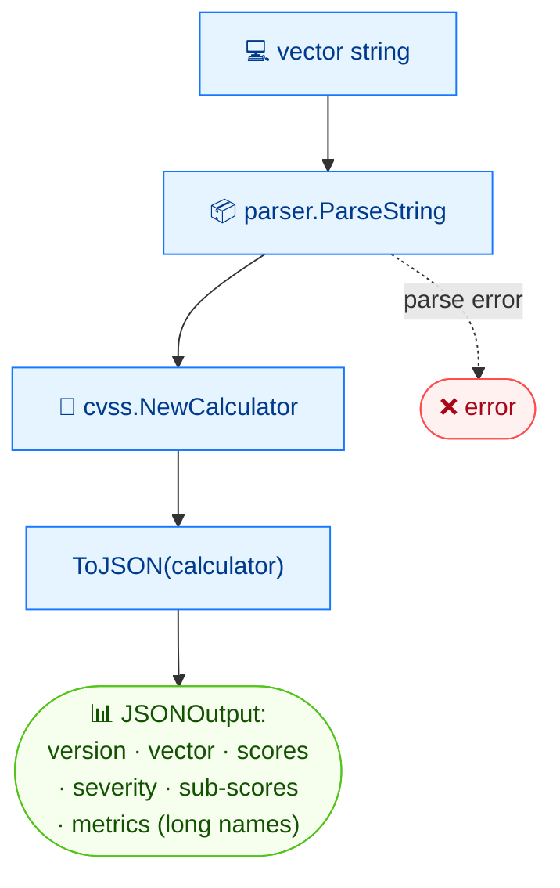

# 🧾 json

<span class="badge">CVSS v3.0</span>
<span class="badge">CVSS v3.1</span>
<span class="badge badge-info">json output</span>

## Synopsis

`cvss json` serializes a CVSS vector string to a structured JSON document. The output includes the version, vector string, base score, severity rating, and metric details with long names, plus exploitability and impact sub-scores. It is the canonical machine-readable representation of a vector.

## How It Works

The parsed vector plus a calculator are fed to `ToJSON`, producing one document carrying the version, vector string, scores, severities, sub-scores, and per-metric details with long names.



## Usage

```
cvss json [vector-string] [flags]
```

### Flags

| Flag | Description |
| --- | --- |
| `-h, --help` | help for `json` |

::: tip Already JSON
`json` emits JSON by definition — there is no `--format` flag. The output is always indented JSON.
:::

## Examples

::: code-group

```bash [Scope-changed vector]
cvss json "CVSS:3.1/AV:N/AC:L/PR:N/UI:N/S:C/C:H/I:H/A:H"
# Output:
# {
#   "version": "3.1",
#   "vectorString": "CVSS:3.1/AV:N/AC:L/PR:N/UI:N/S:C/C:H/I:H/A:H",
#   "baseScore": 10,
#   "baseSeverity": "Critical",
#   "metrics": {
#     "base": {
#       "attackVector": "Network",
#       "attackComplexity": "Low",
#       "privilegesRequired": "None",
#       "userInteraction": "None",
#       "scope": "Changed",
#       "confidentiality": "High",
#       "integrity": "High",
#       "availability": "High",
#       "exploitabilityScore": 3.8870427750000003,
#       "impactScore": 6.128026328809978
#     }
#   }
# }
```

:::

::: warning Validation gates the output
`ToJSON` calls `Check()` on the vector first; an invalid vector causes the command to exit non-zero with a parse error on stderr and produces no JSON.
:::

## Underlying API

```go
import (
    "github.com/scagogogo/cvss-skills/pkg/cvss"
    "github.com/scagogogo/cvss-skills/pkg/parser"
)

cv, err := parser.ParseString("CVSS:3.1/AV:N/AC:L/PR:N/UI:N/S:C/C:H/I:H/A:H")
if err != nil {
    log.Fatal(err)
}

calc := cvss.NewCalculator(cv)
data, err := cv.ToJSON(calc) // []byte
if err != nil {
    log.Fatal(err)
}
fmt.Println(string(data))
```

`ToJSON(calculator *Calculator) ([]byte, error)` serializes the vector. If `calculator` is `nil` it defaults to `NewCalculator(x)`. The calculator supplies the scores embedded in the JSON.

## Related

- [`describe`](/cli/commands/describe) — same data as a one-line human-readable string
- [`score`](/cli/commands/score) — just the numeric score and severity
- [`map`](/cli/commands/map) — flat `key=value` form for shell scripts
