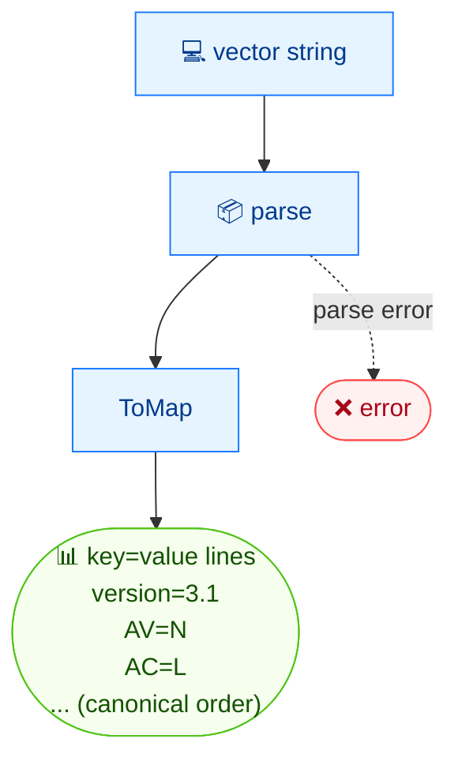

# 🗺️ map

<span class="badge">CVSS v3.0</span>
<span class="badge">CVSS v3.1</span>
<span class="badge badge-info">text output</span>

## Synopsis

`cvss map` outputs a CVSS vector as `key=value` pairs, one per line, in canonical metric order. It is designed for shell scripting — each line is trivial to `grep`, `awk`, or `source` into a shell associative array. The `version` key is always emitted first.

## How It Works

The vector is serialized to `key=value` lines in canonical metric order, with the `version` key emitted first — easy to grep, awk, or source.



## Usage

```
cvss map [vector-string] [flags]
```

### Flags

| Flag | Description |
| --- | --- |
| `-h, --help` | help for `map` |

## Examples

::: code-group

```bash [Scope-changed vector]
cvss map "CVSS:3.1/AV:N/AC:L/PR:N/UI:N/S:C/C:H/I:H/A:H"
# Output:
# version=3.1
# AV=N
# AC=L
# PR=N
# UI=N
# S=C
# C=H
# I=H
# A=H
```

:::

::: tip Canonical ordering
Pairs always print in CVSS canonical order: `version`, then Base metrics (`AV AC PR UI S C I A`), then Temporal (`E RL RC`), then Environmental requirements and modified metrics — but only for metrics actually present in the vector.
:::

::: warning No `--format` flag
`map` has no `--format json` — the `key=value` output *is* its scripting contract. For JSON use [`cvss json`](/cli/commands/json).
:::

## Underlying API

```go
import "github.com/scagogogo/cvss-skills/pkg/parser"

cv, err := parser.ParseString("CVSS:3.1/AV:N/AC:L/PR:N/UI:N/S:C/C:H/I:H/A:H")
if err != nil {
    log.Fatal(err)
}

m := cv.ToMap() // map[string]string

// The CLI iterates a fixed canonical key order and prints those present.
order := []string{"version", "AV", "AC", "PR", "UI", "S", "C", "I", "A",
    "E", "RL", "RC", "CR", "IR", "AR", "MAV", "MAC", "MPR", "MUI", "MS", "MC", "MI", "MA"}
for _, key := range order {
    if val, ok := m[key]; ok {
        fmt.Printf("%s=%s\n", key, val)
    }
}
```

`ToMap() map[string]string` returns every present metric keyed by its short name, plus `version`.

## Related

- [`get`](/cli/commands/get) — read a single metric's value
- [`groups`](/cli/commands/groups) — grouped view of the same data
- [`json`](/cli/commands/json) — structured JSON serialization
