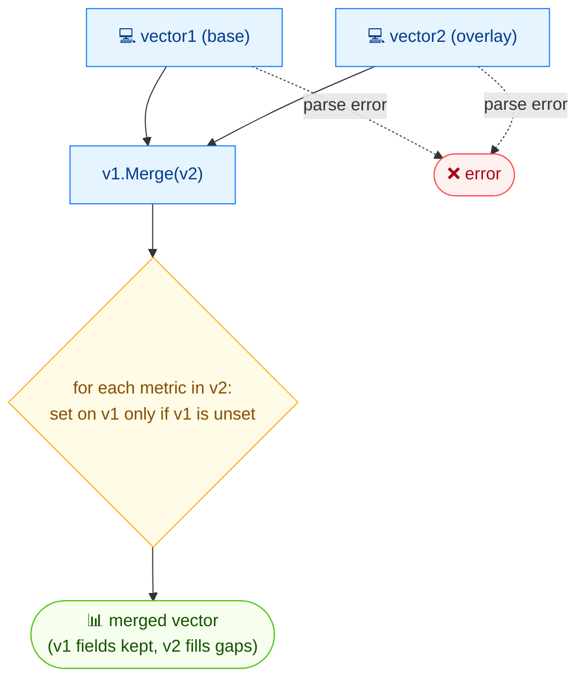

# 🔗 merge

🔗 Merge · 🟢 stable

## Synopsis

`cvss merge` combines two CVSS vectors: fields from the second vector fill in metrics that are missing in the first, while fields already set in the first are never overwritten. This is useful for layering a temporal/environmental overlay onto a base vector, or for combining partial vectors.

## How It Works

The second vector fills only the metrics missing from the first; metrics already set in the first are preserved, yielding one combined vector.



## Usage

```bash
cvss merge [vector1] [vector2] [flags]
```

### Flags

| Flag         | Type   | Default | Description                     |
| ------------ | ------ | ------- | ------------------------------- |
| `--format`   | string | `text`  | Output format: `text` or `json` |
| `-h, --help` | bool   | `false` | Help for `merge`                |

::: warning First vector wins
Metrics present in `vector1` are kept as-is. `vector2` only contributes metrics that `vector1` lacks — so the order of arguments matters.
:::

## Examples

::: code-group

```bash [base + base overlay]
cvss merge "CVSS:3.1/AV:N/AC:L/PR:N/UI:N" "CVSS:3.1/AV:N/AC:L/PR:N/UI:N/S:U/C:H/I:H/A:H"
```

```text [output]
CVSS:3.1/AV:N/AC:L/PR:N/UI:N/S:U/C:H/I:H/A:H
```

:::

::: tip Layer temporal metrics onto a base vector
A common pattern is merging a temporal overlay (`E:F/RL:T/RC:C`) onto a full base vector — the base metrics stay, the temporal metrics get filled in. Since `vector1` keeps its values, pass the base vector first and the overlay second.
:::

## Underlying API

Parses both vectors with [`parser.ParseString`](/sdk/parser), then calls [`cv1.Merge(cv2)`](/sdk/cvss), which returns a new `*Cvss3x` carrying the union of metrics (first wins on conflicts).

```go
import (
    "fmt"

    "github.com/scagogogo/cvss-skills/pkg/parser"
)

cv1, err := parser.ParseString("CVSS:3.1/AV:N/AC:L/PR:N/UI:N")
if err != nil {
    log.Fatal(err)
}
cv2, err := parser.ParseString("CVSS:3.1/AV:N/AC:L/PR:N/UI:N/S:U/C:H/I:H/A:H")
if err != nil {
    log.Fatal(err)
}

merged := cv1.Merge(cv2) // cv1's metrics are kept; cv2 fills the gaps
fmt.Println(merged.String()) // CVSS:3.1/AV:N/AC:L/PR:N/UI:N/S:U/C:H/I:H/A:H
```

## Related

- [modify](/cli/commands/modify) — overwrite specific metrics instead of filling gaps
- [strip](/cli/commands/strip) — the inverse: drop temporal/environmental metrics
- [diff](/cli/commands/diff) — see what differs between two vectors
- [Merge](/sdk/cvss) — Go SDK reference
