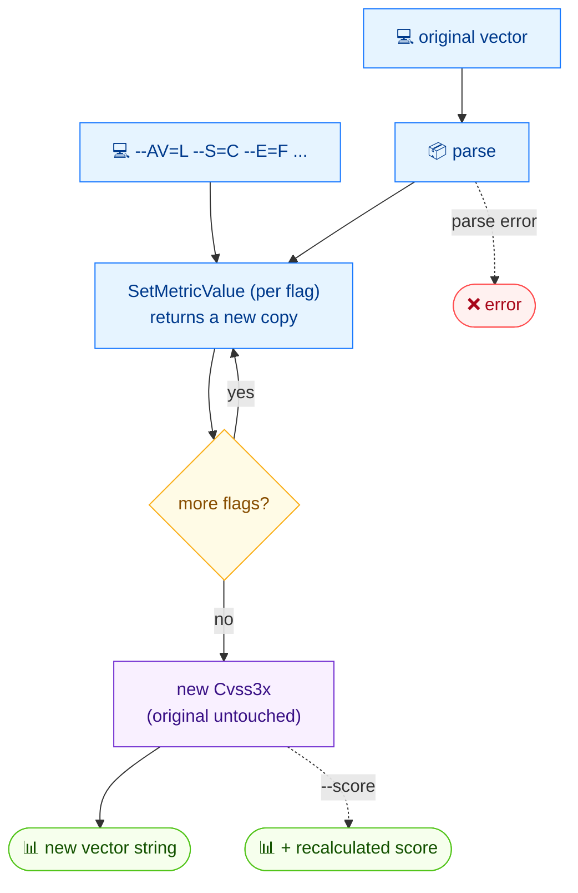

# ✏️ modify

✏️ Modify · 🟢 stable

## Synopsis

`cvss modify` takes an existing CVSS vector and applies metric changes supplied as flags (`--AV=L`, `--S=C`, …), then outputs a new vector. The original is never mutated. Pass `--score` to also print the recalculated score of the result.

## How It Works

Each `--flag` is applied in turn via `SetMetricValue`, which returns a new copy so the original vector is never mutated; the final copy is rendered back to a vector string (with an optional recalculated score).



## Usage

```bash
cvss modify [vector-string] [flags]
```

### Flags

| Flag         | Type   | Default | Description                                          |
| ------------ | ------ | ------- | ---------------------------------------------------- |
| `--A`        | string |         | Availability (H/L/N)                                 |
| `--AC`       | string |         | Attack Complexity (L/H)                              |
| `--AR`       | string |         | Availability Requirement (X/H/M/L)                    |
| `--AV`       | string |         | Attack Vector (N/A/L/P)                              |
| `--C`        | string |         | Confidentiality (H/L/N)                              |
| `--CR`       | string |         | Confidentiality Requirement (X/H/M/L)                 |
| `--E`        | string |         | Exploit Code Maturity (X/U/P/F/H)                     |
| `--I`        | string |         | Integrity (H/L/N)                                    |
| `--IR`       | string |         | Integrity Requirement (X/H/M/L)                       |
| `--MA`       | string |         | Modified Availability (X/H/L/N)                       |
| `--MAC`      | string |         | Modified Attack Complexity (X/L/H)                    |
| `--MAV`      | string |         | Modified Attack Vector (X/N/A/L/P)                    |
| `--MC`       | string |         | Modified Confidentiality (X/H/L/N)                    |
| `--MI`       | string |         | Modified Integrity (X/H/L/N)                          |
| `--MPR`      | string |         | Modified Privileges Required (X/N/L/H)                |
| `--MS`       | string |         | Modified Scope (X/U/C)                                |
| `--MUI`      | string |         | Modified User Interaction (X/N/R)                     |
| `--PR`       | string |         | Privileges Required (N/L/H)                           |
| `--RC`       | string |         | Report Confidence (X/U/R/C)                           |
| `--RL`       | string |         | Remediation Level (X/O/T/W/U)                         |
| `--S`        | string |         | Scope (U/C)                                           |
| `--UI`       | string |         | User Interaction (N/R)                                |
| `--format`   | string | `text`  | Output format: `text` or `json`                       |
| `-h, --help` | bool   | `false` | Help for `modify`                                    |
| `--score`    | bool   | `false` | Show the calculated score                            |

::: tip Only pass the metrics you change
Flags you omit leave the original metric untouched, so you can change a single value (e.g. `--AV=L`) without re-specifying the rest.
:::

## Examples

::: code-group

```bash [single change]
cvss modify "CVSS:3.1/AV:N/AC:L/PR:N/UI:N/S:U/C:H/I:H/A:H" --AV=L
```

```text [output]
CVSS:3.1/AV:L/AC:L/PR:N/UI:N/S:U/C:H/I:H/A:H
```

:::

::: code-group

```bash [change attack vector]
cvss modify --AV=L "CVSS:3.1/AV:N/AC:L/PR:N/UI:N/S:U/C:H/I:H/A:H"
```

```text [output]
CVSS:3.1/AV:L/AC:L/PR:N/UI:N/S:U/C:H/I:H/A:H
```

:::

::: warning Flags may appear before or after the vector
Both `cvss modify "<vec>" --AV=L` and `cvss modify --AV=L "<vec>"` work — Cobra flags are position-independent. Use whichever reads better in your script.
:::

## Underlying API

Parses the vector with [`parser.ParseString`](/sdk/parser), then calls [`cv.SetMetricValue(metric, rune)`](/sdk/cvss) once per supplied flag, accumulating into a new `*Cvss3x`. The result is printed with `cv.String()` (and scored via a calculator when `--score` is set).

```go
import (
    "fmt"

    "github.com/scagogogo/cvss-skills/pkg/cvss"
    "github.com/scagogogo/cvss-skills/pkg/parser"
)

cv, err := parser.ParseString("CVSS:3.1/AV:N/AC:L/PR:N/UI:N/S:U/C:H/I:H/A:H")
if err != nil {
    log.Fatal(err)
}

// change AV to L (returns a new *Cvss3x; original untouched)
cv, err = cv.SetMetricValue("AV", 'L')
if err != nil {
    log.Fatal(err)
}
fmt.Println(cv.String()) // CVSS:3.1/AV:L/AC:L/PR:N/UI:N/S:U/C:H/I:H/A:H
```

## Related

- [build](/cli/commands/build) — construct a vector from scratch instead of editing one
- [score](/cli/commands/score) — score the modified result
- [convert](/cli/commands/convert) — change the CVSS version instead of the metrics
- [SetMetricValue](/sdk/cvss) — Go SDK reference
