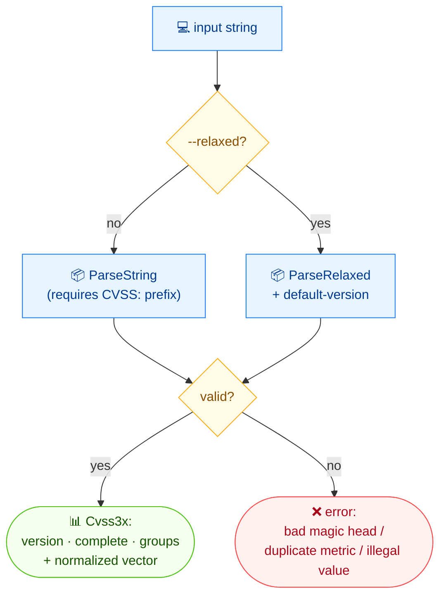

# 🔍 parse

🔍 Parse · 🟢 stable

## Synopsis

`cvss parse` parses a CVSS vector string and reports its version, whether it is complete, and whether temporal/environmental metrics are present, followed by the normalized vector string and a human-readable description. By default it requires the `CVSS:3.x/` prefix; `--relaxed` accepts a bare metric list and assumes a configurable default version.

## How It Works

The string is routed to a strict or relaxed parser: strict demands the `CVSS:3.x/` prefix; relaxed accepts a bare metric list with a default version. Both yield a `Cvss3x` or an error (bad magic head, duplicate metrics, illegal values).



## Usage

```bash
cvss parse [vector-string] [flags]
```

### Flags

| Flag                  | Type   | Default | Description                                       |
| --------------------- | ------ | ------- | ------------------------------------------------- |
| `--default-version`   | string | `3.1`   | Default version used for relaxed parsing          |
| `-h, --help`          | bool   | `false` | Help for `parse`                                  |
| `--relaxed`           | bool   | `false` | Parse without the `CVSS:` prefix                  |

## Examples

::: code-group

```bash [full vector]
cvss parse "CVSS:3.1/AV:N/AC:L/PR:N/UI:N/S:U/C:H/I:H/A:H/E:U/RL:O/RC:C"
```

```text [output]
Version: 3.1
Complete: true
Has Temporal: true
Has Environmental: false

Vector String: CVSS:3.1/AV:N/AC:L/PR:N/UI:N/S:U/C:H/I:H/A:H/E:U/RL:O/RC:C

Description:
Attack Vector: Network, Attack Complexity: Low, Privileges Required: None, User Interaction: None, Scope: Unchanged, Confidentiality: High, Integrity: High, Availability: High, Exploit Code Maturity: Unproven, Remediation Level: Official Fix, Report Confidence: Confirmed
```

:::

::: code-group

```bash [relaxed, partial vector]
cvss parse --relaxed "AV:N/AC:L"
```

```text [output]
Version: 3.1
Complete: false
Has Temporal: false
Has Environmental: false

Vector String: CVSS:3.1/AV:N/AC:L

Description:
Attack Vector: Network, Attack Complexity: Low
```

:::

::: warning Relaxed parsing needs a default version
Without the `CVSS:` prefix the version is unknown, so `--relaxed` falls back to `--default-version` (default `3.1`). Pass `--default-version 3.0` if your bare vectors are v3.0.
:::

## Underlying API

Strict parsing uses [`parser.ParseString`](/sdk/parser); relaxed parsing uses [`parser.ParseRelaxed(str, defaultVersion)`](/sdk/parser). Completeness and temporal/environmental presence come from `cv.IsComplete()`, `cv.HasTemporalMetrics()` and `cv.HasEnvironmentalMetrics()`; the vector string from `cv.String()`; the description from `cv.Description()`.

```go
import (
    "fmt"

    "github.com/scagogogo/cvss-skills/pkg/parser"
)

// strict — requires CVSS: prefix
cv, err := parser.ParseString("CVSS:3.1/AV:N/AC:L/PR:N/UI:N/S:U/C:H/I:H/A:H/E:U/RL:O/RC:C")

// relaxed — no prefix, default version 3.1
cv, err = parser.ParseRelaxed("AV:N/AC:L", "3.1")

fmt.Println("Version:", cv.Version())
fmt.Println("Complete:", cv.IsComplete())
fmt.Println("Has Temporal:", cv.HasTemporalMetrics())
fmt.Println("Has Environmental:", cv.HasEnvironmentalMetrics())
fmt.Println("Vector String:", cv.String())
fmt.Println("Description:", cv.Description())
```

## Related

- [validate](/cli/commands/validate) — also reports missing/invalid metrics, with pass/fail
- [describe](/cli/commands/describe) — description-only view (no version/completeness)
- [parser package](/sdk/parser) — Go SDK reference
