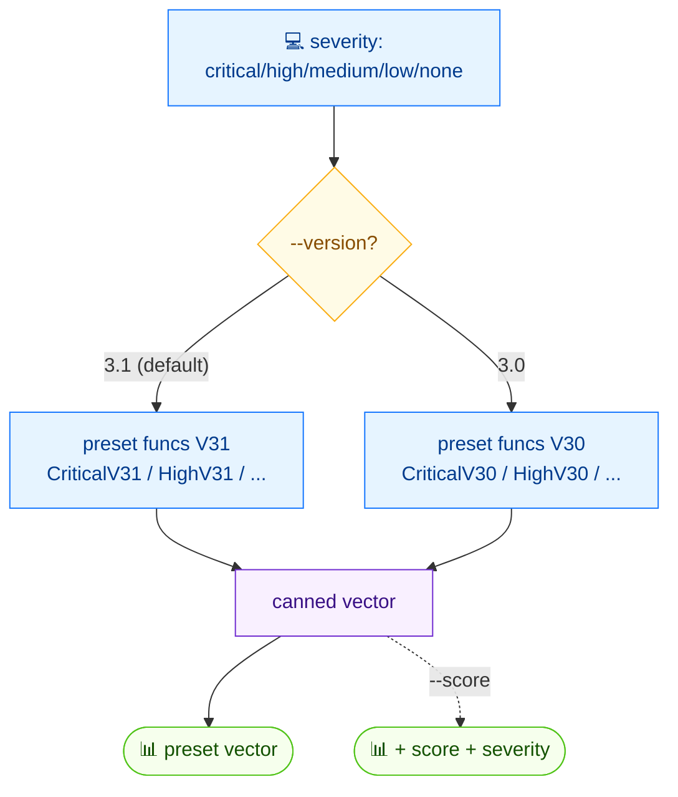

# 🎯 preset

<span class="badge">CVSS v3.0</span>
<span class="badge">CVSS v3.1</span>
<span class="badge badge-info">text + json</span>

## Synopsis

`cvss preset` emits a canned CVSS vector that maps to a requested severity level — `critical`, `high`, `medium`, `low`, or `none`. The default version is 3.1; pass `--version 3.0` for the v3.0 preset. Add `--score` to print the calculated score and severity alongside the vector. Useful as a known-good starting point for examples, tests, or templates.

## How It Works

A severity argument selects a canned preset function keyed by version (e.g. `CriticalV31` / `CriticalV30`); the result is a known-good vector, optionally printed with its score.



## Usage

```
cvss preset [severity] [flags]
```

### Flags

| Flag | Default | Description |
| --- | --- | --- |
| `--format string` | `text` | output format: `text` or `json` |
| `--score` | `false` | show score alongside vector string |
| `--version string` | `3.1` | CVSS version: `3.0` or `3.1` |
| `-h, --help` | — | help for `preset` |

### Available severity levels

`critical`, `high`, `medium`, `low`, `none`

## Examples

::: code-group

```bash [Critical v3.1]
cvss preset critical
# Output:
# CVSS:3.1/AV:N/AC:L/PR:N/UI:N/S:C/C:H/I:H/A:H
```

```bash [High v3.0 with score]
cvss preset --score --version 3.0 high
# Output:
# CVSS:3.0/AV:N/AC:L/PR:N/UI:N/S:U/C:H/I:H/A:H
# Score: 9.8 (Critical)
```

```bash [JSON]
cvss preset --format json critical
```

:::

::: tip Note the severity-vs-rating distinction
The *requested* severity (`critical`, `high`, …) names the preset bucket, while the *computed* severity rating may differ. In the `--score` example above, the `high` preset's v3.0 vector scores `9.8`, whose rating rounds up to `Critical` — the bucket name and the numeric rating are not guaranteed to match exactly.
:::

## Underlying API

```go
import "github.com/scagogogo/cvss-skills/pkg/cvss"

// v3.1 presets
cv := cvss.CriticalV31() // *Cvss3x
_ = cvss.HighV31()
_ = cvss.MediumV31()
_ = cvss.LowV31()
_ = cvss.NoneV31()

// v3.0 presets
_ = cvss.CriticalV30()
_ = cvss.HighV30()
_ = cvss.MediumV30()
_ = cvss.LowV30()
_ = cvss.NoneV30()

fmt.Println(cv.String())

// With --score:
calc := cvss.NewCalculator(cv)
score, _ := calc.Calculate()
fmt.Printf("Score: %.1f (%s)\n", score, cvss.GetSeverity(score))
```

Each severity level maps to a dedicated constructor: `CriticalV31`/`HighV31`/`MediumV31`/`LowV31`/`NoneV31` for v3.1, and the `*V30` counterparts for v3.0. All return `*cvss.Cvss3x`.

## Related

- [`random`](/cli/commands/random) — generate a random vector
- [`score`](/cli/commands/score) — score any vector
- [`range`](/cli/commands/range) — score range for partial vectors
