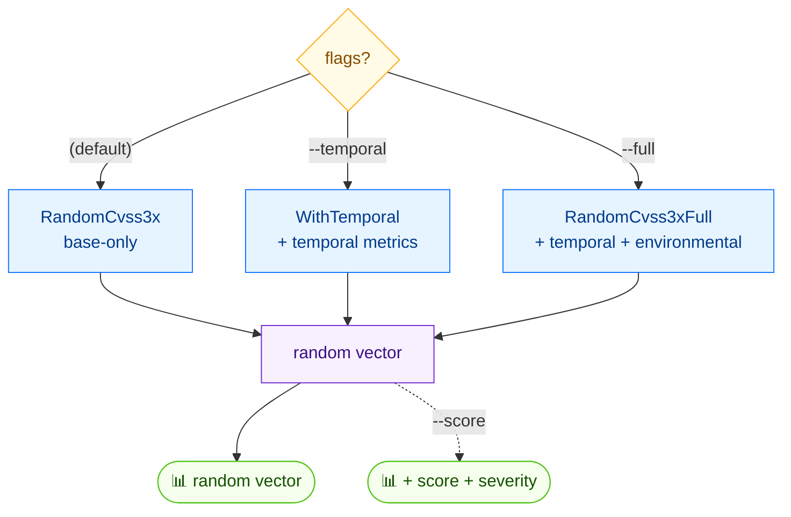

# 🎲 random

<span class="badge">CVSS v3.0</span>
<span class="badge">CVSS v3.1</span>
<span class="badge badge-info">text + json</span>

## Synopsis

`cvss random` generates a random CVSS vector for testing or demonstration. By default it emits base-only metrics. Use `--temporal` to add temporal metrics, or `--full` to add both temporal and environmental metrics. The default version is 3.1; pass `--cvss-version 3.0` for v3.0. Add `--score` to print the calculated score and severity alongside the vector.

::: warning Output is non-deterministic
Every invocation produces a different random vector. The example output below is illustrative — yours will differ.
:::

## How It Works

A random vector is generated with base metrics by default; `--temporal` adds temporal metrics, `--full` adds both temporal and environmental, and `--score` prints the resulting score.



## Usage

```
cvss random [flags]
```

### Flags

| Flag | Default | Description |
| --- | --- | --- |
| `--cvss-version string` | `3.1` | CVSS version: `3.0` or `3.1` |
| `--format string` | `text` | output format: `text` or `json` |
| `--full` | `false` | include temporal and environmental metrics |
| `--score` | `false` | show calculated score |
| `--temporal` | `false` | include temporal metrics |
| `-h, --help` | — | help for `random` |

## Examples

::: code-group

```bash [Base-only (default)]
cvss random
# Example output (yours will differ):
# CVSS:3.1/AV:L/AC:H/PR:L/UI:R/S:C/C:H/I:L/A:H
```

```bash [With score, version 3.0, full]
cvss random --cvss-version 3.0 --full --score
```

```bash [JSON]
cvss random --format json
```

:::

::: tip Flag precedence
`--full` takes precedence over `--temporal`: when both are set, you get a full (temporal + environmental) vector. Neither flag gives base-only.
:::

## Underlying API

```go
import (
    "github.com/scagogogo/cvss-skills/pkg/cvss"
    "github.com/scagogogo/cvss-skills/pkg/mock"
)

minor := 1 // 1 for v3.1, 0 for v3.0

var cv *cvss.Cvss3x
// --full
cv = mock.RandomCvss3xFull(minor)
// --temporal (without --full)
// cv = mock.RandomCvss3xWithTemporal(minor)
// base-only (default)
// cv = mock.RandomCvss3x(minor)

fmt.Println(cv.String())

// With --score:
calc := cvss.NewCalculator(cv)
score, err := calc.Calculate()
if err == nil {
    fmt.Printf("Score: %.1f (%s)\n", score, cvss.GetSeverity(score))
}
```

Three constructors live in `pkg/mock`: `RandomCvss3x(minorVersion int)`, `RandomCvss3xWithTemporal(minorVersion int)`, and `RandomCvss3xFull(minorVersion int)`. All return `*cvss.Cvss3x`. Pass `1` for v3.1 or `0` for v3.0.

## Related

- [`preset`](/cli/commands/preset) — known-good severity-bucketed vectors
- [`score`](/cli/commands/score) — score any vector
- [`range`](/cli/commands/range) — score range for partial vectors
