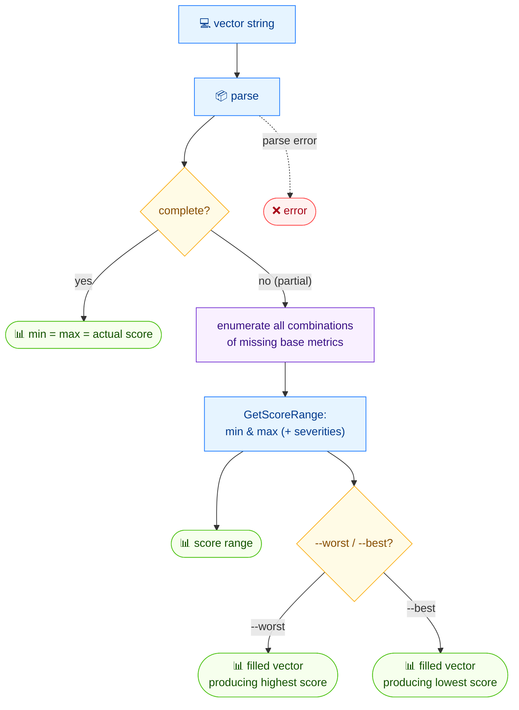

# 📊 range

<span class="badge">CVSS v3.0</span>
<span class="badge">CVSS v3.1</span>
<span class="badge badge-info">text + json</span>

## Synopsis

`cvss range` calculates the minimum and maximum possible score for a CVSS vector. For a complete vector, min equals max equals the actual score. For a **partial** vector (missing base metrics), it tries all combinations of the missing metrics to find the score range. Use `--worst` or `--best` to see the filled-in vector that produces the highest or lowest score.

## How It Works

For a complete vector min equals max equals the actual score; for a partial vector the missing base metrics are exhaustively combined to find the score range, and `--worst`/`--best` return the filled-in extreme vector.



## Usage

```
cvss range [vector-string] [flags]
```

### Flags

| Flag | Default | Description |
| --- | --- | --- |
| `--best` | `false` | show the best-case (lowest score) vector |
| `--format string` | `text` | output format: `text` or `json` |
| `--worst` | `false` | show the worst-case (highest score) vector |
| `-h, --help` | — | help for `range` |

## Examples

::: code-group

```bash [Partial vector — 4 metrics missing]
cvss range "CVSS:3.1/AV:N/AC:L/PR:N/UI:N"
# Output:
# Score range: 0.0 (None) ~ 10.0 (Critical)
# Complete: false, Missing metrics: 4
```

```bash [With the worst-case vector filled in]
cvss range --worst "CVSS:3.1/AV:N/AC:L/PR:N/UI:N"
# Output:
# Score range: 0.0 (None) ~ 10.0 (Critical)
# Complete: false, Missing metrics: 4
# Worst case: CVSS:3.1/AV:N/AC:L/PR:N/UI:N/S:C/C:H/I:H/A:H (10.0)
```

:::

::: tip Why the worst case is `Scope: Changed`
For a partial base vector, the highest possible score is achieved by filling the missing impact metrics at `High` and `Scope` at `Changed`, which together push the score to `10.0`. The lowest is `0.0` (all impacts `None`, scope `Unchanged`).
:::

::: tip `--best` and `--worst` are independent
You can pass either, both, or neither. With neither, you get just the range summary. JSON mode (`--format json`) serializes the whole `ScoreRange` struct regardless of `--best`/`--worst`.
:::

## Underlying API

```go
import (
    "github.com/scagogogo/cvss-skills/pkg/cvss"
    "github.com/scagogogo/cvss-skills/pkg/parser"
)

// ParseRelaxed accepts partial vectors (missing base metrics).
cv, err := parser.ParseRelaxed("CVSS:3.1/AV:N/AC:L/PR:N/UI:N", "3.1")
if err != nil {
    log.Fatal(err)
}

rng := cvss.GetScoreRange(cv) // ScoreRange
fmt.Printf("Score range: %.1f (%s) ~ %.1f (%s)\n",
    rng.MinScore, rng.MinSeverity, rng.MaxScore, rng.MaxSeverity)
fmt.Printf("Complete: %v, Missing metrics: %d\n", rng.IsComplete, rng.MissingCount)

// --worst
worst, score, err := cvss.GetWorstCase(cv) // (*Cvss3x, float64, error)
if err == nil {
    fmt.Printf("Worst case: %s (%.1f)\n", worst.String(), score)
}

// --best
best, score, err := cvss.GetBestCase(cv) // (*Cvss3x, float64, error)
```

`parser.ParseRelaxed` (unlike `ParseString`) accepts incomplete vectors. `cvss.GetScoreRange(cv *Cvss3x) ScoreRange` returns a struct with `MinScore`, `MaxScore`, `MinSeverity`, `MaxSeverity`, `IsComplete`, and `MissingCount`. `cvss.GetWorstCase` and `cvss.GetBestCase` each return the filled-in `*Cvss3x` and its score.

## Related

- [`score`](/cli/commands/score) — score a complete vector
- [`analyze`](/cli/commands/analyze) — per-metric sensitivity analysis
- [`preset`](/cli/commands/preset) — known-good severity-bucketed vectors
