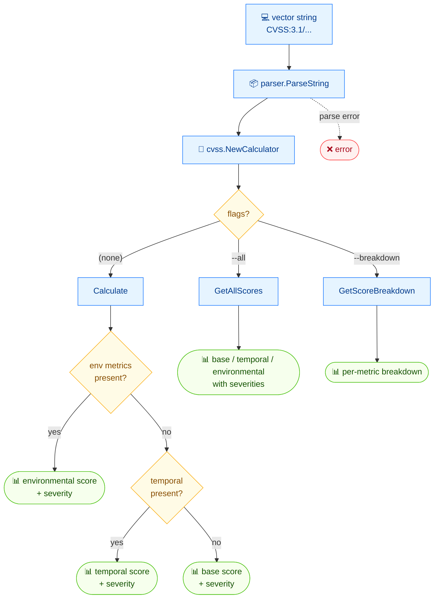

# 🧮 score

🧮 Scoring · 🟢 stable

## Synopsis

`cvss score` calculates the overall CVSS score from a vector string and prints it with its severity rating. Use `--all` to surface base/temporal/environmental scores, or `--breakdown` for a per-metric contribution view. Every mode supports `--format json`.

## How It Works

From a vector string, the command parses and implicitly validates the metrics, hands the result to a calculator, then branches on which score group to report — defaulting to the most specific score actually available.



## Usage

```bash
cvss score [vector-string] [flags]
```

### Flags

| Flag            | Type   | Default | Description                                     |
| --------------- | ------ | ------- | ----------------------------------------------- |
| `--all`         | bool   | `false` | Show all scores (base, temporal, environmental) with severities |
| `--breakdown`   | bool   | `false` | Show per-metric score breakdown                 |
| `--format`      | string | `text`  | Output format: `text` or `json`                 |
| `-h, --help`    | bool   | `false` | Help for `score`                                |

::: tip Overall score by default
With no flags, the command prints a single overall score and its severity — the environmental score when environmental metrics are present, otherwise the temporal score, otherwise the base score.
:::

## Examples

::: code-group

```bash [overall score]
cvss score "CVSS:3.1/AV:N/AC:L/PR:N/UI:N/S:C/C:H/I:H/A:H"
```

```text [output]
10.0 (Critical)
```

:::

::: code-group

```bash [all scores]
cvss score --all "CVSS:3.1/AV:N/AC:L/PR:N/UI:N/S:C/C:H/I:H/A:H"
```

```text [output]
Base: 10.0 (Critical)
```

:::

::: code-group

```bash [json]
cvss score --format json "CVSS:3.1/AV:N/AC:L/PR:N/UI:N/S:C/C:H/I:H/A:H"
```

```json [output]
{
  "score": 10,
  "severity": "Critical"
}
```

:::

## Underlying API

Parses the vector with [`parser.ParseString`](/sdk/parser), wraps it in a [`cvss.Calculator`](/sdk/calculator) via `cvss.NewCalculator`, then calls `calc.Calculate()` / `calc.GetAllScores()` / `calc.GetScoreBreakdown()` depending on the flags.

```go
import (
    "fmt"

    "github.com/scagogogo/cvss-skills/pkg/cvss"
    "github.com/scagogogo/cvss-skills/pkg/parser"
)

cv, err := parser.ParseString("CVSS:3.1/AV:N/AC:L/PR:N/UI:N/S:C/C:H/I:H/A:H")
if err != nil {
    log.Fatal(err)
}

calc := cvss.NewCalculator(cv)
score, _ := calc.Calculate()
fmt.Printf("%.1f (%s)\n", score, cvss.GetSeverity(score))

// all base / temporal / environmental scores + severities
all, _ := calc.GetAllScores()
fmt.Printf("Base: %.1f (%s)\n", all.BaseScore, all.BaseSeverity)

// per-metric contribution
bd, _ := calc.GetScoreBreakdown()
_ = bd
```

## Related

- [severity](/cli/commands/severity) — map a numeric score to a rating
- [subs](/cli/commands/subs) — impact / exploitability sub-scores
- [analyze](/cli/commands/analyze) — how each metric moves the score
- [Scoring calculator](/sdk/calculator) — Go SDK reference
