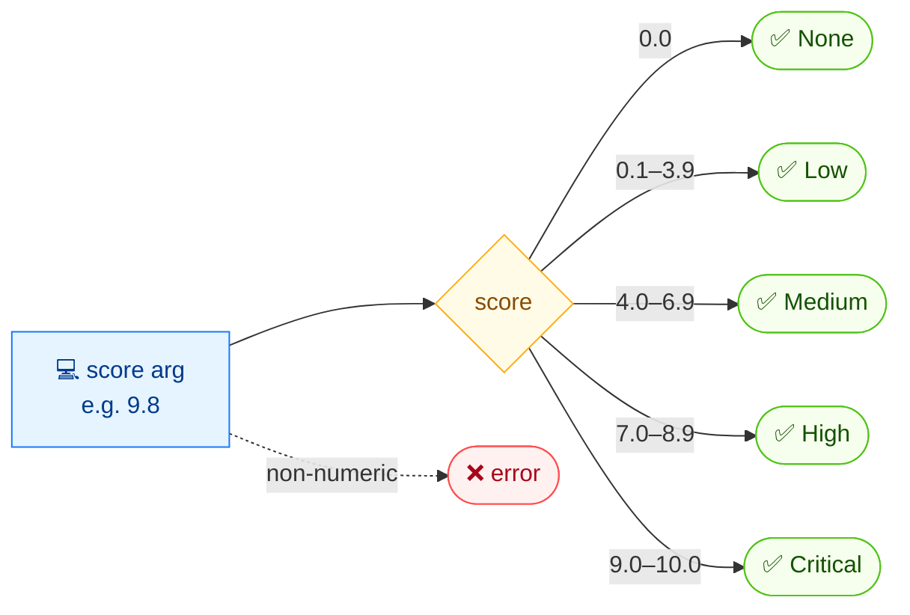

# 🏷️ severity

🏷️ Rating · 🟢 stable

## Synopsis

`cvss severity` maps a numeric CVSS score to its qualitative severity rating. It is handy when you already have a score (from a scanner, spreadsheet or API) and only need the rating, without parsing a full vector.

## How It Works

A single numeric score is read and mapped through the v3.1 threshold table to one of five ratings; nothing is parsed or scored.



## Usage

```bash
cvss severity [score] [flags]
```

### Flags

| Flag         | Type   | Default | Description                     |
| ------------ | ------ | ------- | ------------------------------- |
| `--format`   | string | `text`  | Output format: `text` or `json` |
| `-h, --help` | bool   | `false` | Help for `severity`             |

### CVSS v3.1 thresholds

| Rating    | Range           |
| --------- | --------------- |
| None      | `0.0`           |
| Low       | `0.1 – 3.9`     |
| Medium    | `4.0 – 6.9`     |
| High      | `7.0 – 8.9`     |
| Critical  | `9.0 – 10.0`    |

::: warning v3.0 vs v3.1
The numeric thresholds are identical for v3.0 and v3.1, but a given vector may produce a slightly different score across versions (notably for `UI:R`), which can push it across a boundary. `severity` itself is version-agnostic — it only looks at the number you give it.
:::

## Examples

::: code-group

```bash [text]
cvss severity 7.5
```

```text [output]
High
```

:::

::: code-group

```bash [json]
cvss severity --format json 9.2
```

```json [output]
{
  "score": 9.2,
  "severity": "Critical"
}
```

:::

## Underlying API

Calls the standalone [`cvss.GetSeverity`](/sdk/cvss) function, which returns a `cvss.Severity` value. No vector parsing is required.

```go
import (
    "fmt"

    "github.com/scagogogo/cvss-skills/pkg/cvss"
)

severity := cvss.GetSeverity(9.2)
fmt.Println(severity) // Critical
```

## Related

- [score](/cli/commands/score) — calculate the score from a vector first
- [Severity Ratings](/concepts/severity) — concept page on the rating model
