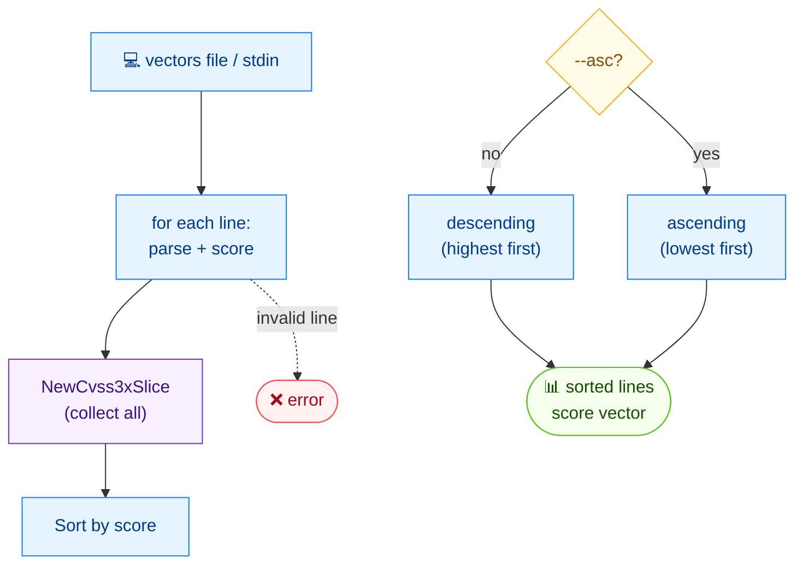

# 🔢 sort

<span class="badge">CVSS v3.0</span>
<span class="badge">CVSS v3.1</span>
<span class="badge badge-info">text output</span>

## Synopsis

`cvss sort` reads CVSS vectors from a file (or stdin) and prints them sorted by score. The default order is **descending** (highest score first); pass `--asc` for ascending order. Each output line is `score  vector-string`.

## How It Works

Each input line is parsed, scored, and collected into a slice that is then sorted by score — descending by default, ascending with `--asc` — and re-emitted as `score  vector` lines.



## Usage

```
cvss sort [file] [flags]
```

### Flags

| Flag | Default | Description |
| --- | --- | --- |
| `--asc` | `false` | sort ascending (lowest score first) |
| `-h, --help` | — | help for `sort` |

## Examples

::: code-group

```bash [Sort a file descending]
cat > vectors.txt <<'EOF'
CVSS:3.1/AV:N/AC:L/PR:N/UI:N/S:U/C:H/I:H/A:H
CVSS:3.1/AV:N/AC:L/PR:N/UI:N/S:C/C:H/I:H/A:H
CVSS:3.1/AV:L/AC:H/PR:H/UI:R/S:U/C:L/I:L/A:N
EOF
cvss sort vectors.txt
```

```bash [Ascending, from stdin]
cat vectors.txt | cvss sort --asc -
```

:::

::: tip `sort` reads vectors, not JSON
`cvss sort` takes a plain text file of vector strings (one per line) and prints `score  vector` lines. It does **not** consume `--format json` output. Blank lines and `#`-comments are skipped.
:::

::: warning Invalid vectors are skipped, not fatal
Lines that fail to parse are reported on stderr as `Skipping invalid: <line>` and excluded from the sorted output; valid vectors are still sorted and printed.
:::

## Underlying API

```go
import (
    "github.com/scagogogo/cvss-skills/pkg/cvss"
    "github.com/scagogogo/cvss-skills/pkg/parser"
)

lines := readLines("vectors.txt") // []string

var vectors []*cvss.Cvss3x
for _, line := range lines {
    cv, err := parser.ParseString(line)
    if err != nil {
        continue // skipped
    }
    vectors = append(vectors, cv)
}

slice := cvss.NewCvss3xSlice(vectors...) // *Cvss3xSlice
// slice.Asc() sets ascending order (default is descending)
slice.Sort()

for _, cv := range slice.Items() {
    calc := cvss.NewCalculator(cv)
    score, _ := calc.Calculate()
    fmt.Printf("%.1f  %s\n", score, cv.String())
}
```

`cvss.NewCvss3xSlice(items ...*Cvss3x) *Cvss3xSlice` wraps the vectors; call `.Asc()` to switch to ascending order (the default is descending), then `.Sort()` to order them in place, and `.Items()` to read them back. Scores are computed per-vector with a `cvss.NewCalculator`.

## Related

- [`batch score`](/cli/commands/batch-score) — score (without sorting) many vectors
- [`score`](/cli/commands/score) — score a single vector
- [`csv write`](/cli/commands/csv-write) — write vectors with scores to CSV
