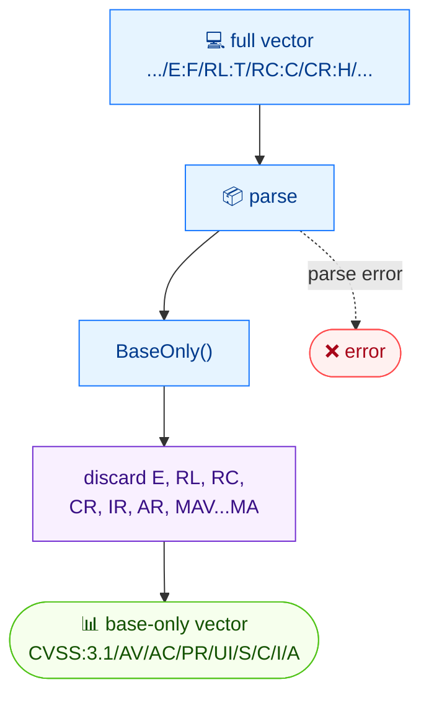

# ✂️ strip

✂️ Strip · 🟢 stable

## Synopsis

`cvss strip` (alias `base-only`) removes temporal and environmental metrics from a CVSS vector, keeping only the eight base metrics (`AV`/`AC`/`PR`/`UI`/`S`/`C`/`I`/`A`). Use it to normalize a full vector down to its base form before comparing, scoring, or storing.

## How It Works

All temporal and environmental metrics are dropped, leaving only the eight base metrics; the result is a minimal base vector.



## Usage

```bash
cvss base-only [vector-string] [flags]
```

**Aliases:** `base-only`, `strip`

### Flags

| Flag         | Type | Default | Description               |
| ------------ | ---- | ------- | ------------------------- |
| `-h, --help` | bool | `false` | Help for `base-only`      |

::: tip Two names, one command
The canonical command name is `base-only`; `strip` is a built-in alias. Both invoke the same code path, so use whichever reads better in your scripts.
:::

## Examples

::: code-group

```bash [strip temporal metrics]
cvss strip "CVSS:3.1/AV:N/AC:L/PR:N/UI:N/S:U/C:H/I:H/A:H/E:U/RL:O/RC:C"
```

```text [output]
CVSS:3.1/AV:N/AC:L/PR:N/UI:N/S:U/C:H/I:H/A:H
```

:::

::: tip Also works on environmental metrics
A vector carrying environmental metrics (`CR`/`IR`/`AR` and any `M*`) is reduced the same way — every non-base metric is dropped, leaving just the base vector.
:::

## Underlying API

Parses the vector with [`parser.ParseString`](/sdk/parser), then calls [`cv.BaseOnly()`](/sdk/cvss), which returns a new `*Cvss3x` containing only the base metrics.

```go
import (
    "fmt"

    "github.com/scagogogo/cvss-skills/pkg/parser"
)

cv, err := parser.ParseString("CVSS:3.1/AV:N/AC:L/PR:N/UI:N/S:U/C:H/I:H/A:H/E:U/RL:O/RC:C")
if err != nil {
    log.Fatal(err)
}

base := cv.BaseOnly()
fmt.Println(base.String()) // CVSS:3.1/AV:N/AC:L/PR:N/UI:N/S:U/C:H/I:H/A:H
```

## Related

- [merge](/cli/commands/merge) — the inverse operation: add temporal/environmental metrics back
- [convert](/cli/commands/convert) — change the CVSS version instead of the metric set
- [score](/cli/commands/score) — score the stripped base vector
- [BaseOnly](/sdk/cvss) — Go SDK reference
