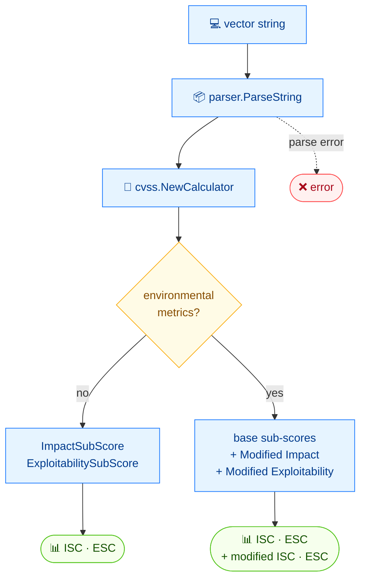

# 🧩 subs

🧩 Sub-scores · 🟢 stable

## Synopsis

`cvss subs` prints the Impact Sub-Score and Exploitability Sub-Score that make up a CVSS base score. For vectors carrying environmental (modified) metrics, it additionally shows the Modified Impact and Modified Exploitability sub-scores used by the environmental score.

## How It Works

The calculator exposes the two sub-scores that compose a base score; when environmental (modified) metrics are present, it additionally reports the modified sub-scores that feed the environmental score.



## Usage

```bash
cvss subs [vector-string] [flags]
```

### Flags

| Flag         | Type   | Default | Description                     |
| ------------ | ------ | ------- | ------------------------------- |
| `--format`   | string | `text`  | Output format: `text` or `json` |
| `-h, --help` | bool   | `false` | Help for `subs`                 |

::: tip When modified sub-scores appear
The two `Modified *` lines only print when the vector contains at least one environmental metric (`CR`/`IR`/`AR` or any `M*`). A pure base or base+temporal vector shows just the two base sub-scores.
:::

## Examples

::: code-group

```bash [base + temporal]
cvss subs "CVSS:3.1/AV:N/AC:L/PR:N/UI:N/S:U/C:H/I:H/A:H/E:U/RL:O/RC:C"
```

```text [output]
Impact Sub-Score:        5.8731
Exploitability Sub-Score: 3.8870
```

:::

::: code-group

```bash [with environmental metrics]
cvss subs "CVSS:3.1/AV:N/AC:L/PR:N/UI:N/S:U/C:H/I:H/A:H/CR:H/IR:M/AR:L/MAV:L/MC:N"
```

```text [output]
Impact Sub-Score:        5.8731
Exploitability Sub-Score: 3.8870
Modified Impact Sub-Score:        4.3861
Modified Exploitability Sub-Score: 2.5151
```

:::

## Underlying API

Parses the vector with [`parser.ParseString`](/sdk/parser), wraps it in a [`cvss.Calculator`](/sdk/calculator), then reads `calc.GetImpactSubScore()` / `calc.GetExploitabilitySubScore()` (and, for environmental vectors, `calc.GetModifiedImpactSubScore()` / `calc.GetModifiedExploitabilitySubScore()`).

```go
import (
    "fmt"

    "github.com/scagogogo/cvss-skills/pkg/cvss"
    "github.com/scagogogo/cvss-skills/pkg/parser"
)

cv, err := parser.ParseString("CVSS:3.1/AV:N/AC:L/PR:N/UI:N/S:U/C:H/I:H/A:H/E:U/RL:O/RC:C")
if err != nil {
    log.Fatal(err)
}

calc := cvss.NewCalculator(cv)
impact, _ := calc.GetImpactSubScore()
exploit, _ := calc.GetExploitabilitySubScore()
fmt.Printf("Impact Sub-Score: %.4f\n", impact)
fmt.Printf("Exploitability Sub-Score: %.4f\n", exploit)

// only when environmental metrics are present:
if cv.HasEnvironmentalMetrics() {
    mImpact, _ := calc.GetModifiedImpactSubScore()
    mExploit, _ := calc.GetModifiedExploitabilitySubScore()
    fmt.Printf("Modified Impact Sub-Score: %.4f\n", mImpact)
    fmt.Printf("Modified Exploitability Sub-Score: %.4f\n", mExploit)
}
```

## Related

- [score](/cli/commands/score) — the overall score built from these sub-scores
- [describe](/cli/commands/describe) — full metric breakdown, incl. sub-scores in JSON
- [Scoring calculator](/sdk/calculator) — Go SDK reference
