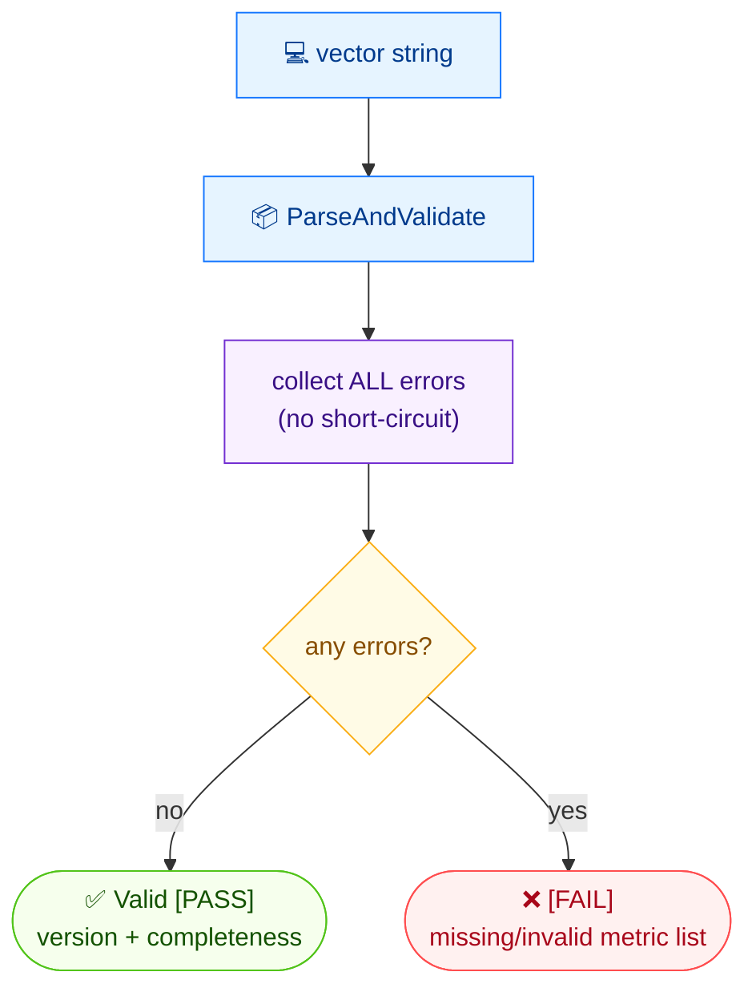

# ✅ validate

✅ Validate · 🟢 stable

## Synopsis

`cvss validate` checks a CVSS vector string and reports any missing or invalid metrics in a single pass (it does not short-circuit on the first error). On success it prints `Valid [PASS]` with the version and completeness; on failure it lists every problem.

## How It Works

The string is parsed and every metric is checked in one non-short-circuiting pass, so all missing and invalid metrics are reported together — `PASS` only when the collection is complete and well-formed.



## Usage

```bash
cvss validate [vector-string] [flags]
```

### Flags

| Flag         | Type   | Default | Description                     |
| ------------ | ------ | ------- | ------------------------------- |
| `--format`   | string | `text`  | Output format: `text` or `json` |
| `-h, --help` | bool   | `false` | Help for `validate`             |

## Examples

::: code-group

```bash [valid vector]
cvss validate "CVSS:3.1/AV:N/AC:L/PR:N/UI:N/S:C/C:H/I:H/A:H"
```

```text [output]
Valid [PASS]
  Version: 3.1
  Complete: true
```

:::

::: code-group

```bash [invalid vector]
cvss validate "bad"
```

```text [output]
Validation failed: validation failed: metric I: is required but not set; metric A: is required but not set
```

:::

::: tip All errors at once
Because validation is non-short-circuiting, a single run surfaces every missing metric — useful when cleaning up malformed vectors in bulk. The invalid example above reports both `I` and `A` in one message.
:::

## Underlying API

Calls [`parser.ParseAndValidate`](/sdk/parser), which parses and validates in one step and returns an error listing every problem when the vector is malformed.

```go
import (
    "fmt"
    "log"

    "github.com/scagogogo/cvss-skills/pkg/parser"
)

cv, err := parser.ParseAndValidate("CVSS:3.1/AV:N/AC:L/PR:N/UI:N/S:C/C:H/I:H/A:H")
if err != nil {
    log.Fatalf("Validation failed: %v", err) // lists all missing/invalid metrics
}
fmt.Printf("Valid [PASS]\n  Version: %s\n  Complete: %v\n", cv.Version(), cv.IsComplete())
```

## Related

- [parse](/cli/commands/parse) — parse without the strict validation pass
- [canonicalize](/cli/commands/canonicalize) — also exposes a `--check` for canonical order
- [Validation Model](/concepts/validation) — concept page
- [parser package](/sdk/parser) — Go SDK reference
