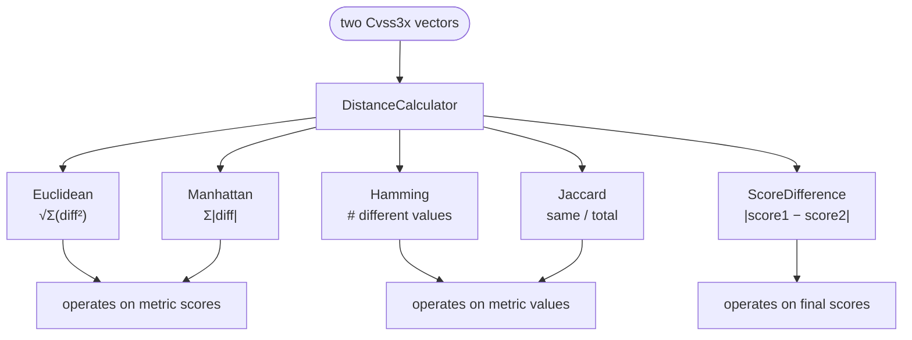

# 📏 Distance Metrics

## Synopsis

Comparing two CVSS vectors is rarely a single "are they equal?" question — you usually want to know *how far apart* they are, and in what sense. The toolkit provides **five distance metrics** on a `DistanceCalculator`, each with optional `...WithEnv` (include environmental metrics) and `...Checked` (return an error instead of silently `0.0`) variants.

## The Five Metrics

| Metric | Returns | What it measures | Sensitivity |
|--------|---------|------------------|-------------|
| `EuclideanDistance` | `float64` | Straight-line distance in metric-score space | Magnitude |
| `ManhattanDistance` | `float64` | Sum of per-metric absolute score deltas | Magnitude |
| `HammingDistance` | `int` | Count of metrics whose **value** differs | Count |
| `JaccardSimilarity` | `float64` | Same / total metric count | Ratio (0–1) |
| `ScoreDifference` | `float64` | Absolute delta of the final computed scores | Final score |

All score-based metrics (Euclidean, Manhattan) operate on **per-metric numeric scores**, not raw value codes. `PR` is resolved with Scope context (`GetPrivilegesRequiredScore`), and `UI` is resolved with version context (`GetUserInteractionScore`, so `UI:R` is `0.56` or `0.62` correctly). `Scope` is treated as a binary `0`/`1`.

### Comparison at a glance



## Variants

### `...WithEnv` — include environmental metrics

The base metrics-only methods ignore the `Cvss3xEnvironmental` block. The `WithEnv` variants additionally fold in the 11 environmental metrics (CR, IR, AR, MAV, MAC, MPR, MUI, MS, MC, MI, MA) when both vectors have environmental data:

- `EuclideanDistanceWithEnv`
- `ManhattanDistanceWithEnv`
- `HammingDistanceWithEnv`
- `JaccardSimilarityWithEnv`

If either vector lacks environmental metrics, the `WithEnv` methods gracefully fall back to base+temporal only (Hamming/Jaccard) or skip the env term (Euclidean/Manhattan).

### `...Checked` — error instead of silent zero

The plain methods return `0.0` when inputs are incomplete (e.g. missing base metrics), which can mask a real problem. The `Checked` variants return an explicit `error`:

- `EuclideanDistanceChecked` — `errIncompleteMetrics` if base metrics incomplete
- `ManhattanDistanceChecked`
- `ScoreDifferenceChecked` — wraps per-vector `Calculate` errors
- `EuclideanDistanceWithEnvChecked`
- `ManhattanDistanceWithEnvChecked`

## When to Use Which

- **"How different are these two vectors in impact magnitude?"** → `ManhattanDistance` (or Euclidean for a compounded view). Both weight every metric equally in score space.
- **"How many metrics did they change?"** → `HammingDistance`. Insensitive to *how much* a metric changed; only whether it changed at all.
- **"What fraction of metrics agree?"** → `JaccardSimilarity`. A normalized `0–1` counterpart to Hamming; `1.0` means identical.
- **"Did the final severity change, and by how much?"** → `ScoreDifference`. The only metric that runs the full calculator — it captures the *net* effect of all differences, including Scope's `1.08` multiplier and `roundUp`.
- **Comparing environmental-tuned vectors** → the `WithEnv` family.
- **Production code that must not silently produce `0`** → the `Checked` family.

## In Code

All metrics are methods on `DistanceCalculator` (`pkg/cvss/distance.go`, `distance_env.go`, `distance_checked.go`):

```go
dc := cvss.NewDistanceCalculator(cv1, cv2)

eu  := dc.EuclideanDistance()         // float64
man := dc.ManhattanDistance()         // float64
ham := dc.HammingDistance()           // int
jac := dc.JaccardSimilarity()         // float64 0–1
sd  := dc.ScoreDifference()           // float64

// env-aware
euE := dc.EuclideanDistanceWithEnv()

// checked (returns error)
if d, err := dc.EuclideanDistanceChecked(); err == nil {
    fmt.Println("euclidean:", d)
}
```

`ScoreDifference` internally constructs two `Calculator`s and calls `Calculate()` on each, so it respects version (`UI:R`), Scope, and `roundUp` — it is the most "end-to-end" comparison.

## Example

```bash
$ cvss distance "CVSS:3.1/AV:N/AC:L/PR:N/UI:N/S:U/C:H/I:H/A:H" "CVSS:3.1/AV:N/AC:L/PR:N/UI:N/S:U/C:L/I:L/A:N"
# reports Euclidean, Manhattan, Hamming, Jaccard, and score-difference
```

## Related

- [Go SDK: Distance & Comparison](/sdk/distance) — the SDK-facing API
- [Scoring Formulas](./scoring-formula) — what `ScoreDifference` ultimately runs
- [v3.0 vs v3.1](./version-diff) — why `UI` resolution needs the version
