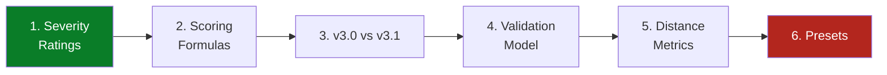

# 📚 Concepts & Theory

## Synopsis

The **Concepts** section explains the *why* behind the CVSS Skills toolkit — the scoring math, the severity thresholds, the v3.0↔v3.1 quirks, and the validation/comparison models that every command and SDK call rests on.

If the [CLI Reference](/cli/) and [Go SDK](/sdk/) docs tell you *what to call*, this section tells you *what the numbers mean and where they come from*. Every formula, threshold, and constant below is taken directly from the Go source — nothing is invented.

## Learning Path

Read top to bottom for a complete mental model, or jump to the topic you need:

| Step | Topic | What you learn |
|------|-------|----------------|
| 1 | [Severity Ratings](./severity) | The None/Low/Medium/High/Critical bands, their thresholds, and how a score maps to a label. |
| 2 | [Scoring Formulas](./scoring-formula) | Base = `roundup(min(ISC+ESC, 10))`, plus Temporal and Environmental extensions. |
| 3 | [v3.0 vs v3.1](./version-diff) | The two version-specific quirks: `UI:R` scores and the `roundUp` algorithm. |
| 4 | [Validation Model](./validation) | `Check` (short-circuit) vs `Validate` (collect-all), and the sentinel errors. |
| 5 | [Distance Metrics](./distance) | Euclidean, Manhattan, Hamming, Jaccard, ScoreDifference — and their `env`/`checked` variants. |
| 6 | [Presets & Severity](./presets) | The ready-made `CriticalV31`/`HighV31`/... vectors and `WithCriticalBase` options. |

## Where the Code Lives

All concepts map to concrete source files:

- `pkg/cvss/severity.go` — `Severity` type, `GetSeverity`, `ParseSeverity`
- `pkg/cvss/calculator.go` — `calculateBaseScore`, `roundUp`, `calculateTemporalScore`, `calculateEnvironmentalScore`
- `pkg/cvss/scores.go` — `GetBaseScore`, `GetAllScores`, `RoundUp`
- `pkg/cvss/validate.go` / `pkg/cvss/errors.go` — `Validate`, `ValidationErrors`, sentinels
- `pkg/cvss/distance.go` / `distance_env.go` / `distance_checked.go` — five metrics + variants
- `pkg/cvss/presets.go` / `options.go` / `pkg/mock/presets.go` — preset vectors and options
- `pkg/vector/user_interaction.go` — the `UI:R` 0.56/0.62 version branch

## Related

- [Go SDK Overview](/sdk/) — the package-level API that implements these concepts
- [CLI Reference](/cli/) — command-line surface over the same core
- [CVSS Metrics](/metrics/) — per-metric value reference
