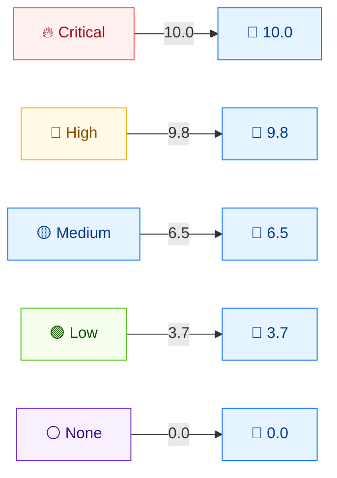

# 📦 Presets & Severity

## Synopsis

When you need a representative vector at a given severity tier — for tests, demos, fixtures, or defaults — the toolkit ships preset vectors at each of the five severity bands, in both v3.0 and v3.1. There are three flavors: standalone constructor functions, functional-option base presets, and the `pkg/mock` package's presets.

## Severity-Tier Presets (pkg/cvss)

Each preset returns a fully-populated, valid `*Cvss3x` whose Base score lands on the named tier. Defined in `pkg/cvss/presets.go`:

| Preset | Vector string | Base score | Severity |
|--------|---------------|------------|----------|
| `CriticalV31()` | `CVSS:3.1/AV:N/AC:L/PR:N/UI:N/S:C/C:H/I:H/A:H` | **10.0** | Critical |
| `HighV31()` | `CVSS:3.1/AV:N/AC:L/PR:N/UI:N/S:U/C:H/I:H/A:H` | **9.8** | Critical |
| `MediumV31()` | `CVSS:3.1/AV:N/AC:L/PR:N/UI:N/S:U/C:L/I:L/A:N` | **6.5** | Medium |
| `LowV31()` | `CVSS:3.1/AV:N/AC:H/PR:N/UI:N/S:U/C:L/I:N/A:N` | **3.7** | Low |
| `NoneV31()` | `CVSS:3.1/AV:N/AC:L/PR:N/UI:N/S:U/C:N/I:N/A:N` | **0.0** | None |

The only difference between `CriticalV31` (10.0) and `HighV31` (9.8) is **Scope** (`S:C` vs `S:U`) — illustrating the `1.08` Scope-Changed multiplier (see [Scoring Formulas](./scoring-formula)).

## Severity-Tier Score Map



The v3.0 counterparts (`CriticalV30`, `HighV30`, `MediumV30`, `LowV30`, `NoneV30`) use the same metrics under `MinorVersion: 0`. Note `MediumV30` uses `UI:R` (scored `0.56` under v3.0), whereas `MediumV31` uses `UI:N` — the two Medium presets are not byte-identical.

## Functional-Option Base Presets (pkg/cvss/options.go)

For vectors you build with `NewCvss3xWithOptions`, the `With*Base()` options seed the eight base metrics at a severity tier, leaving Temporal/Environmental unset:

| Option | Sets base metrics to | Tier |
|--------|----------------------|------|
| `WithCriticalBase()` | `AV:N/AC:L/PR:N/UI:N/S:C/C:H/I:H/A:H` | Critical (Scope Changed) |
| `WithHighBase()` | `AV:N/AC:L/PR:N/UI:N/S:U/C:H/I:H/A:H` | High |
| `WithMediumBase()` | `AV:N/AC:L/PR:N/UI:N/S:U/C:L/I:L/A:N` | Medium |
| `WithLowBase()` | `AV:N/AC:H/PR:N/UI:R/S:U/C:L/I:N/A:N` | Low |
| `WithNoneBase()` | `AV:N/AC:L/PR:N/UI:N/S:U/C:N/I:N/A:N` | None |

These compose with any other `Option` (Temporal, Environmental, version), so you can start from a tier and refine:

```go
cv, err := cvss.NewCvss3xWithOptions(
    cvss.WithCriticalBase(),
    cvss.WithVersion31(),
    cvss.WithTemporal('U', 'O', 'C'), // E:U RL:O RC:C
)
```

## Mock Presets (pkg/mock/presets.go)

The `pkg/mock` package mirrors the `pkg/cvss` presets for test fixtures, constructing each via `cvss.NewCvss3x()`:

| Mock preset | Equivalent |
|-------------|------------|
| `mock.CriticalCvss31()` / `mock.CriticalCvss30()` | `CriticalV31` / `CriticalV30` |
| `mock.HighCvss31()` / `mock.HighCvss30()` | `HighV31` / `HighV30` |
| `mock.MediumCvss31()` / `mock.MediumCvss30()` | `MediumV31` / `MediumV30` |
| `mock.LowCvss31()` / `mock.LowCvss30()` | `LowV31` / `LowV30` |
| `mock.NoneCvss31()` / `mock.NoneCvss30()` | `NoneV31` / `NoneV30` |

## In Code

```go
// Standalone constructor
crit := cvss.CriticalV31()       // → Base 10.0, Severity Critical
base, _ := cvss.NewCalculator(crit).GetBaseScore() // 10.0

// Functional option
cv, _ := cvss.NewCvss3xWithOptions(cvss.WithHighBase(), cvss.WithVersion31())

// Mock fixture
m := mock.MediumCvss31()
```

## Example

```bash
$ cvss score "CVSS:3.1/AV:N/AC:L/PR:N/UI:N/S:C/C:H/I:H/A:H"
10.0 (Critical)

$ cvss score "CVSS:3.1/AV:N/AC:L/PR:N/UI:N/S:U/C:H/I:H/A:H"
9.8 (Critical)

$ cvss score "CVSS:3.1/AV:N/AC:L/PR:N/UI:N/S:U/C:L/I:L/A:N"
6.5 (Medium)

$ cvss score "CVSS:3.1/AV:N/AC:H/PR:N/UI:N/S:U/C:L/I:N/A:N"
3.7 (Low)

$ cvss score "CVSS:3.1/AV:N/AC:L/PR:N/UI:N/S:U/C:N/I:N/A:N"
0.0 (None)
```

## Related

- [Severity Ratings](./severity) — the bands these presets target
- [Scoring Formulas](./scoring-formula) — why `S:C` yields 10.0 vs `S:U` 9.8
- [Go SDK: Presets](/sdk/presets) & [Functional Options](/sdk/options) — SDK-facing docs
