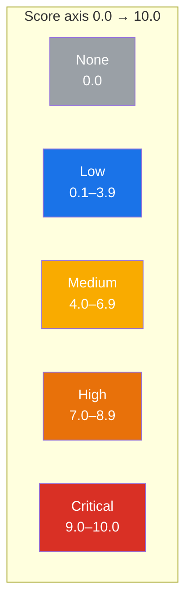

# 🚦 Severity Ratings

## Synopsis

Every CVSS score (Base, Temporal, or Environmental) maps to one of five **severity ratings**: `None`, `Low`, `Medium`, `High`, or `Critical`. This page documents the exact thresholds, the `GetSeverity`/`ParseSeverity` API, and how the toolkit renders a numeric score as a human label.

## Severity Bands

The thresholds follow the CVSS v3.1 specification. The implementation lives in `pkg/cvss/severity.go`:

| Rating | Score Range | Color | Meaning |
|--------|-------------|-------|---------|
| **None** | `0.0` | ⚪ Gray | No impact |
| **Low** | `0.1 – 3.9` | 🔵 Blue | Minimal impact |
| **Medium** | `4.0 – 6.9` | 🟡 Yellow | Moderate impact |
| **High** | `7.0 – 8.9` | 🟠 Orange | Significant impact |
| **Critical** | `9.0 – 10.0` | 🔴 Red | Catastrophic impact |

### Rating Dashboard



## In Code

### `GetSeverity(score)` — number to rating

```go
// pkg/cvss/severity.go
func GetSeverity(score float64) Severity {
    if score <= 0 {
        return SeverityNone
    } else if score < 4.0 {
        return SeverityLow
    } else if score < 7.0 {
        return SeverityMedium
    } else if score < 9.0 {
        return SeverityHigh
    } else {
        return SeverityCritical
    }
}
```

Note the boundary semantics: `score <= 0` is `None`; the upper bound of each band is **exclusive** (`< 4.0`, `< 7.0`, `< 9.0`), so `4.0` falls into `Medium`, `7.0` into `High`, `9.0` into `Critical`. `10.0` is the maximum and lands in `Critical`.

### `ParseSeverity(s)` — string to rating

`ParseSeverity` accepts the canonical names case-insensitively (`None`, `none`, `NONE` all work) and returns an error for anything else:

```go
sev, err := cvss.ParseSeverity("Critical")
if err != nil { /* handle */ }
// sev == cvss.SeverityCritical
```

### The `Severity` type

`Severity` is a named `string` with convenience predicates — `IsNone()`, `IsLow()`, `IsMedium()`, `IsHigh()`, `IsCritical()` — and a `String()` method:

```go
var s cvss.Severity = cvss.GetSeverity(9.8)
s.IsCritical() // true
s.String()     // "Critical"
```

### Via the Calculator

`Calculator.GetSeverityRating(score)` delegates to the standalone `GetSeverity`, so a rating is always one call away after scoring:

```go
calc := cvss.NewCalculator(cvssObj)
base, _ := calc.GetBaseScore()
rating := calc.GetSeverityRating(base) // cvss.SeverityCritical
```

## Example

Using the CLI to score a vector and see its rating:

```bash
$ cvss score "CVSS:3.1/AV:N/AC:L/PR:N/UI:N/S:U/C:H/I:H/A:H"
9.8 (Critical)

$ cvss score "CVSS:3.1/AV:N/AC:L/PR:N/UI:N/S:U/C:L/I:L/A:N"
6.5 (Medium)

$ cvss score "CVSS:3.1/AV:N/AC:L/PR:N/UI:N/S:U/C:N/I:N/A:N"
0.0 (None)
```

## Related

- [Scoring Formulas](./scoring-formula) — how the numeric score is computed before rating
- [Presets & Severity](./presets) — ready-made vectors at each rating tier
