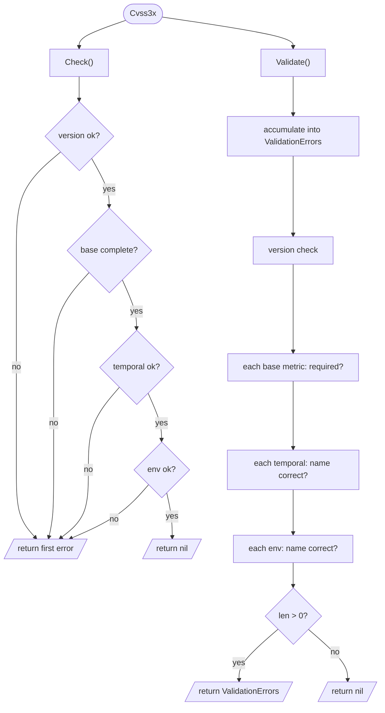

# ✅ Validation Model

## Synopsis

The toolkit offers two complementary validation entry points on every `Cvss3x`:

- **`Check()`** — short-circuits, returns the **first** error as a plain `error`. Fast, good for "is this usable?".
- **`Validate()`** — collects **all** errors into a structured `ValidationErrors`. Good for "tell me everything that's wrong".

Both verify version, base-metric completeness, and the names of any set temporal/environmental metrics. This page traces the flow and the error types.

## Check vs Validate



### `Check()` — first error wins

Defined in `pkg/cvss/cvss3x.go`, `Check` walks version → base → temporal → environmental and returns the **first** problem as a plain `error`:

```go
func (x *Cvss3x) Check() error {
    // nil receiver, version, base completeness, temporal, environmental...
    // returns at the FIRST failure
}
```

Because scoring (`Calculate`, `GetBaseScore`, ...) calls `Check()` first, an invalid vector never reaches the calculator — you get the error before a meaningless score.

### `Validate()` — collect all

Defined in `pkg/cvss/validate.go`, `Validate` accumulates every problem into `ValidationErrors` (a slice of `*ValidationError`). It does **not** short-circuit, so a vector missing three base metrics reports all three at once:

```go
type ValidationError struct {
    Metric  string // e.g. "AV", "PR", "E"
    Message string // human-readable
}
type ValidationErrors []*ValidationError
```

Each `ValidationError` exposes `Metric` (the short name) and `Message`. `ValidationErrors` supports:

- `.Error()` — joined `;`-separated string
- `.MissingMetrics()` — just the metric short names
- `.HasErrors()` — `len > 0`
- `.Unwrap() []error` — Go 1.20+ multi-error unwrapping, so `errors.Is`/`errors.As` work

## Sentinel Errors

`pkg/cvss/errors.go` defines reusable sentinel values for `errors.Is`:

```go
var (
    ErrNilReceiver         = errors.New("nil receiver")
    ErrIncompleteBaseMetrics = errors.New("incomplete base metrics")
    ErrUnsupportedVersion  = errors.New("unsupported CVSS version")
    ErrInvalidMetricValue  = errors.New("invalid metric value")
)
```

## MissingMetrics

`MissingMetrics()` is a convenience wrapper over `Validate()` that returns only the names of base metrics that are `is required but not set`:

```go
// pkg/cvss/validate.go
func (x *Cvss3x) MissingMetrics() []string
```

## In Code

```go
cv := cvss.NewCvss3x() // empty — no base metrics set

// Check: returns the first problem
if err := cv.Check(); err != nil {
    fmt.Println("not usable:", err)
}

// Validate: returns everything
if err := cv.Validate(); err != nil {
    var ve cvss.ValidationErrors
    if errors.As(err, &ve) {
        fmt.Println("missing:", ve.MissingMetrics())
        // e.g. [AV AC PR UI S C I A]
    }
}

// Just the missing names
fmt.Println(cv.MissingMetrics())

// Sentinel matching
if errors.Is(err, cvss.ErrIncompleteBaseMetrics) { /* ... */ }
```

## Example

```bash
$ cvss validate "CVSS:3.1/AV:N/AC:L/PR:N"
✗ validation failed: metric UI: is required but not set; metric S: is required but not set; ...
```

The CLI's `validate` command surfaces the full `ValidationErrors` list so you can fix every problem in one pass instead of one-at-a-time.

## Related

- [Go SDK: Validation](/sdk/validation) — the SDK-facing validation API
- [Scoring Formulas](./scoring-formula) — `Check()` gates the calculator
- [CLI: validate](/cli/) — the command-line surface
