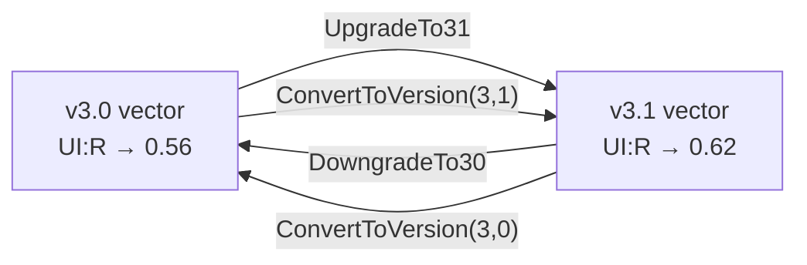

# 🔀 CVSS v3.0 vs v3.1

## Synopsis

CVSS v3.1 is a refinement of v3.0, not a redesign. Almost all metric values are identical between the two versions — but two things differ, and they are enough to change final scores:

1. **`UI:R` (User Interaction: Required)** scores `0.56` under v3.0 and `0.62` under v3.1.
2. **The `roundUp` algorithm** — v3.0 and v3.1 differ in how the final score is rounded to one decimal place.

This page documents both, shows the version-branching code, and explains how to convert a vector between versions.

## Difference 1: `UI:R` metric value

`UI:N` is `0.85` in both versions. Only `UI:R` differs:

| Metric value | v3.0 | v3.1 |
|--------------|------|------|
| `UI:N` | 0.85 | 0.85 |
| `UI:R` | **0.56** | **0.62** |

The branching lives in `pkg/vector/user_interaction.go`:

```go
// GetUserInteractionScore returns the UI score, honoring the CVSS version.
// CVSS v3.0: UI:R = 0.56; CVSS v3.1: UI:R = 0.62; UI:N = 0.85 (both versions)
func GetUserInteractionScore(ui Vector, minorVersion int) float64 {
    if ui == nil || ui.IsNotDefined() {
        return 1.0
    }
    switch ui.GetShortValue() {
    case 'N':
        return 0.85
    case 'R':
        if minorVersion == 0 {
            return 0.56 // CVSS v3.0 value
        }
        return 0.62 // CVSS v3.1 value
    default:
        return ui.GetScore()
    }
}
```

Because `ESC = 8.22 × AV × AC × PR × UI`, a higher `UI` raises the Exploitability sub-score, which in turn raises the Base score. A vector with `UI:R` will therefore score slightly **higher under v3.1** than the identical vector under v3.0.

## Difference 2: `roundUp` algorithm

The CVSS specification defines `Roundup(x)` as "the smallest number, specified to one decimal place, that is equal to or larger than `x`." The toolkit implements this single algorithm (in `pkg/cvss/calculator.go`) and applies it uniformly:

```go
func roundUp(x float64) float64 {
    intInput := int(math.Round(x * 100000))
    if intInput%10000 == 0 {
        return float64(intInput) / 100000
    }
    return float64(intInput + (10000 - intInput%10000)) / 100000
}
```

The spec's v3.0 and v3.1 *wording* of the rounding procedure differs slightly, but the integer-arithmetic implementation above satisfies the "smallest one-decimal number ≥ x" contract used by both versions. `RoundUp` is exported from `pkg/cvss/scores.go` so callers round consistently.

## Version Conversion

A `Cvss3x` carries `MajorVersion`/`MinorVersion`. Conversion between v3.0 and v3.1 **does not change any metric value** — it only rewrites the version number, after which scoring automatically picks the right `UI:R` constant and rounding behavior.



The API (in `pkg/cvss/conversion.go`):

```go
// Generic: any supported 3.x target
func (x *Cvss3x) ConvertToVersion(major, minor int) (*Cvss3x, error)

// Convenience wrappers
func (x *Cvss3x) UpgradeTo31() (*Cvss3x, error)      // → ConvertToVersion(3, 1)
func (x *Cvss3x) DowngradeTo30() (*Cvss3x, error)    // → ConvertToVersion(3, 0)
```

`ConvertToVersion` clones the vector (`x.Clone()`) so the original is untouched, then sets the version. It rejects anything outside `3.0`/`3.1`.

## In Code

```go
cv := mock.LowCvss31()           // v3.1
v30, err := cv.DowngradeTo30()   // now v3.0, same metrics
v31, err := v30.UpgradeTo31()    // back to v3.1

// Direct
v30b, err := cv.ConvertToVersion(3, 0)
```

Only v3.0 and v3.1 are supported — `ConvertToVersion` returns an error for any other minor version, and `Check`/`Validate` reject vectors with `MinorVersion` outside `{0, 1}`.

## Example

Scoring the same vector under both versions to see the `UI:R` delta:

```bash
# v3.1 — UI:R contributes 0.62
$ cvss score "CVSS:3.1/AV:N/AC:L/PR:N/UI:R/S:U/C:H/I:H/A:H"
8.8 (High)

# v3.0 — identical metrics, UI:R contributes 0.56
$ cvss score "CVSS:3.0/AV:N/AC:L/PR:N/UI:R/S:U/C:H/I:H/A:H"
8.7 (High)
```

Same metrics, different version → a `0.1` score difference driven entirely by the `UI:R` constant.

## Related

- [Scoring Formulas](./scoring-formula) — where `UI` feeds into `ESC`
- [Validation Model](./validation) — version checks enforced during validation
- [User Interaction metric](/metrics/user-interaction) — the metric reference
