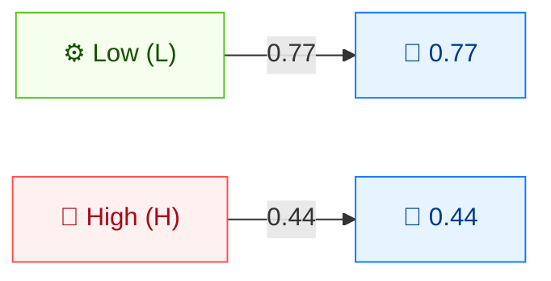

# ⚙️ Attack Complexity (AC)

🟦 Base Metric · 📐 Scoring impact

## Definition

Attack Complexity (AC) captures conditions beyond the attacker's control that must exist in order to exploit the vulnerability. It describes how reliably an attack can be reproduced, not how technically difficult the exploit is to write.

## Values

| Short Value | Long Value | Score | Description |
| ----------- | ---------- | ----- | ----------- |
| `L` | Low  | 0.77 | No specialized conditions exist; the attacker can expect repeatable success at will. |
| `H` | High | 0.44 | A successful attack depends on conditions beyond the attacker's control (race conditions, environment knowledge, MITM positioning, etc.). |

Scores are taken from `pkg/vector/attack_complexity.go`.

## Score Map



Low complexity = repeatable, attacker-controlled success (0.77, higher score). High complexity = success depends on conditions outside the attacker's control (0.44, lower score).

## Scoring Impact

AC is a multiplier on the **Exploitability** sub-score. `Low` (0.77) leaves the score high; `High` (0.44) roughly halves the exploitability contribution and noticeably lowers the final Base Score.

## Example

```bash
cvss score "CVSS:3.1/AV:N/AC:L/PR:N/UI:N/S:U/C:H/I:H/A:H"  # AC:Low
cvss score "CVSS:3.1/AV:N/AC:H/PR:N/UI:N/S:U/C:H/I:H/A:H"  # AC:High
```

```text
9.8 (Critical)   # AC:L
8.1 (High)       # AC:H
```

Go SDK:

```go
package main

import (
    "fmt"

    "github.com/scagogogo/cvss-skills/pkg/vector"
)

func main() {
    low, _ := vector.GetAttackComplexity('L')
    high, _ := vector.GetAttackComplexity('H')
    fmt.Printf("AC:L=%.2f  AC:H=%.2f\n", low.GetScore(), high.GetScore())
}
```

## Source

[`pkg/vector/attack_complexity.go`](https://github.com/scagogogo/cvss-skills/blob/main/pkg/vector/attack_complexity.go) — defines `AttackComplexityLow` (0.77) and `AttackComplexityHigh` (0.44), plus the `MAC` modified variants.

## Related

- [Metrics Overview](./)
- [Attack Vector (AV)](./attack-vector)
- [Modified Metrics (M*)](./modified)
