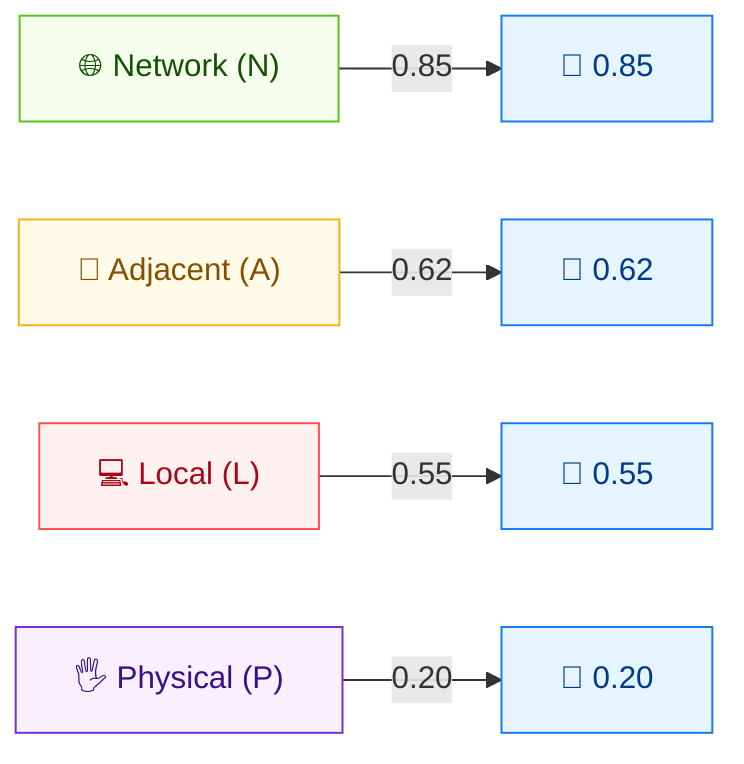

# 🌐 Attack Vector (AV)

🟦 Base Metric · 📐 Scoring impact

## Definition

Attack Vector (AV) describes the context in which the vulnerability is exploited. It captures how "remote" the attacker must be — from anywhere on the Internet down to physical contact with the device. The more accessible the vulnerability, the higher the score.

## Values

| Short Value | Long Value | Score | Description |
| ----------- | ---------- | ----- | ----------- |
| `N` | Network  | 0.85 | The vulnerable component is bound to the network stack; attackers can be anywhere, up to the entire Internet (remotely exploitable). |
| `A` | Adjacent | 0.62 | Bound to the network stack, but limited to a logically adjacent topology (same physical/logical network, e.g. Bluetooth, local LAN). |
| `L` | Local    | 0.55 | Not bound to the network stack; the attacker accesses the target locally (keyboard/console/SSH) or via user interaction. |
| `P` | Physical | 0.20 | The attacker must physically touch or manipulate the vulnerable component (e.g. cold boot, evil maid). |

Scores are taken from `pkg/vector/attack_vector.go`.

## Score Map



Higher scores = more accessible = greater exploitability. **Network** is most dangerous; **Physical** requires physical access.

## Scoring Impact

AV is a multiplier on the **Exploitability** sub-score of the Base Score. Network is the most exploitable (0.85) and drives the highest scores; Physical (0.20) drastically lowers them. The four values are monotonically decreasing, so moving from `N` to `P` always reduces the score.

## Example

Compare the four attack vectors on an otherwise identical vulnerability (`AC:L/PR:N/UI:N/S:U/C:H/I:H/A:H`):

```bash
cvss score "CVSS:3.1/AV:N/AC:L/PR:N/UI:N/S:U/C:H/I:H/A:H"  # Network
cvss score "CVSS:3.1/AV:A/AC:L/PR:N/UI:N/S:U/C:H/I:H/A:H"  # Adjacent
cvss score "CVSS:3.1/AV:L/AC:L/PR:N/UI:N/S:U/C:H/I:H/A:H"  # Local
cvss score "CVSS:3.1/AV:P/AC:L/PR:N/UI:N/S:U/C:H/I:H/A:H"  # Physical
```

```text
9.8 (Critical)   # AV:N
8.8 (High)       # AV:A
8.4 (High)       # AV:L
6.8 (Medium)     # AV:P
```

Go SDK:

```go
package main

import (
    "fmt"

    "github.com/scagogogo/cvss-skills/pkg/vector"
)

func main() {
    for _, v := range []rune{'N', 'A', 'L', 'P'} {
        av, _ := vector.GetAttackVector(v)
        fmt.Printf("AV:%c  score=%.2f  long=%s\n", v, av.GetScore(), av.GetLongValue())
    }
}
```

## Source

[`pkg/vector/attack_vector.go`](https://github.com/scagogogo/cvss-skills/blob/main/pkg/vector/attack_vector.go) — defines `AttackVectorNetwork` (0.85), `AttackVectorAdjacent` (0.62), `AttackVectorLocal` (0.55), `AttackVectorPhysical` (0.20), plus the `MAV` modified variants.

## Related

- [Metrics Overview](./)
- [Modified Metrics (M*)](./modified)
- [SDK: vector package](../sdk/vector)
