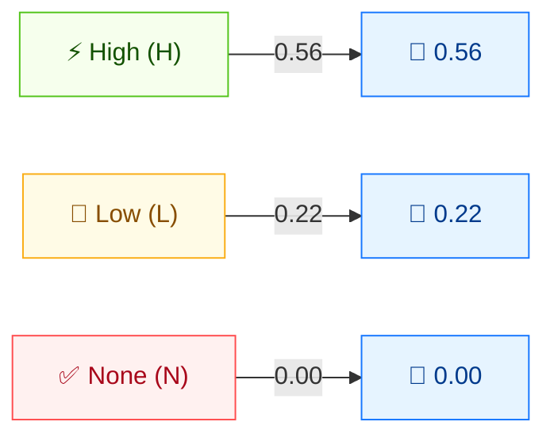

# ⏱️ Availability (A)

🟦 Base Metric · 📐 Impact sub-score

## Definition

Availability (A) measures the impact on availability within the impacted component — the degree to which an attacker can deny access to resources. It is one of the three CIA impact metrics that together form the **Impact** sub-score.

## Values

| Short Value | Long Value | Score | Description |
| ----------- | ---------- | ----- | ----------- |
| `H` | High | 0.56 | Total loss of availability: the attacker can fully deny access to resources, sustained or persistently. |
| `L` | Low  | 0.22 | Performance is reduced or there are interruptions, but the attacker cannot fully deny service and the impact is not directly serious. |
| `N` | None | 0.00 | No impact to availability within the impacted component. |

Scores are taken from `pkg/vector/availability.go`.

## Score Map



C, I, and A share the **same score scale** (H=0.56, L=0.22, N=0.00). They feed the ISC (Impact) sub-score: higher values = greater impact. Total loss (H) maximizes impact; no loss (N) contributes nothing.

## Scoring Impact

A feeds the **Impact** sub-score. The three impact metrics combine as `Impact = 1 − (1 − C) × (1 − I) × (1 − A)`. With A as the only impact, `A:H` yields an Impact of 0.56, `A:L` yields 0.22, and `A:N` yields 0.

## Example

Isolate A by setting C and I to `None`:

```bash
cvss score "CVSS:3.1/AV:N/AC:L/PR:N/UI:N/S:U/C:N/I:N/A:H"  # A:High
cvss score "CVSS:3.1/AV:N/AC:L/PR:N/UI:N/S:U/C:N/I:N/A:L"  # A:Low
cvss score "CVSS:3.1/AV:N/AC:L/PR:N/UI:N/S:U/C:N/I:N/A:N"  # A:None
```

```text
7.5 (High)     # A:H
5.3 (Medium)   # A:L
0.0 (None)     # A:N
```

Go SDK:

```go
package main

import (
    "fmt"

    "github.com/scagogogo/cvss-skills/pkg/vector"
)

func main() {
    h, _ := vector.GetAvailability('H')
    l, _ := vector.GetAvailability('L')
    n, _ := vector.GetAvailability('N')
    fmt.Printf("A:H=%.2f  A:L=%.2f  A:N=%.2f\n", h.GetScore(), l.GetScore(), n.GetScore())
}
```

## Source

[`pkg/vector/availability.go`](https://github.com/scagogogo/cvss-skills/blob/main/pkg/vector/availability.go) — defines `AvailabilityHigh` (0.56), `AvailabilityLow` (0.22), `AvailabilityNone` (0), plus the `MA` modified variants.

## Related

- [Metrics Overview](./)
- [Confidentiality (C)](./confidentiality)
- [Integrity (I)](./integrity)
- [Requirements (CR/IR/AR)](./requirements)
- [Modified Metrics (M*)](./modified)
